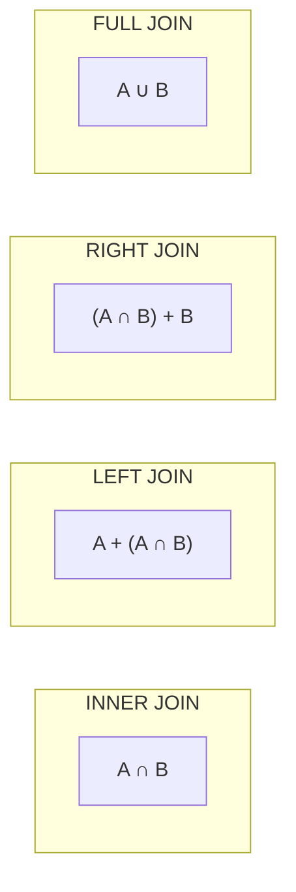
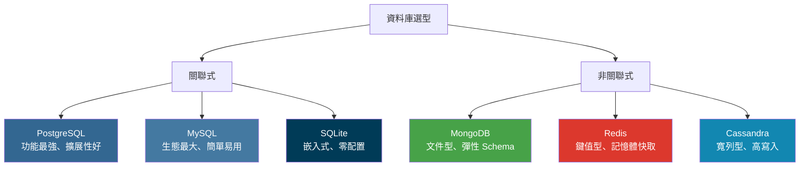
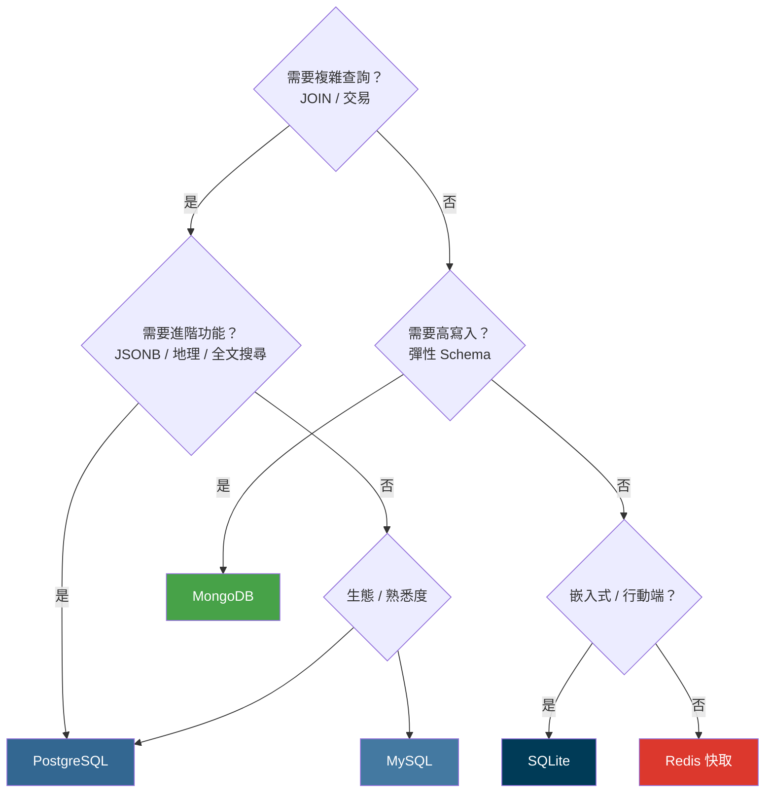

# 全端工程師基礎知識

## 目錄

1. [前端基礎](#前端基礎)
2. [後端基礎](#後端基礎)
3. [資料庫基礎](#資料庫基礎)
4. [網路與通訊協定](#網路與通訊協定)
5. [版本控制](#版本控制)
6. [開發工具與環境](#開發工具與環境)
7. [基礎資安觀念](#基礎資安觀念)
8. [部署與維運基礎](#部署與維運基礎)

---

## 前端基礎

### HTML

- **語義化標籤**：`<header>`, `<nav>`, `<main>`, `<section>`, `<article>`, `<footer>` 等
- **表單元素**：`<form>`, `<input>`, `<select>`, `<textarea>`, 表單驗證屬性
- **多媒體**：``, `<video>`, `<audio>`, `<canvas>`
- **SEO 基礎**：`<meta>` 標籤、Open Graph、結構化資料
- **無障礙 (Accessibility)**：ARIA 屬性、語義化 HTML 對螢幕閱讀器的影響

### CSS

- **盒模型 (Box Model)**：`content`, `padding`, `border`, `margin`，`box-sizing` 的差異
- **排版系統**：
  - Flexbox：主軸/交叉軸、`justify-content`, `align-items`, `flex-grow/shrink/basis`
  - Grid：`grid-template-columns/rows`, `grid-area`, `fr` 單位
- **定位 (Positioning)**：`static`, `relative`, `absolute`, `fixed`, `sticky`
- **響應式設計 (RWD)**：Media Queries、`rem`/`em`/`vw`/`vh` 單位、Mobile First
- **CSS 預處理器**：SCSS/Sass 基礎語法（變數、巢狀、Mixin）
- **CSS 方法論**：BEM 命名規範、CSS Modules、CSS-in-JS 概念

### JavaScript

- **基本語法**：變數（`let`, `const`, `var`）、資料型別、運算子
- **函式**：箭頭函式、閉包 (Closure)、高階函式、IIFE
- **物件導向**：原型鏈 (Prototype Chain)、`class` 語法、繼承
- **非同步處理**：
  - Callback → Promise → async/await 演進
  - Event Loop 機制、Microtask vs Macrotask
- **DOM 操作**：選取元素、事件監聽、事件冒泡/捕獲、事件委派
- **ES6+ 語法**：解構賦值、展開運算子、模板字串、Optional Chaining、Nullish Coalescing
- **模組系統**：ESM (`import/export`) vs CommonJS (`require/module.exports`)
- **錯誤處理**：`try/catch/finally`、自訂錯誤類別

### TypeScript

- **型別系統**：基本型別、`interface` vs `type`、泛型 (Generics)
- **型別守衛 (Type Guard)**：`typeof`, `instanceof`, 自訂型別守衛
- **工具型別 (Utility Types)**：`Partial`, `Required`, `Pick`, `Omit`, `Record`
- **設定檔**：`tsconfig.json` 常用配置

### 前端框架（擇一深入）

- **React**：
  - JSX 語法、元件生命週期
  - Hooks：`useState`, `useEffect`, `useContext`, `useRef`, `useMemo`, `useCallback`
  - 狀態管理：Context API、Redux / Zustand / Jotai
  - 路由：React Router
- **Vue**：
  - 模板語法、Composition API vs Options API
  - 響應式原理：`ref`, `reactive`, `computed`, `watch`
  - 狀態管理：Pinia
  - 路由：Vue Router
- **Angular**：
  - 模組化架構、依賴注入
  - Components、Directives、Pipes
  - RxJS 與 Observable

### 建構工具

- **打包工具**：Vite / Webpack 基礎概念
- **套件管理**：npm / yarn / pnpm，`package.json` 與 `lock` 檔案
- **Linter & Formatter**：ESLint、Prettier

---

## 後端基礎

### 程式語言（擇一深入）

- **Node.js (JavaScript/TypeScript)**：Express.js / Fastify / NestJS
- **Python**：Django / Flask / FastAPI
- **Java**：Spring Boot
- **Go**：Gin / Echo
- **C#**：ASP.NET Core

### RESTful API 設計

- **HTTP 方法語義**：GET（查詢）、POST（新增）、PUT（全量更新）、PATCH（部分更新）、DELETE（刪除）
- **URL 設計原則**：使用名詞複數、資源巢狀、查詢參數設計
- **狀態碼**：
  - 2xx：200 OK、201 Created、204 No Content
  - 3xx：301 Moved Permanently、304 Not Modified
  - 4xx：400 Bad Request、401 Unauthorized、403 Forbidden、404 Not Found、422 Unprocessable Entity
  - 5xx：500 Internal Server Error、502 Bad Gateway、503 Service Unavailable
- **回應格式**：統一 JSON 回應結構、分頁 (Pagination)、錯誤格式

### API 文件

- **OpenAPI / Swagger**：API 規格撰寫、Swagger UI 使用
- **Postman / Insomnia**：API 測試工具使用

### 認證與授權

- **Session-based Auth**：Cookie + Session 機制
- **Token-based Auth**：JWT（Header、Payload、Signature）、Access Token / Refresh Token
- **OAuth 2.0**：Authorization Code Flow、Client Credentials
- **密碼儲存**：雜湊 (Hashing) + 鹽值 (Salt)，bcrypt / Argon2

### 伺服器端觀念

- **中介軟體 (Middleware)**：請求/回應攔截、日誌記錄、錯誤處理
- **輸入驗證 (Validation)**：請求參數驗證、資料清洗
- **檔案上傳**：Multipart 處理、檔案大小限制
- **排程任務 (Cron Jobs)**：定時任務設計

---

## 資料庫基礎

### SQL 基礎語法

#### DDL (Data Definition Language)

```sql
-- 建表
CREATE TABLE users (
    id SERIAL PRIMARY KEY,
    name VARCHAR(100) NOT NULL,
    email VARCHAR(255) UNIQUE NOT NULL,
    created_at TIMESTAMP DEFAULT CURRENT_TIMESTAMP
);

-- 修改表
ALTER TABLE users ADD COLUMN age INT;
ALTER TABLE users DROP COLUMN age;

-- 刪除表
DROP TABLE IF EXISTS users;
```

#### DML (Data Manipulation Language)

```sql
-- 新增
INSERT INTO users (name, email) VALUES ('Alice', 'alice@example.com');

-- 查詢
SELECT * FROM users WHERE name LIKE 'A%' ORDER BY created_at DESC LIMIT 10;

-- 更新
UPDATE users SET name = 'Bob' WHERE id = 1;

-- 刪除
DELETE FROM users WHERE id = 1;
```

#### JOIN



```sql
-- INNER JOIN：只回傳兩邊都有匹配的列
SELECT u.name, o.total
FROM users u INNER JOIN orders o ON u.id = o.user_id;

-- LEFT JOIN：左表全部 + 右表匹配的列
SELECT u.name, o.total
FROM users u LEFT JOIN orders o ON u.id = o.user_id;
```

#### 聚合與分組

```sql
-- GROUP BY + 聚合函數
SELECT department, COUNT(*) AS count, AVG(salary) AS avg_salary
FROM employees
GROUP BY department
HAVING AVG(salary) > 50000
ORDER BY avg_salary DESC;
```

#### 子查詢與 CTE

```sql
-- 子查詢
SELECT * FROM users WHERE id IN (SELECT user_id FROM orders WHERE total > 1000);

-- CTE (Common Table Expression)：更易讀的子查詢
WITH high_spenders AS (
    SELECT user_id, SUM(total) AS total_spent
    FROM orders
    GROUP BY user_id
    HAVING SUM(total) > 10000
)
SELECT u.name, hs.total_spent
FROM users u JOIN high_spenders hs ON u.id = hs.user_id;
```

#### Window Functions

```sql
-- ROW_NUMBER：編號
SELECT name, salary, ROW_NUMBER() OVER (ORDER BY salary DESC) AS rank
FROM employees;

-- RANK：排名（同分同名次，跳號）
SELECT name, salary, RANK() OVER (ORDER BY salary DESC) AS rank
FROM employees;

-- 分組排名
SELECT department, name, salary,
       RANK() OVER (PARTITION BY department ORDER BY salary DESC) AS dept_rank
FROM employees;
```

### 資料庫設計

- **正規化 (Normalization)**：
  - **1NF**：每個欄位只存單一值（不存陣列或逗號分隔）
  - **2NF**：消除部分相依（非主鍵欄位完全依賴主鍵）
  - **3NF**：消除遞移相依（非主鍵欄位不依賴其他非主鍵）
- **反正規化 (Denormalization)**：為效能犧牲正規化，減少 JOIN
- **主鍵 (Primary Key)**：唯一識別每一列
- **外鍵 (Foreign Key)**：建立表之間的參照關係
- **索引 (Index)**：加速查詢，但增加寫入開銷
- **ER Diagram**：Entity-Relationship 圖，用於視覺化資料模型

### 各資料庫比較



| 資料庫 | 類型 | 授權 | 特色 | 適用場景 |
|--------|------|------|------|---------|
| **PostgreSQL** | RDBMS | 開源 (PostgreSQL License) | 功能豐富、擴展性強、ACID | 複雜查詢、地理資料、JSON 混合 |
| **MySQL** | RDBMS | 開源 (GPL) / 商業 | 生態成熟、效能穩定 | Web 應用、讀多寫少 |
| **SQLite** | RDBMS | 公共領域 | 嵌入式、零配置、單檔案 | 行動端、嵌入式、原型開發 |
| **MongoDB** | Document | 開源 (SSPL) | 彈性 Schema、水平擴展 | 快速迭代、非結構化資料 |
| **Redis** | Key-Value | 開源 (BSD) | 記憶體存取、極低延遲 | 快取、Session、排行榜 |

---

### PostgreSQL

#### 特色功能

- **ACID 完整支援**：嚴格的交易保證
- **豐富的資料型別**：JSONB、Array、UUID、hstore、幾何型別、IP 位址
- **進階索引**：B-Tree、Hash、GiST、GIN、BRIN
- **全文搜尋**：`tsvector` / `tsquery` 原生支援
- **擴展性**：支援自訂型別、函數、運算子
- **MVCC**：多版本並行控制，讀不阻塞寫

#### 常用資料型別

| 類型 | 範例 | 說明 |
|------|------|------|
| `SERIAL` / `BIGSERIAL` | 自動遞增整數 | 常用於主鍵 |
| `UUID` | `gen_random_uuid()` | 分散式系統友好的主鍵 |
| `VARCHAR(n)` / `TEXT` | 字串 | TEXT 無長度限制 |
| `INTEGER` / `BIGINT` | 整數 | 4 / 8 bytes |
| `NUMERIC(p,s)` | 精確小數 | 金額計算用 |
| `BOOLEAN` | `true` / `false` | 布林值 |
| `TIMESTAMP` / `TIMESTAMPTZ` | 時間戳 | 建議用 TIMESTAMPTZ（含時區） |
| `JSONB` | 二進位 JSON | 可索引、可查詢 |
| `ARRAY` | `INTEGER[]` | 陣列型別 |
| `INET` / `CIDR` | IP 位址 | 網路應用 |

#### JSONB 操作

```sql
-- 建表
CREATE TABLE products (
    id SERIAL PRIMARY KEY,
    name TEXT,
    metadata JSONB
);

-- 插入 JSON
INSERT INTO products (name, metadata)
VALUES ('Phone', '{"color": "black", "specs": {"ram": 8, "storage": 256}}');

-- 查詢 JSON 欄位
SELECT name, metadata->>'color' AS color FROM products;            -- 取值（text）
SELECT name, metadata->'specs'->>'ram' AS ram FROM products;       -- 巢狀取值
SELECT * FROM products WHERE metadata @> '{"color": "black"}';     -- 包含查詢
SELECT * FROM products WHERE metadata->'specs'->>'ram' = '8';      -- 條件篩選

-- GIN 索引加速 JSONB 查詢
CREATE INDEX idx_products_metadata ON products USING GIN (metadata);
```

#### 常用進階功能

```sql
-- UPSERT（不存在則新增，存在則更新）
INSERT INTO users (email, name) VALUES ('a@b.com', 'Alice')
ON CONFLICT (email) DO UPDATE SET name = EXCLUDED.name;

-- RETURNING（操作後回傳結果）
INSERT INTO users (name, email) VALUES ('Bob', 'bob@b.com') RETURNING id, created_at;

-- 產生 UUID
SELECT gen_random_uuid();

-- 陣列操作
SELECT * FROM posts WHERE tags @> ARRAY['javascript'];  -- 包含某標籤
SELECT * FROM posts WHERE 'react' = ANY(tags);           -- 任一匹配
```

#### 常用管理指令

```bash
# 連線
psql -h localhost -U postgres -d mydb

# 常用 psql 指令
\l              # 列出所有資料庫
\dt             # 列出所有表
\d users        # 查看表結構
\di             # 列出所有索引
\q              # 離開

# 備份與還原
pg_dump mydb > backup.sql
pg_dump -Fc mydb > backup.dump        # 自訂格式（支援平行還原）
psql mydb < backup.sql
pg_restore -d mydb backup.dump
```

---

### MySQL

#### 特色功能

- **儲存引擎可選**：InnoDB（預設）、MyISAM 等
- **生態成熟**：最廣泛使用的 RDBMS
- **效能穩定**：讀多寫少場景表現優秀
- **主從複製**：原生支援、設定簡單

#### InnoDB vs MyISAM

| 特性 | InnoDB | MyISAM |
|------|--------|--------|
| 交易支援 | 支援 ACID | 不支援 |
| 鎖粒度 | 行鎖 | 表鎖 |
| 外鍵 | 支援 | 不支援 |
| 全文搜尋 | 支援 (5.6+) | 支援 |
| 崩潰恢復 | 支援 (redo log) | 不支援 |
| 適用場景 | 大部分場景（預設） | 只讀分析表 |

#### 與 PostgreSQL 的主要差異

| 面向 | MySQL | PostgreSQL |
|------|-------|------------|
| **預設隔離等級** | Repeatable Read | Read Committed |
| **JSON 支援** | JSON（MySQL 8.0+） | JSONB（更成熟、可索引） |
| **陣列型別** | 不支援 | 原生支援 |
| **全文搜尋** | 基礎 | 更強大（tsvector） |
| **擴展性** | 有限 | 自訂型別、函數、運算子 |
| **複製** | 原生主從、Group Replication | Streaming Replication、邏輯複製 |
| **適用場景** | Web 應用、CRUD | 複雜查詢、地理資料、資料分析 |

#### 常用語法差異

```sql
-- 自動遞增
-- MySQL
CREATE TABLE users (id INT AUTO_INCREMENT PRIMARY KEY, name VARCHAR(100));

-- PostgreSQL
CREATE TABLE users (id SERIAL PRIMARY KEY, name VARCHAR(100));

-- 分頁
-- MySQL / PostgreSQL 相同
SELECT * FROM users LIMIT 10 OFFSET 20;

-- UPSERT
-- MySQL
INSERT INTO users (email, name) VALUES ('a@b.com', 'Alice')
ON DUPLICATE KEY UPDATE name = VALUES(name);

-- PostgreSQL
INSERT INTO users (email, name) VALUES ('a@b.com', 'Alice')
ON CONFLICT (email) DO UPDATE SET name = EXCLUDED.name;
```

#### 常用管理指令

```bash
# 連線
mysql -h localhost -u root -p mydb

# 常用指令
SHOW DATABASES;
SHOW TABLES;
DESCRIBE users;
SHOW INDEX FROM users;

# 備份與還原
mysqldump -u root -p mydb > backup.sql
mysql -u root -p mydb < backup.sql
```

---

### SQLite

- **特色**：嵌入式、零配置、單一檔案、不需要 Server
- **資料型別**：動態型別（TEXT、INTEGER、REAL、BLOB、NULL）
- **適用場景**：
  - 行動端本地資料庫（Android Room、iOS CoreData 底層）
  - 桌面應用（Electron）
  - 原型開發、測試、嵌入式系統
- **限制**：不適合高併發寫入、不支援使用者管理

```bash
# 開啟或建立資料庫
sqlite3 mydb.sqlite

# 常用指令
.tables         # 列出表
.schema users   # 查看建表語句
.mode column    # 欄位對齊顯示
.quit           # 離開
```

---

### MongoDB

#### 核心概念

| RDBMS | MongoDB | 說明 |
|-------|---------|------|
| Database | Database | 資料庫 |
| Table | Collection | 集合（表） |
| Row | Document | 文件（列） |
| Column | Field | 欄位 |
| Primary Key | `_id` | 自動產生 ObjectId |
| JOIN | `$lookup` / 嵌入 | 關聯查詢或嵌入子文件 |

#### CRUD 操作

```javascript
// 新增
db.users.insertOne({ name: "Alice", age: 25, tags: ["dev", "js"] });
db.users.insertMany([{ name: "Bob" }, { name: "Carol" }]);

// 查詢
db.users.find({ age: { $gte: 20, $lte: 30 } });       // 範圍查詢
db.users.find({ tags: { $in: ["js", "python"] } });     // 陣列包含
db.users.find({ "address.city": "Taipei" });             // 巢狀查詢
db.users.find({}, { name: 1, age: 1, _id: 0 });         // 投影（選擇欄位）

// 更新
db.users.updateOne({ name: "Alice" }, { $set: { age: 26 } });
db.users.updateMany({ age: { $lt: 18 } }, { $set: { status: "minor" } });

// 刪除
db.users.deleteOne({ name: "Alice" });
```

#### 聚合管道 (Aggregation Pipeline)

```javascript
db.orders.aggregate([
  { $match: { status: "completed" } },           // 篩選
  { $group: { _id: "$userId", total: { $sum: "$amount" } } },  // 分組
  { $sort: { total: -1 } },                      // 排序
  { $limit: 10 }                                  // 限制筆數
]);
```

#### 資料建模策略

| 策略 | 適用場景 | 範例 |
|------|---------|------|
| **嵌入 (Embedding)** | 一對少、經常一起查詢 | 文章嵌入留言（少量） |
| **參照 (Referencing)** | 一對多、資料量大 | 使用者 → 訂單（用 userId 關聯） |

#### 索引

```javascript
db.users.createIndex({ email: 1 }, { unique: true });  // 唯一索引
db.users.createIndex({ name: "text" });                 // 全文索引
db.products.createIndex({ location: "2dsphere" });      // 地理索引
```

---

### Redis

#### 資料結構與應用場景

| 結構 | 指令範例 | 適用場景 |
|------|---------|---------|
| **String** | `SET key val` / `GET key` | 快取、計數器、分散式鎖 |
| **Hash** | `HSET user:1 name Alice` | 物件屬性存取 |
| **List** | `LPUSH queue task1` | 訊息佇列、最近瀏覽紀錄 |
| **Set** | `SADD tags js python` | 標籤、去重、交集運算 |
| **Sorted Set** | `ZADD rank 100 user:1` | 排行榜、延遲佇列 |
| **Stream** | `XADD stream * key val` | 事件串流、日誌 |

#### 常用操作

```bash
# 字串
SET user:token "abc123" EX 3600     # 設值 + 過期時間（秒）
GET user:token
INCR page:views                      # 原子遞增

# 雜湊
HSET user:1 name "Alice" age 25
HGETALL user:1

# 列表
LPUSH notifications "new_msg"        # 左端推入
RPOP notifications                   # 右端彈出
LRANGE notifications 0 9             # 取前 10 筆

# 集合
SADD user:1:following user:2 user:3
SINTER user:1:following user:2:following   # 共同關注

# 有序集合
ZADD leaderboard 100 "Alice" 90 "Bob"
ZREVRANGE leaderboard 0 9 WITHSCORES      # 前 10 名

# 過期
EXPIRE key 300                       # 設定 300 秒後過期
TTL key                              # 查詢剩餘時間
```

#### 常用應用模式

| 模式 | 說明 |
|------|------|
| **快取** | 減少 DB 查詢，設定合理 TTL |
| **Session 儲存** | 取代 Server 記憶體儲存 Session |
| **分散式鎖** | `SETNX` + `EX` 實現互斥 |
| **計數器/限流** | `INCR` + `EXPIRE` 實現滑動視窗 |
| **排行榜** | Sorted Set 天然排序 |
| **Pub/Sub** | 發布訂閱即時通知 |

---

### ORM (Object-Relational Mapping)

| 語言/框架 | ORM | 特色 |
|----------|-----|------|
| Node.js | **Prisma** | Type-safe、Schema first、自動 Migration |
| Node.js | **Sequelize** | 傳統 ORM、功能完整 |
| Node.js | **TypeORM** | 支援 Active Record 和 Data Mapper |
| Node.js | **Drizzle** | 輕量、SQL-like API、效能好 |
| Python | **SQLAlchemy** | 最強大的 Python ORM |
| Python | **Django ORM** | 內建於 Django |
| Java | **JPA / Hibernate** | Java 標準 ORM |
| Go | **GORM** | Go 生態最流行 |

### 資料庫管理

- **Migration**：Schema 版本控制，可回滾
- **Seed**：初始資料 / 測試資料填充
- **備份策略**：
  - 全量備份 (Full Backup)：定期完整備份
  - 增量備份 (Incremental)：只備份變更部分
  - WAL 歸檔 (PostgreSQL)：可恢復到任意時間點 (PITR)
- **備份工具**：`pg_dump` / `mysqldump` / `mongodump`

### 資料庫選型指南



---

## 網路與通訊協定

### HTTP/HTTPS

- **請求/回應結構**：Request Line、Headers、Body
- **常用 Headers**：`Content-Type`, `Authorization`, `Cache-Control`, `CORS` 相關
- **HTTPS**：SSL/TLS 握手流程、憑證 (Certificate)
- **HTTP/2 vs HTTP/1.1**：多路複用 (Multiplexing)、Server Push、Header 壓縮

### 其他通訊方式

- **WebSocket**：全雙工通訊、適用場景（聊天室、即時通知）
- **Server-Sent Events (SSE)**：伺服器推送、與 WebSocket 的差異
- **GraphQL 基礎**：Query、Mutation、Schema 定義

### DNS

- **域名解析流程**：Root → TLD → Authoritative
- **常見記錄類型**：A、AAAA、CNAME、MX、TXT

### CORS

- **同源政策 (Same-Origin Policy)**：協定、域名、埠號
- **CORS 設定**：`Access-Control-Allow-Origin`, Preflight Request (`OPTIONS`)

---

## 版本控制

### Git

- **基本操作**：`init`, `add`, `commit`, `push`, `pull`, `fetch`
- **分支管理**：`branch`, `checkout`, `merge`, `rebase`
- **衝突解決**：合併衝突的判讀與處理
- **Git Flow**：`main`, `develop`, `feature/*`, `release/*`, `hotfix/*`
- **Conventional Commits**：`feat:`, `fix:`, `docs:`, `refactor:`, `chore:`
- **.gitignore**：忽略規則撰寫

### GitHub / GitLab

- **Pull Request / Merge Request**：Code Review 流程
- **Issues & Projects**：任務追蹤
- **GitHub Actions / GitLab CI 基礎**：CI pipeline 撰寫

---

## 開發工具與環境

### 編輯器與 IDE

- **VS Code**：常用擴充套件、快捷鍵、偵錯工具
- **瀏覽器 DevTools**：Elements、Console、Network、Performance、Application

### 終端機 (Terminal)

- **常用指令**：`ls`, `cd`, `mkdir`, `rm`, `cp`, `mv`, `cat`, `grep`, `find`, `chmod`
- **Shell 腳本基礎**：變數、條件判斷、迴圈
- **SSH**：金鑰產生、遠端連線

### 容器化

- **Docker 基礎**：
  - `Dockerfile` 撰寫：`FROM`, `COPY`, `RUN`, `EXPOSE`, `CMD`
  - 常用指令：`docker build`, `docker run`, `docker ps`, `docker logs`
  - Docker Compose：多容器應用編排
  - Volume：資料持久化
  - Network：容器間通訊

### 環境管理

- **環境變數**：`.env` 檔案、dotenv
- **Node 版本管理**：nvm / fnm
- **Python 虛擬環境**：venv / pyenv

---

## 基礎資安觀念

### OWASP Top 10 常見漏洞

| 漏洞類型 | 說明 | 防護方式 |
|---------|------|---------|
| SQL Injection | 透過輸入注入 SQL 語句 | 參數化查詢、ORM |
| XSS (Cross-Site Scripting) | 注入惡意腳本到網頁 | 輸出編碼、CSP |
| CSRF (Cross-Site Request Forgery) | 偽造使用者請求 | CSRF Token、SameSite Cookie |
| 敏感資料洩露 | 未加密傳輸或儲存敏感資料 | HTTPS、加密儲存 |
| 不安全的反序列化 | 反序列化未驗證的資料 | 輸入驗證、型別檢查 |

### 其他安全實踐

- **HTTPS 強制使用**：HSTS Header
- **密碼政策**：長度要求、bcrypt 雜湊
- **Rate Limiting**：API 速率限制、防止暴力破解
- **Helmet.js / Security Headers**：`X-Frame-Options`, `X-Content-Type-Options`

---

## 部署與維運基礎

### 雲端平台

- **IaaS**：AWS EC2、GCP Compute Engine、Azure VM
- **PaaS**：Heroku、Railway、Render、Vercel、Netlify
- **Serverless**：AWS Lambda、GCP Cloud Functions

### CI/CD

- **持續整合 (CI)**：自動測試、Lint 檢查、Build 驗證
- **持續部署 (CD)**：自動部署到 Staging / Production
- **工具**：GitHub Actions、GitLab CI、Jenkins

### 基本監控

- **日誌 (Logging)**：結構化日誌、日誌等級（DEBUG、INFO、WARN、ERROR）
- **健康檢查 (Health Check)**：`/health` 端點
- **錯誤追蹤**：Sentry 基礎使用

### Web Server

- **Nginx 基礎**：反向代理 (Reverse Proxy)、靜態檔案服務、SSL 設定
- **PM2**：Node.js 程序管理

---

## 學習路徑建議

```
HTML/CSS/JS 基礎
       ↓
前端框架（React / Vue）
       ↓
後端語言 + 框架（Node.js + Express）
       ↓
資料庫（PostgreSQL + Redis）
       ↓
RESTful API 設計
       ↓
認證授權（JWT / OAuth）
       ↓
Docker + 部署
       ↓
CI/CD + 監控
```

---

## 推薦學習資源

- **MDN Web Docs**：前端技術權威文件
- **freeCodeCamp**：免費全端課程
- **The Odin Project**：完整全端學習路徑
- **roadmap.sh**：前端/後端/全端學習路線圖
- **JavaScript.info**：JavaScript 深入教學
