# 全端工程師進階知識

## 目錄

1. [前端進階](#前端進階)
2. [後端進階](#後端進階)
3. [資料庫進階](#資料庫進階)
4. [DevOps 與雲端進階](#devops-與雲端進階)
5. [架構與設計模式](#架構與設計模式)
6. [資安進階](#資安進階)
7. [軟技能與工程文化](#軟技能與工程文化)

---

## 前端進階

### 效能優化

#### Core Web Vitals

Google 定義的三大核心指標：

| 指標 | 全名 | 目標 | 衡量面向 |
|------|------|------|---------|
| LCP | Largest Contentful Paint | < 2.5s | 載入效能 |
| INP | Interaction to Next Paint | < 200ms | 互動回應性 |
| CLS | Cumulative Layout Shift | < 0.1 | 視覺穩定性 |

#### 載入優化技術

- **Code Splitting**：依路由或元件拆分打包，`React.lazy()` + `Suspense` 或動態 `import()`
- **Tree Shaking**：透過 ESM 靜態分析移除未使用的程式碼，需避免副作用匯出
- **Lazy Loading**：圖片 `loading="lazy"`、路由懶載入、Intersection Observer API
- **圖片優化**：WebP/AVIF 格式、`<picture>` 標籤多格式 fallback、srcset 響應式圖片
- **資源提示**：`<link rel="preload">`、`<link rel="prefetch">`、`<link rel="preconnect">`
- **Critical CSS**：內嵌首屏關鍵 CSS、延遲載入非關鍵樣式

#### 執行時優化

- **虛擬捲動 (Virtual Scrolling)**：只渲染可見區域的列表項目（react-virtualized / tanstack-virtual）
- **防抖 (Debounce) 與節流 (Throttle)**：控制高頻事件觸發頻率
- **Web Worker**：將耗時運算移至背景執行緒，避免阻塞主執行緒
- **requestAnimationFrame**：平滑動畫渲染

### SSR / SSG / ISR

| 渲染模式 | 全名 | 時機 | 適用場景 |
|---------|------|------|---------|
| CSR | Client-Side Rendering | 瀏覽器端 | SPA、管理後台 |
| SSR | Server-Side Rendering | 每次請求時 | SEO 需求、動態內容 |
| SSG | Static Site Generation | 建構時 | 部落格、文件網站 |
| ISR | Incremental Static Regeneration | 背景重新生成 | 電商、新聞 |

**框架選擇**：
- React → Next.js (App Router / Pages Router)
- Vue → Nuxt.js
- Svelte → SvelteKit

### 前端狀態管理進階

#### 有限狀態機 (FSM) 與 XState

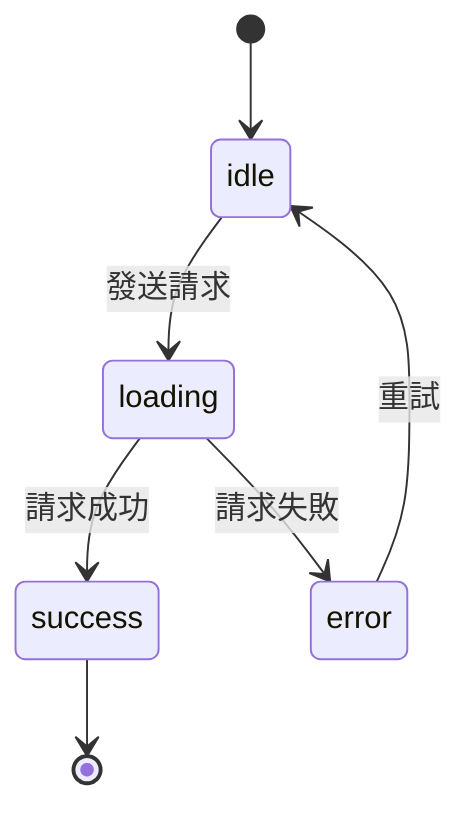

- 明確定義所有可能狀態與轉換，消除「不可能的狀態」
- 適合複雜 UI 流程：多步驟表單、支付流程、媒體播放器

#### 狀態管理演進

- **Server State vs Client State** 分離：TanStack Query / SWR 管理 Server State
- **原子化狀態**：Jotai / Recoil，每個狀態獨立、按需訂閱
- **Proxy-based**：Valtio / MobX，透過 Proxy 自動追蹤依賴

### Web Worker / Service Worker / PWA

- **Web Worker**：背景執行 CPU 密集任務，透過 `postMessage` 與主執行緒通訊
- **Service Worker**：
  - 攔截網路請求、實現離線快取
  - 快取策略：Cache First、Network First、Stale While Revalidate
  - 推播通知 (Push Notification)
- **PWA (Progressive Web App)**：
  - `manifest.json` 配置
  - 可安裝到桌面 (A2HS)
  - 離線體驗

### 微前端 (Micro Frontend)

- **Module Federation**：Webpack 5 / Vite 原生支援，運行時動態載入遠端模組
- **Single-SPA**：框架無關的微前端編排器
- **qiankun**：螞蟻金服開源，基於 Single-SPA 的微前端方案
- **設計考量**：
  - 共用依賴管理（避免重複載入 React/Vue）
  - CSS 隔離（Shadow DOM / CSS Modules）
  - 跨應用通訊（Custom Events / 共用狀態）
  - 路由整合

### 前端測試

| 層級 | 工具 | 測試對象 | 速度 |
|------|------|---------|------|
| Unit Test | Jest / Vitest | 函式、工具方法 | 最快 |
| Component Test | Testing Library | 元件行為 | 快 |
| Integration Test | Testing Library + MSW | 元件 + API 互動 | 中 |
| E2E Test | Cypress / Playwright | 完整用戶流程 | 慢 |

- **測試金字塔**：Unit > Integration > E2E（數量由多到少）
- **MSW (Mock Service Worker)**：攔截 API 請求，提供穩定的測試環境
- **Visual Regression Testing**：Chromatic / Percy，截圖比對 UI 變化

### 前端監控與可觀測性

- **Real User Monitoring (RUM)**：收集真實使用者的效能指標
- **Performance API**：`performance.mark()`, `performance.measure()`, `PerformanceObserver`
- **Error Boundary (React)**：捕獲元件樹中的 JavaScript 錯誤
- **Source Map**：生產環境錯誤追蹤回原始碼
- **工具**：Sentry、Datadog RUM、Google Analytics 4

### WebAssembly (Wasm)

- **用途**：在瀏覽器中執行接近原生效能的程式碼
- **語言**：Rust (wasm-pack)、C/C++ (Emscripten)、AssemblyScript
- **適用場景**：影像/音訊處理、遊戲引擎、PDF 渲染、密碼學運算
- **與 JavaScript 互操作**：透過 JS 膠合碼 (glue code) 呼叫 Wasm 函式

---

## 後端進階

### 系統設計基礎

#### 擴展策略

- **垂直擴展 (Scale Up)**：增加單機資源（CPU、RAM）— 簡單但有上限
- **水平擴展 (Scale Out)**：增加更多機器 — 需處理狀態共享、資料一致性

#### 負載平衡 (Load Balancing)

- **演算法**：Round Robin、Weighted Round Robin、Least Connections、IP Hash
- **層級**：L4（TCP/UDP）vs L7（HTTP），L7 可根據 URL/Header 路由
- **工具**：Nginx、HAProxy、AWS ALB/NLB

#### CAP 理論

分散式系統只能同時滿足三者中的兩個：

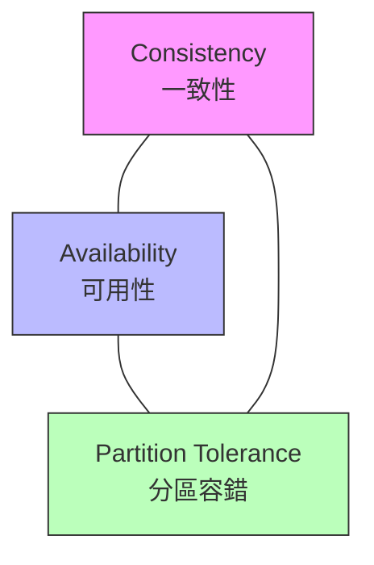

- **CP**：犧牲可用性（MongoDB、HBase）
- **AP**：犧牲一致性（Cassandra、DynamoDB）
- 實務上 Partition Tolerance 必須保證，所以通常在 C 和 A 之間取捨

### 微服務架構

#### 核心元件

- **API Gateway**：統一入口、路由、認證、限流（Kong、AWS API Gateway、Traefik）
- **服務發現 (Service Discovery)**：Consul、Eureka、Kubernetes DNS
- **Service Mesh**：Istio / Linkerd — 處理服務間通訊的 Sidecar Proxy
- **Configuration Center**：Consul KV、Spring Cloud Config、etcd

#### 微服務通訊模式

- **同步**：REST、gRPC
- **非同步**：Message Queue、Event-Driven
- **Saga Pattern**：跨服務分散式交易的編排 / 協調模式

#### 微服務挑戰

- 分散式追蹤 (Distributed Tracing)
- 資料一致性（最終一致性 vs 強一致性）
- 服務依賴管理
- 測試複雜度增加

### 訊息佇列 (Message Queue)

| 系統 | 特點 | 適用場景 |
|------|------|---------|
| RabbitMQ | AMQP 協議、靈活路由、可靠投遞 | 任務佇列、RPC |
| Apache Kafka | 高吞吐、持久化、分區有序 | 事件串流、日誌收集 |
| AWS SQS | 全託管、無需維運 | 解耦微服務 |
| Redis Streams | 輕量、低延遲 | 簡單的事件串流 |

#### 常見模式

- **生產者-消費者 (Producer-Consumer)**：工作佇列、負載分散
- **發布-訂閱 (Pub/Sub)**：事件廣播、多消費者
- **Dead Letter Queue (DLQ)**：處理失敗訊息的隔離佇列
- **冪等性 (Idempotency)**：消費者重複處理同一訊息不產生副作用

### 快取策略

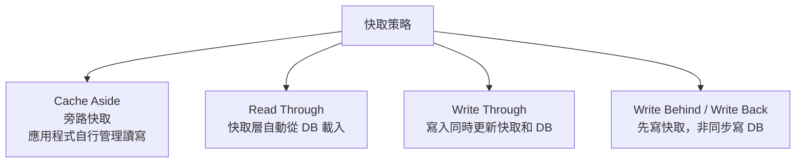

- **快取穿透 (Cache Penetration)**：查詢不存在的資料 → 布隆過濾器 (Bloom Filter)
- **快取雪崩 (Cache Avalanche)**：大量快取同時過期 → 隨機 TTL、熱點預載
- **快取擊穿 (Cache Breakdown)**：熱點 Key 過期瞬間高併發 → 分散式鎖、永不過期策略

### 全文搜尋

- **Elasticsearch / OpenSearch**：
  - 倒排索引 (Inverted Index) 原理
  - Mapping 設計（keyword vs text）
  - 分析器 (Analyzer)：分詞器 (Tokenizer) + 過濾器 (Filter)
  - 查詢 DSL：match、term、bool、aggregations
  - 叢集架構：Node、Shard、Replica
- **中文分詞**：IK Analyzer、Jieba

### 分散式系統概念

- **一致性協議**：Raft、Paxos — Leader 選舉、日誌複製
- **分散式鎖**：Redis（Redlock 演算法）、ZooKeeper、etcd
- **分散式 ID 生成**：Snowflake 演算法、UUID v7、資料庫號段模式
- **冪等設計**：唯一請求 ID + 去重表，確保重試安全

### GraphQL 進階

- **DataLoader**：批次載入、解決 N+1 查詢問題
- **Subscription**：透過 WebSocket 實現即時資料推送
- **Federation**：多個 GraphQL 服務組合成統一 Schema（Apollo Federation）
- **Persisted Queries**：預先註冊查詢，減少傳輸量、提高安全性
- **Schema Stitching vs Federation**：合併多個 Schema 的兩種策略

### gRPC 與 Protocol Buffers

- **Protocol Buffers**：二進位序列化格式，比 JSON 更小更快
- **gRPC 特點**：HTTP/2、雙向串流、強型別、自動產生客戶端程式碼
- **四種通訊模式**：Unary、Server Streaming、Client Streaming、Bidirectional Streaming
- **適用場景**：微服務間通訊、低延遲需求、行動端 API

### 限流與熔斷

#### 限流演算法

| 演算法 | 原理 | 特點 |
|--------|------|------|
| 固定視窗 (Fixed Window) | 時間窗口內計數 | 簡單，但邊界突發 |
| 滑動視窗 (Sliding Window) | 加權計算跨窗口 | 更平滑 |
| 漏桶 (Leaky Bucket) | 固定速率處理 | 平滑流量 |
| 令牌桶 (Token Bucket) | 固定速率產生令牌 | 允許突發 |

#### 熔斷器 (Circuit Breaker)

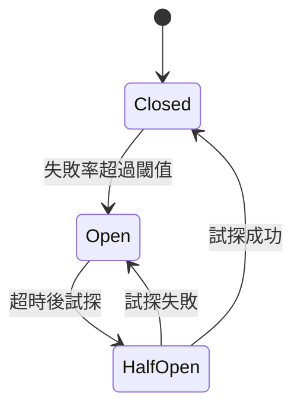

- **工具**：Resilience4j、Hystrix (維護模式)、Sentinel

---

## 資料庫進階

### 效能調校

#### 慢查詢分析

- **EXPLAIN / EXPLAIN ANALYZE**：查看查詢執行計畫
- **關注指標**：Seq Scan vs Index Scan、Rows Estimated vs Actual、Sort Method

#### 索引策略

| 索引類型 | 適用場景 |
|---------|---------|
| B-Tree | 預設，等值/範圍查詢 |
| Hash | 等值查詢 |
| GiST | 幾何、全文搜尋 |
| GIN | 陣列、JSONB、全文搜尋 |
| BRIN | 大表且資料有序 |

- **複合索引**：欄位順序影響效能（最左前綴原則）
- **覆蓋索引 (Covering Index)**：`INCLUDE` 子句避免回表查詢
- **部分索引 (Partial Index)**：只索引符合條件的列

#### 查詢優化技巧

- 避免 `SELECT *`，只查需要的欄位
- 避免在 WHERE 條件的欄位上使用函式
- 適當使用 `EXISTS` 替代 `IN`
- 大表分頁使用 Cursor-based Pagination 替代 OFFSET

### 資料庫複製與分片

#### 複製 (Replication)

- **主從複製 (Primary-Replica)**：寫入主庫，讀取從庫 — 讀寫分離
- **同步 vs 非同步複製**：一致性 vs 效能的取捨
- **串聯複製 (Cascading Replication)**：減少主庫的複製壓力

#### 分片 (Sharding)

- **水平分片**：依某個 Key（如 user_id）將資料分散到不同資料庫
- **分片策略**：
  - Hash-based：均勻分布，但範圍查詢困難
  - Range-based：範圍查詢友好，但可能熱點
  - Directory-based：靈活但引入單點故障
- **挑戰**：跨分片 JOIN、分散式交易、重新分片

### 事務隔離等級

| 隔離等級 | 髒讀 | 不可重複讀 | 幻讀 | 效能 |
|---------|------|-----------|------|------|
| Read Uncommitted | 可能 | 可能 | 可能 | 最高 |
| Read Committed | 防止 | 可能 | 可能 | 高 |
| Repeatable Read | 防止 | 防止 | 可能 | 中 |
| Serializable | 防止 | 防止 | 防止 | 最低 |

- PostgreSQL 預設 Read Committed
- MySQL InnoDB 預設 Repeatable Read（透過 MVCC + Gap Lock 防止幻讀）

### CQRS 與 Event Sourcing

#### CQRS (Command Query Responsibility Segregation)

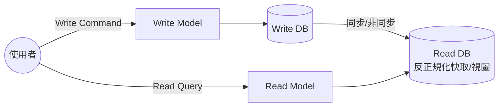

- 讀寫模型獨立擴展
- 讀模型可針對查詢優化（反正規化、物化視圖）

#### Event Sourcing

- 儲存事件序列而非當前狀態
- 可重播事件重建任意時間點的狀態
- 天然的審計日誌
- **挑戰**：事件 Schema 演進、快照 (Snapshot) 策略、最終一致性

### 時序資料庫

- **InfluxDB**：時間序列專用，InfluxQL / Flux 查詢語言
- **TimescaleDB**：PostgreSQL 擴充套件，相容 SQL
- **適用場景**：IoT 感測器資料、監控指標、金融行情

### 資料庫連線池管理

- **連線池原理**：預建連線、重複使用、避免頻繁建立/銷毀
- **參數調校**：最小/最大連線數、連線超時、閒置超時
- **工具**：PgBouncer (PostgreSQL)、ProxySQL (MySQL)、HikariCP (Java)

---

## DevOps 與雲端進階

### Kubernetes (K8s)

#### 核心物件

| 物件 | 用途 |
|------|------|
| Pod | 最小部署單位，一個或多個容器 |
| Deployment | 管理 Pod 的宣告式更新 |
| Service | Pod 的穩定網路端點（ClusterIP / NodePort / LoadBalancer） |
| Ingress | HTTP 路由、SSL 終止 |
| ConfigMap | 非機密配置 |
| Secret | 機密資料（Base64 編碼） |
| HPA | 水平自動擴展（依 CPU / 自訂指標） |
| PVC | 持久化儲存宣告 |

#### 進階概念

- **Namespace**：資源隔離
- **RBAC**：角色型存取控制
- **Helm**：K8s 套件管理器
- **Kustomize**：原生配置客製化
- **Operator Pattern**：自訂控制器管理複雜應用

### Infrastructure as Code (IaC)

- **Terraform**：
  - HCL 語法、State 管理
  - Provider 生態系（AWS / GCP / Azure）
  - Module 重用、Remote State
  - `plan` → `apply` 工作流程
- **Pulumi**：使用通用程式語言（TypeScript/Python/Go）定義基礎設施
- **AWS CDK**：TypeScript/Python 定義 AWS 資源

### 可觀測性三大支柱

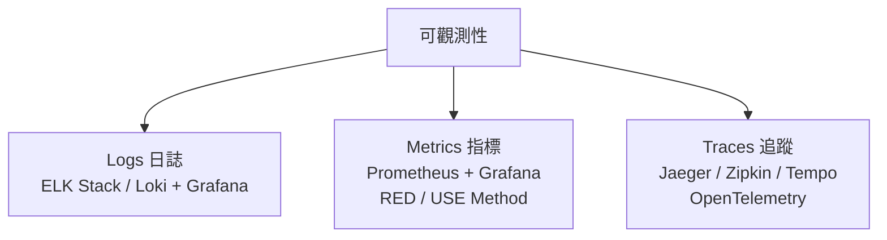

- **ELK Stack**：Elasticsearch + Logstash + Kibana
- **PLG Stack**：Promtail + Loki + Grafana（更輕量）
- **SLA / SLO / SLI**：服務等級協議、目標、指標

### 部署策略

| 策略 | 說明 | 風險 | 回滾速度 |
|------|------|------|---------|
| 滾動更新 (Rolling) | 逐步替換舊版本 | 中 | 中 |
| 藍綠部署 (Blue-Green) | 兩套環境切換 | 低 | 快 |
| 金絲雀部署 (Canary) | 少量流量驗證新版 | 最低 | 快 |
| A/B Testing | 依條件分流 | 低 | 快 |

### CDN 原理與配置

- **邊緣節點快取**：靜態資源就近回應
- **快取策略**：Cache-Control Header、快取失效（Purge）
- **常見 CDN**：CloudFront、Cloudflare、Fastly、Akamai
- **進階功能**：Edge Functions、WAF、DDoS 防護

### 多環境管理策略

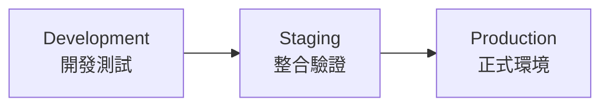

- 環境配置分離（環境變數 / ConfigMap）
- Feature Flags 控制功能開關
- 資料庫 Migration 在各環境的執行順序

### GitOps

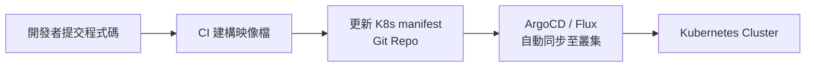

- **原則**：Git 為唯一真實來源 (Single Source of Truth)
- **ArgoCD**：Kubernetes 的 GitOps 持續部署工具
- **Flux**：CNCF 的 GitOps 工具集

### 容災與高可用

- **Multi-AZ**：跨可用區部署，單區故障不影響服務
- **Multi-Region**：跨地區部署，應對區域級故障
- **RTO vs RPO**：
  - RTO (Recovery Time Objective)：可容忍的恢復時間
  - RPO (Recovery Point Objective)：可容忍的資料丟失量
- **DR 策略**：Backup & Restore → Pilot Light → Warm Standby → Hot Standby
- **Chaos Engineering**：Netflix Chaos Monkey，主動注入故障測試韌性

---

## 架構與設計模式

### 常見設計模式

#### 創建型模式

- **Singleton**：確保類別只有一個實例（DI 框架中的 Scope 管理）
- **Factory Method**：將物件建立延遲到子類別
- **Abstract Factory**：建立一系列相關物件
- **Builder**：分步驟建構複雜物件

#### 結構型模式

- **Adapter**：轉換不相容的介面（例如：包裝第三方 SDK）
- **Decorator**：動態新增功能（例如：Middleware 鏈）
- **Proxy**：控制對物件的存取（例如：快取代理、懶載入）
- **Facade**：簡化複雜子系統的介面

#### 行為型模式

- **Observer**：一對多通知機制（Event Emitter、RxJS）
- **Strategy**：封裝可互換的演算法
- **Command**：將請求封裝為物件（支援 undo/redo）
- **Chain of Responsibility**：請求沿處理鏈傳遞（Middleware）

### DDD (Domain-Driven Design)

- **戰略設計**：
  - Bounded Context：明確的領域邊界
  - Ubiquitous Language：統一的領域語言
  - Context Map：Bounded Context 之間的關係
- **戰術設計**：
  - Entity：有唯一識別碼的物件
  - Value Object：由屬性值定義的不可變物件
  - Aggregate：一致性邊界內的物件群
  - Repository：Aggregate 的持久化介面
  - Domain Event：領域中發生的重要事件
  - Domain Service：不屬於任何 Entity 的領域邏輯

### Clean Architecture / Hexagonal Architecture

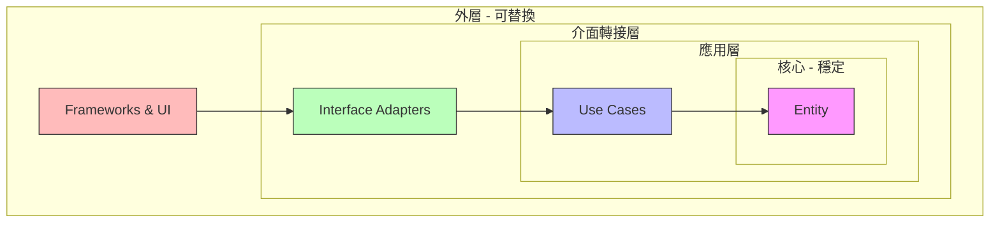

- 依賴方向：由外向內
- 內層不知道外層的存在
- 透過介面反轉依賴（Dependency Inversion）

### SOLID 原則深入

| 原則 | 全名 | 實務意義 |
|------|------|---------|
| S | Single Responsibility | 一個類別只有一個改變的理由 |
| O | Open-Closed | 對擴充開放、對修改封閉 |
| L | Liskov Substitution | 子類別必須能替換父類別 |
| I | Interface Segregation | 介面應該小而精確 |
| D | Dependency Inversion | 依賴抽象而非具體實作 |

### 12-Factor App

1. **Codebase** — 一個程式碼庫、多次部署
2. **Dependencies** — 明確宣告依賴
3. **Config** — 環境變數管理配置
4. **Backing Services** — 視為附加資源
5. **Build, Release, Run** — 嚴格分離建構、發佈、執行階段
6. **Processes** — 以無狀態程序執行
7. **Port Binding** — 透過埠號對外提供服務
8. **Concurrency** — 透過程序模型擴展
9. **Disposability** — 快速啟動、優雅關閉
10. **Dev/Prod Parity** — 開發與生產環境儘量一致
11. **Logs** — 視為事件串流
12. **Admin Processes** — 管理任務作為一次性程序

### API 版本管理策略

| 策略 | 範例 | 優點 | 缺點 |
|------|------|------|------|
| URL Path | `/v1/users` | 直觀、易於路由 | URL 不穩定 |
| Query Param | `/users?version=1` | URL 較乾淨 | 容易忽略 |
| Header | `Accept: application/vnd.api+json;version=1` | URL 穩定 | 不直觀 |
| Content Negotiation | `Accept: application/vnd.company.v1+json` | RESTful | 較複雜 |

---

## 資安進階

### Zero Trust 架構

- **核心原則**：永不信任、始終驗證 (Never Trust, Always Verify)
- **實踐要素**：
  - 身份驗證每一次請求
  - 最小權限原則 (Principle of Least Privilege)
  - 微分段 (Micro-segmentation)
  - 持續監控與驗證

### 權限模型

#### RBAC (Role-Based Access Control)

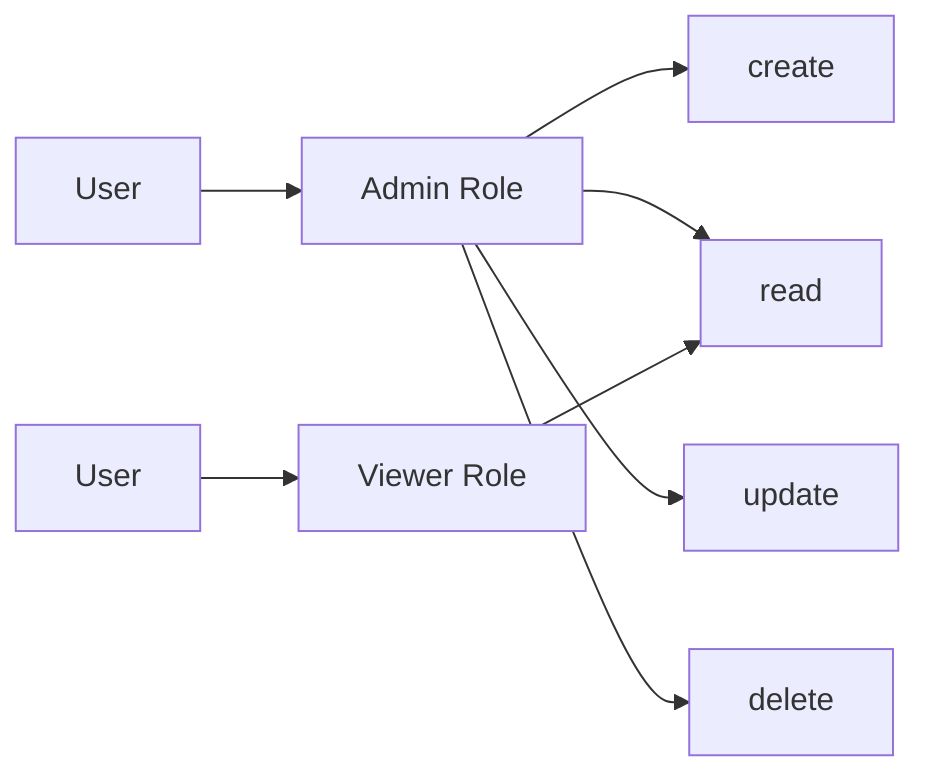

#### ABAC (Attribute-Based Access Control)

- 基於屬性的動態權限判斷
- 屬性來源：使用者（部門、職級）、資源（分類、擁有者）、環境（時間、IP）
- 更靈活但更複雜

### API Security

- **API Key 管理**：金鑰輪換 (Rotation)、Scope 限制
- **Request Signing**：HMAC 簽章驗證請求完整性
- **mTLS (Mutual TLS)**：客戶端與伺服器雙向驗證
- **API Rate Limiting**：依 API Key / IP / User 限流
- **Input Validation**：嚴格的 Schema 驗證（Zod / Joi / JSON Schema）

### 密碼學基礎

| 類型 | 演算法 | 用途 |
|------|--------|------|
| 對稱加密 | AES-256-GCM | 資料加密（快速） |
| 非對稱加密 | RSA、ECDSA | 金鑰交換、數位簽章 |
| 雜湊 | SHA-256、bcrypt、Argon2 | 密碼儲存、完整性檢查 |
| HMAC | HMAC-SHA256 | 訊息認證 |

- **數位簽章**：私鑰簽名、公鑰驗證 — 確保來源與完整性
- **憑證鏈**：Root CA → Intermediate CA → Server Certificate

### OWASP API Security Top 10

1. Broken Object Level Authorization (BOLA)
2. Broken Authentication
3. Broken Object Property Level Authorization
4. Unrestricted Resource Consumption
5. Broken Function Level Authorization
6. Unrestricted Access to Sensitive Business Flows
7. Server Side Request Forgery (SSRF)
8. Security Misconfiguration
9. Improper Inventory Management
10. Unsafe Consumption of APIs

### Secret Management

- **HashiCorp Vault**：動態密鑰、密鑰輪換、審計日誌
- **AWS Secrets Manager / SSM Parameter Store**：雲端密鑰管理
- **GCP Secret Manager**：Google Cloud 密鑰管理
- **原則**：
  - 程式碼中永遠不放密鑰
  - 密鑰加密儲存、傳輸加密
  - 定期輪換
  - 最小權限存取

---

## 軟技能與工程文化

### Code Review 最佳實踐

- **Review 重點**：邏輯正確性 > 安全性 > 效能 > 可讀性 > 風格
- **好的 Review Comment**：指出問題 + 說明原因 + 建議改法
- **Review 禮儀**：
  - 區分「必須修改」和「建議改進」
  - 讚美好的設計決策
  - 對事不對人
- **PR 大小**：單一 PR 不超過 400 行變更，大功能拆分 PR

### 技術文件撰寫

- **ADR (Architecture Decision Record)**：記錄架構決策的背景、選項、結論
- **RFC (Request for Comments)**：提案式技術文件，收集團隊意見
- **Runbook**：運維操作手冊，Step-by-step 處理流程
- **README**：專案入門指南（安裝、使用、貢獻方式）

### 敏捷與專案管理

- **Scrum**：Sprint Planning → Daily Standup → Sprint Review → Retrospective
- **Kanban**：WIP Limit、Lead Time、Cycle Time
- **估時技巧**：Story Points、Planning Poker、T-Shirt Sizing
- **技術 Spike**：限時調研，降低不確定性

### 系統設計面試準備

- **流程**：
  1. 釐清需求（功能需求 + 非功能需求）
  2. 粗估（QPS、儲存量、頻寬）
  3. 高層級設計（畫架構圖）
  4. 深入設計（關鍵元件）
  5. 討論瓶頸與擴展
- **常見題目**：URL Shortener、Chat System、News Feed、Rate Limiter

### 技術債管理

- **分類**：刻意的 vs 無意的、謹慎的 vs 魯莽的
- **管理策略**：
  - 記錄技術債（Tech Debt Register）
  - 每個 Sprint 分配固定比例處理技術債
  - 與 Product Owner 溝通技術債的業務風險
  - Boy Scout Rule：離開時讓程式碼比來時更好

### 效能預算 (Performance Budget)

- **指標預算**：LCP < 2.5s、JS Bundle < 200KB gzipped
- **執行方式**：
  - CI 中加入 Lighthouse 檢查
  - webpack-bundle-analyzer 監控 Bundle 大小
  - 超過預算時 Build 失敗

---

## 學習路徑建議

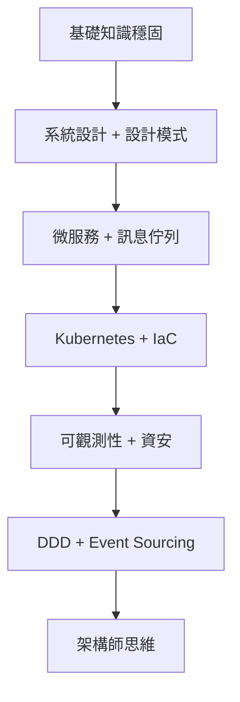

---

## 推薦學習資源

### 書籍

- **Designing Data-Intensive Applications** (Martin Kleppmann) — 分散式系統聖經
- **Clean Architecture** (Robert C. Martin) — 架構設計原則
- **System Design Interview** (Alex Xu) — 系統設計面試
- **Domain-Driven Design** (Eric Evans) — DDD 經典
- **Release It!** (Michael Nygard) — 生產環境系統設計

### 線上資源

- **roadmap.sh** — 全端學習路線圖
- **System Design Primer (GitHub)** — 系統設計入門
- **ByteByteGo Newsletter** (Alex Xu) — 系統設計圖解
- **Martin Fowler's Blog** — 架構與設計模式
- **The Pragmatic Engineer Newsletter** — 資深工程師觀點
- **OWASP** — Web 安全知識庫
