# 全端工程師進階知識 — 面試準備

> 面向全端/後端工程師的系統設計與技術面試準備材料。
> 架構與設計模式（GoF、SOLID、DDD、Clean Architecture、12-Factor App 等）請參考 [架構與設計模式.md](架構與設計模式.md)

---

## 目錄

1. [系統設計面試](#系統設計面試)
2. [後端進階](#後端進階)
3. [資料庫進階](#資料庫進階)
4. [前端進階](#前端進階)
5. [DevOps 與雲端進階](#devops-與雲端進階)
6. [資安進階](#資安進階)

---

## 系統設計面試

### 面試流程

1. **釐清需求**（3-5 分鐘）
   - 功能需求：核心功能有哪些？
   - 非功能需求：延遲、可用性、一致性、擴展性
   - 使用者規模：DAU、QPS、讀寫比例
2. **粗估**（3-5 分鐘）
   - QPS 計算：DAU × 平均操作次數 ÷ 86400
   - 儲存量計算：每筆資料大小 × 每日新增量 × 保留天數
   - 頻寬估算
3. **高層級設計**（10-15 分鐘）
   - 畫出核心架構圖（Client → API Gateway → Services → DB）
   - 確認 API 設計（RESTful endpoints）
   - 確認資料模型（核心 Schema）
4. **深入設計**（10-15 分鐘）
   - 針對面試官關注的元件展開
   - 討論具體演算法或資料結構選擇
5. **討論瓶頸與擴展**（5 分鐘）
   - 單點故障如何解決
   - 瓶頸在哪裡、如何水平擴展

### 常見題目與考點

| 題目 | 核心考點 |
|------|---------|
| URL Shortener | 雜湊/編碼、讀寫比例、快取、301 vs 302 |
| Chat System | WebSocket、訊息佇列、已讀回執、推播 |
| News Feed | Fan-out on write vs read、排序演算法、快取 |
| Rate Limiter | 令牌桶/滑動視窗、分散式限流、Redis |
| Notification System | 多管道推播、重試機制、模板引擎 |
| Search Autocomplete | Trie、前綴搜尋、排名演算法、快取 |
| Distributed File Storage | 分片、複製、一致性雜湊、元資料管理 |

### 效能預算 (Performance Budget)

- **指標預算**：LCP < 2.5s、JS Bundle < 200KB gzipped
- **執行方式**：
  - CI 中加入 Lighthouse 檢查
  - webpack-bundle-analyzer 監控 Bundle 大小
  - 超過預算時 Build 失敗

---

## 後端進階

### 擴展策略

- **垂直擴展 (Scale Up)**：增加單機資源（CPU、RAM）— 簡單但有上限
- **水平擴展 (Scale Out)**：增加更多機器 — 需處理狀態共享、資料一致性

### 負載平衡 (Load Balancing)

- **演算法**：Round Robin、Weighted Round Robin、Least Connections、IP Hash
- **層級**：L4（TCP/UDP）vs L7（HTTP），L7 可根據 URL/Header 路由
- **工具**：Nginx、HAProxy、AWS ALB/NLB

### CAP 理論

分散式系統只能同時滿足三者中的兩個：

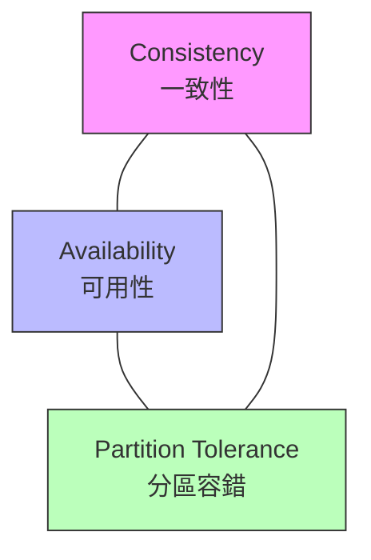

- **CP**：犧牲可用性（MongoDB、HBase）
- **AP**：犧牲一致性（Cassandra、DynamoDB）
- 實務上 Partition Tolerance 必須保證，所以通常在 C 和 A 之間取捨

### 微服務架構

#### 核心元件

- **API Gateway**：統一入口、路由、認證、限流（Kong、AWS API Gateway、Traefik）
- **服務發現 (Service Discovery)**：Consul、Eureka、Kubernetes DNS
- **Service Mesh**：Istio / Linkerd — 處理服務間通訊的 Sidecar Proxy
- **Configuration Center**：Consul KV、Spring Cloud Config、etcd

#### 微服務通訊模式

- **同步**：REST、gRPC
- **非同步**：Message Queue、Event-Driven
- **Saga Pattern**：跨服務分散式交易的編排 / 協調模式

#### 微服務挑戰

- 分散式追蹤 (Distributed Tracing)
- 資料一致性（最終一致性 vs 強一致性）
- 服務依賴管理
- 測試複雜度增加

#### 服務拆分原則

- **按業務能力拆分**：每個服務對應一個業務領域（訂單、支付、庫存）
- **按子域拆分 (Bounded Context)**：依領域邊界劃分服務
- **拆分信號**：團隊需獨立部署、不同擴展需求、不同技術棧需求
- **反模式**：過早拆分、分散式單體 (Distributed Monolith)、共用資料庫

#### 分散式交易

| 方案 | 一致性 | 效能 | 複雜度 | 適用場景 |
|------|--------|------|--------|---------|
| 2PC (Two-Phase Commit) | 強一致 | 低 | 中 | 資料庫層級交易 |
| TCC (Try-Confirm-Cancel) | 強一致 | 中 | 高 | 業務層級需即時確認 |
| Saga（編排式） | 最終一致 | 高 | 中 | 長流程業務（訂單→支付→出貨） |
| Saga（協調式） | 最終一致 | 高 | 低 | 簡單跨服務流程 |
| 本地訊息表 | 最終一致 | 高 | 低 | 非同步可接受的場景 |

**Saga Pattern 深入**：

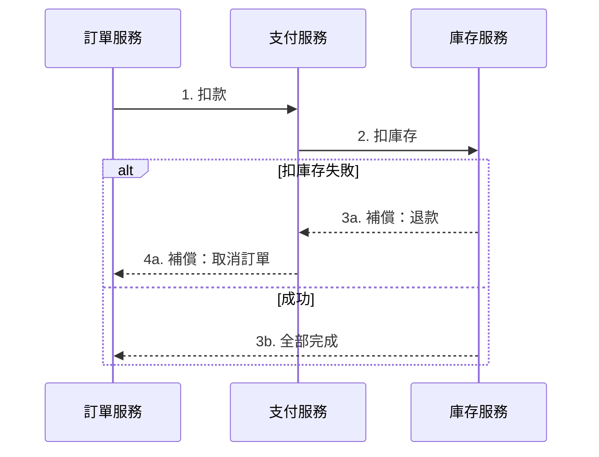

- **編排式 (Orchestration)**：中央協調器控制流程，易追蹤但有單點
- **協調式 (Choreography)**：各服務透過事件自行協作，去中心化但難追蹤

#### 服務治理

**熔斷 (Circuit Breaker)**：

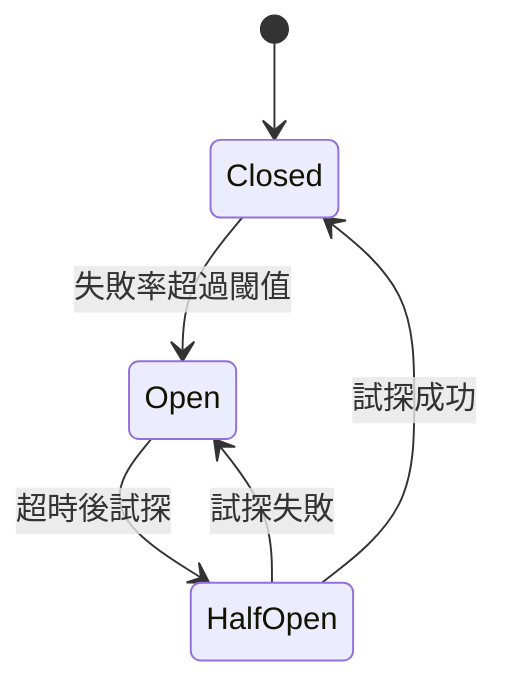

- **Closed**：正常放行，監控失敗率
- **Open**：直接拒絕請求，避免打故障服務
- **Half-Open**：放行少量請求測試是否恢復
- **工具**：Resilience4j、Sentinel

**降級 (Degradation)**：非核心服務故障時，回傳預設值或快取資料

**限流 (Rate Limiting)**：

| 演算法 | 原理 | 特點 |
|--------|------|------|
| 固定視窗 (Fixed Window) | 時間窗口內計數 | 簡單，但邊界突發 |
| 滑動視窗 (Sliding Window) | 加權計算跨窗口 | 更平滑 |
| 漏桶 (Leaky Bucket) | 固定速率處理 | 平滑流量 |
| 令牌桶 (Token Bucket) | 固定速率產生令牌 | 允許突發 |

- 工具：Nginx `limit_req`、Redis + Lua、API Gateway 內建

**重試策略**：
- 指數退避 (Exponential Backoff) + 抖動 (Jitter)
- 最大重試次數限制
- 冪等保證（避免重複處理）

### 訊息佇列 (Message Queue)

| 系統 | 特點 | 適用場景 |
|------|------|---------|
| RabbitMQ | AMQP 協議、靈活路由、可靠投遞 | 任務佇列、RPC |
| Apache Kafka | 高吞吐、持久化、分區有序 | 事件串流、日誌收集 |
| AWS SQS | 全託管、無需維運 | 解耦微服務 |
| Redis Streams | 輕量、低延遲 | 簡單的事件串流 |

#### 常見模式

- **生產者-消費者 (Producer-Consumer)**：工作佇列、負載分散
- **發布-訂閱 (Pub/Sub)**：事件廣播、多消費者
- **Dead Letter Queue (DLQ)**：處理失敗訊息的隔離佇列
- **冪等性 (Idempotency)**：消費者重複處理同一訊息不產生副作用

### 快取策略

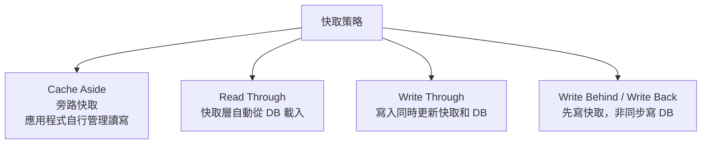

- **快取穿透 (Cache Penetration)**：查詢不存在的資料 → 布隆過濾器 (Bloom Filter)
- **快取雪崩 (Cache Avalanche)**：大量快取同時過期 → 隨機 TTL、熱點預載
- **快取擊穿 (Cache Breakdown)**：熱點 Key 過期瞬間高併發 → 分散式鎖、永不過期策略

### 全文搜尋

- **Elasticsearch / OpenSearch**：
  - 倒排索引 (Inverted Index) 原理
  - Mapping 設計（keyword vs text）
  - 分析器 (Analyzer)：分詞器 (Tokenizer) + 過濾器 (Filter)
  - 查詢 DSL：match、term、bool、aggregations
  - 叢集架構：Node、Shard、Replica
- **中文分詞**：IK Analyzer、Jieba

### 分散式系統概念

- **一致性協議**：Raft、Paxos — Leader 選舉、日誌複製
- **分散式鎖**：Redis（Redlock 演算法）、ZooKeeper、etcd
- **分散式 ID 生成**：Snowflake 演算法、UUID v7、資料庫號段模式
- **冪等設計**：唯一請求 ID + 去重表，確保重試安全

### 鎖與高併發處理

#### 鎖的分類

| 分類維度 | 類型 | 說明 |
|---------|------|------|
| 依策略 | 樂觀鎖 / 悲觀鎖 | 樂觀鎖假設無衝突用版本號檢測；悲觀鎖先加鎖再操作 |
| 依讀寫 | 共享鎖 (S) / 排他鎖 (X) | 共享鎖允許多讀並行；排他鎖獨佔寫入 |
| 依粒度 | 行鎖 / 表鎖 / 頁鎖 | 粒度越小併發越高，但開銷越大 |
| 依範圍 | 本地鎖 / 分散式鎖 | 單機用 Mutex/synchronized；跨機器用 Redis/ZK |

#### 樂觀鎖 vs 悲觀鎖

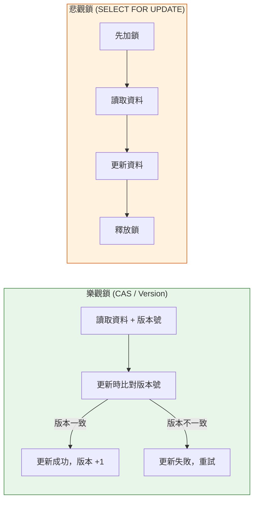

| | 樂觀鎖 | 悲觀鎖 |
|---|--------|--------|
| **實現** | 版本號 / CAS / 時間戳 | `SELECT ... FOR UPDATE` / Mutex |
| **適用場景** | 讀多寫少、衝突率低 | 寫多讀少、衝突率高 |
| **優點** | 不阻塞讀取、吞吐量高 | 保證一致性、邏輯簡單 |
| **缺點** | 高衝突時大量重試 | 可能死鎖、併發度低 |

#### 資料庫鎖 (MySQL InnoDB)

| 鎖類型 | 鎖定範圍 | 說明 |
|--------|---------|------|
| Record Lock | 單行記錄 | 精確鎖定索引上的一行 |
| Gap Lock | 索引間隙 | 防止幻讀，鎖定兩個索引值之間的間隙 |
| Next-Key Lock | Record + Gap | InnoDB 預設，Record Lock + 左側 Gap Lock |
| Intent Lock | 表級意向鎖 | 快速判斷表中是否有行鎖，避免逐行檢查 |

**死鎖處理**：
- InnoDB 自動偵測死鎖，回滾較小的交易
- 預防：固定加鎖順序、縮小交易範圍、設定鎖等待超時

#### 分散式鎖

| 實現方式 | 優點 | 缺點 |
|---------|------|------|
| **Redis (SETNX + TTL)** | 效能高、實現簡單 | 主從切換可能丟鎖 |
| **Redis Redlock** | 多節點容錯 | 爭議性高（Kleppmann 的批評） |
| **ZooKeeper** | 強一致、可靠 | 效能較低、運維複雜 |
| **etcd** | 強一致 (Raft)、輕量 | 效能中等 |

**Redis 分散式鎖注意事項**：
- 設定合理 TTL，避免死鎖
- 解鎖時驗證持有者（Lua 腳本保證原子性）
- 考慮鎖續期 (Watchdog) 機制（如 Redisson）

#### 高併發場景：秒殺系統

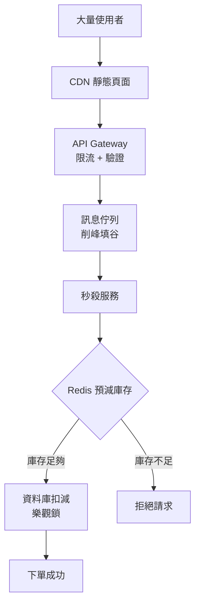

**關鍵設計**：
- **前端防重**：按鈕防抖、驗證碼
- **閘道限流**：令牌桶 / 滑動視窗
- **削峰填谷**：請求先入 MQ，消費者按能力處理
- **Redis 預減庫存**：原子操作 `DECR`，快速判斷
- **資料庫兜底**：樂觀鎖 `WHERE stock > 0` 保證不超賣
- **冪等保證**：訂單唯一 ID 去重

#### 併發模型

| 模型 | 語言/框架 | 說明 |
|------|----------|------|
| 執行緒 + 鎖 | Java, C++ | 傳統模型，需手動管理同步 |
| 協程 (Coroutine) | Kotlin, Go, Python | 輕量級，非阻塞 I/O |
| Actor Model | Akka, Erlang | 每個 Actor 有獨立狀態，透過訊息通訊 |
| CSP | Go (goroutine + channel) | 透過 Channel 通訊，不共享記憶體 |
| 事件迴圈 | Node.js, Nginx | 單執行緒 + 非阻塞 I/O + 事件驅動 |
| Reactive | RxJava, Project Reactor | 響應式串流，背壓控制 |

#### 背壓 (Backpressure)

當生產者速度 > 消費者速度時的處理策略：

| 策略 | 說明 | 使用場景 |
|------|------|---------|
| **Buffer** | 暫存在緩衝區 | 短暫突發流量 |
| **Drop** | 丟棄多餘資料 | 即時串流（可容忍丟失） |
| **Latest** | 只保留最新資料 | UI 更新、感測器資料 |
| **Error** | 拋出錯誤 | 不可丟失的場景 |
| **Request-based** | 消費者主動拉取 | Reactive Streams 規範 |

### GraphQL 進階

- **DataLoader**：批次載入、解決 N+1 查詢問題
- **Subscription**：透過 WebSocket 實現即時資料推送
- **Federation**：多個 GraphQL 服務組合成統一 Schema（Apollo Federation）
- **Persisted Queries**：預先註冊查詢，減少傳輸量、提高安全性
- **Schema Stitching vs Federation**：合併多個 Schema 的兩種策略

### gRPC 與 Protocol Buffers

- **Protocol Buffers**：二進位序列化格式，比 JSON 更小更快
- **gRPC 特點**：HTTP/2、雙向串流、強型別、自動產生客戶端程式碼
- **四種通訊模式**：Unary、Server Streaming、Client Streaming、Bidirectional Streaming
- **適用場景**：微服務間通訊、低延遲需求、行動端 API

### 即時通訊技術

#### 技術比較

| 技術 | 方向 | 協議 | 連線方式 | 適用場景 |
|------|------|------|---------|---------|
| Short Polling | Client → Server | HTTP | 反覆建立 | 簡單狀態檢查 |
| Long Polling | Client → Server | HTTP | 掛起等待 | 即時通知（相容性好） |
| SSE | Server → Client | HTTP | 長連線 | 串流推送、AI 回應、即時動態 |
| WebSocket | 雙向 | WS/WSS | 長連線 | 聊天室、即時協作、遊戲 |
| gRPC Streaming | 雙向 | HTTP/2 | 長連線 | 微服務間串流通訊 |

#### SSE (Server-Sent Events)

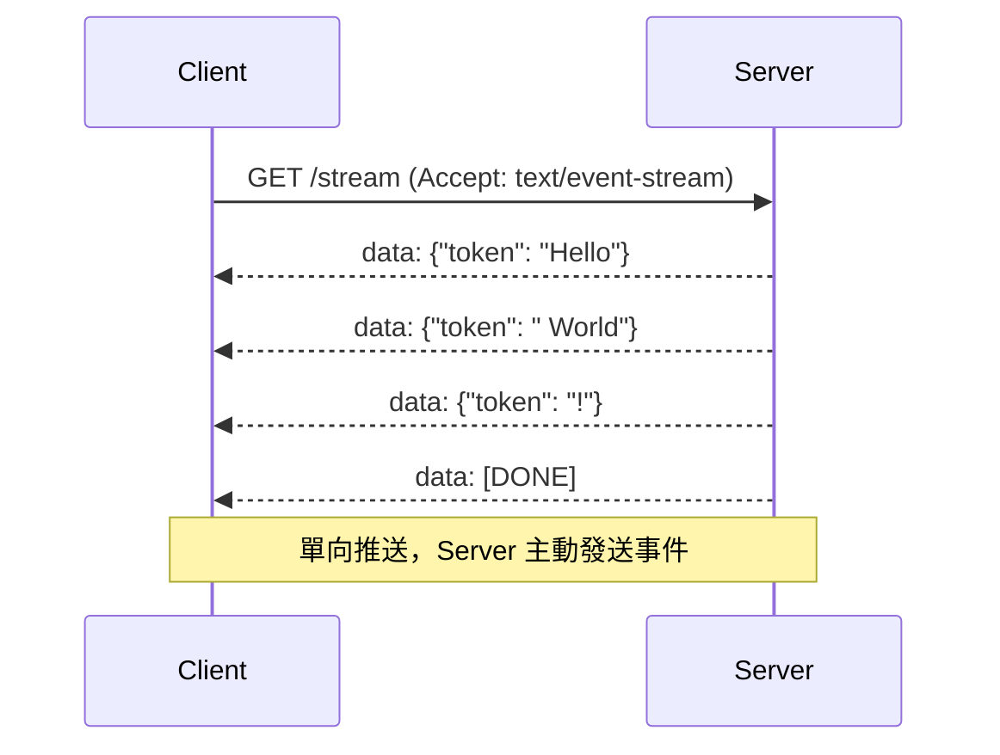

**協議格式**：

```
event: message
id: 1
retry: 3000
data: {"content": "Hello World"}
```

| 欄位 | 說明 |
|------|------|
| `data` | 事件資料（每行一個 `data:` 前綴） |
| `event` | 自定義事件名稱（預設 `message`） |
| `id` | 事件 ID，斷線重連時透過 `Last-Event-ID` 續傳 |
| `retry` | 建議重連間隔（毫秒） |

**SSE vs WebSocket**：

| | SSE | WebSocket |
|---|-----|-----------|
| **方向** | 單向（Server → Client） | 雙向 |
| **協議** | HTTP | WS（需要 Upgrade） |
| **自動重連** | 內建 | 需自行實現 |
| **資料格式** | 純文字 (UTF-8) | 文字 + 二進位 |
| **防火牆穿透** | 友好（標準 HTTP） | 可能被阻擋 |
| **適用場景** | AI 串流回應、通知推送、股價 | 聊天、協作編輯、遊戲 |

**後端實現 (Node.js)**：

```javascript
app.get('/stream', (req, res) => {
  res.setHeader('Content-Type', 'text/event-stream');
  res.setHeader('Cache-Control', 'no-cache');
  res.setHeader('Connection', 'keep-alive');

  const send = (data) => res.write(`data: ${JSON.stringify(data)}\n\n`);

  send({ token: 'Hello' });
  // 持續推送事件...
});
```

**後端實現 (Spring Boot)**：

```java
@GetMapping(value = "/stream", produces = MediaType.TEXT_EVENT_STREAM_VALUE)
public Flux<ServerSentEvent<String>> stream() {
    return Flux.interval(Duration.ofSeconds(1))
        .map(i -> ServerSentEvent.<String>builder()
            .id(String.valueOf(i))
            .data("message " + i)
            .build());
}
```

**前端使用**：

```javascript
const source = new EventSource('/stream');
source.onmessage = (event) => {
  const data = JSON.parse(event.data);
  // 逐步渲染串流資料
};
source.onerror = () => source.close();
```

**典型應用**：
- ChatGPT / Claude 的逐字回應
- 即時搜尋結果串流
- 股價行情推送
- CI/CD 建構日誌即時輸出

#### WebSocket

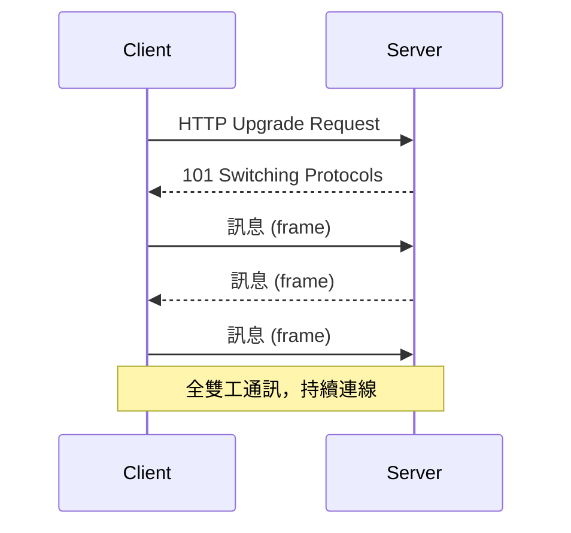

**連線管理**：
- **心跳機制 (Heartbeat)**：定期 Ping/Pong 偵測連線狀態
- **斷線重連**：指數退避重連策略
- **連線數上限**：單機通常數萬，受 file descriptor 限制

**規模化架構**：

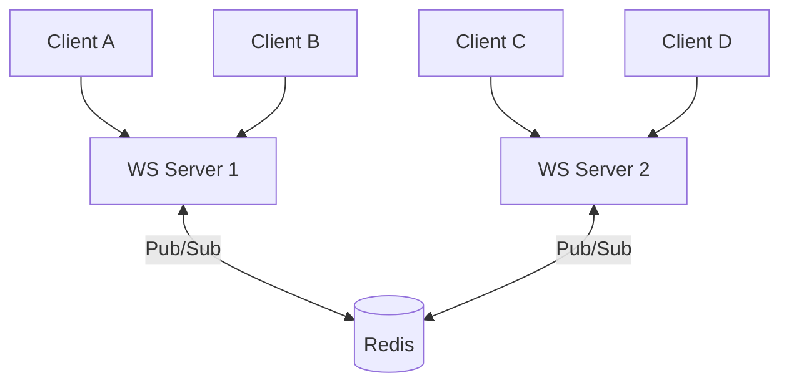

- **Sticky Session**：同一用戶的連線固定到同一台 Server（透過 LB）
- **Redis Pub/Sub**：跨 Server 廣播訊息
- **專用 WebSocket 服務**：與業務 API 分離部署，獨立擴展

#### Long Polling

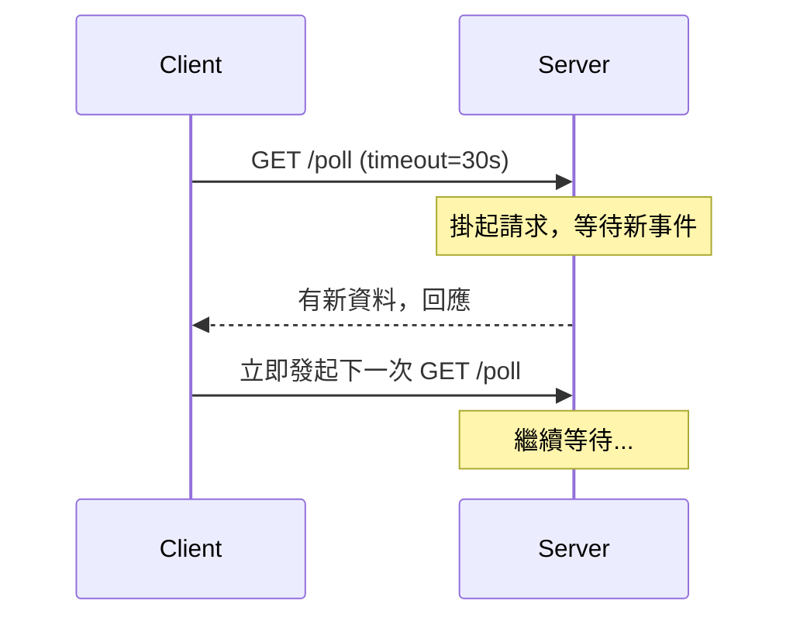

- 相容性最好，適合無法使用 SSE/WebSocket 的環境
- 缺點：延遲較高、伺服器資源消耗大（大量掛起的連線）
- 實際案例：早期的 Facebook 即時通知

### 作業系統與 Linux

#### Process vs Thread vs Coroutine

| 概念 | 記憶體空間 | 切換成本 | 建立成本 | 適用場景 |
|------|----------|---------|---------|---------|
| **Process** | 獨立 | 高（需切換頁表） | 高 | 隔離性需求（多服務、Worker） |
| **Thread** | 共享（同 Process 內） | 中（共享位址空間） | 中 | 並行任務（Java Thread Pool） |
| **Coroutine** | 共享（同 Thread 內） | 極低（用戶態切換） | 極低 | I/O 密集（Kotlin/Go/Node.js） |

#### I/O 模型

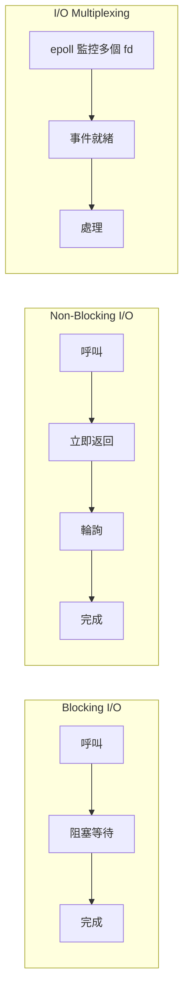

| 模型 | 說明 | 代表 |
|------|------|------|
| Blocking I/O | 呼叫後阻塞直到完成 | 傳統 JDBC |
| Non-Blocking I/O | 立即返回，需輪詢結果 | Java NIO |
| I/O Multiplexing | 一個執行緒監控多個 fd | select / poll / epoll |
| Signal-driven I/O | 核心通知就緒 | 較少使用 |
| Async I/O | 完全非同步，完成後回調 | io_uring (Linux)、IOCP (Windows) |

**epoll vs select vs poll**：

| | select | poll | epoll |
|---|--------|------|-------|
| fd 上限 | 1024（預設） | 無限制 | 無限制 |
| 每次呼叫 | O(n) 掃描全部 fd | O(n) 掃描全部 fd | O(1) 事件驅動 |
| 觸發模式 | Level Triggered | Level Triggered | LT + Edge Triggered |
| 應用 | 相容性場景 | 少量 fd | **Linux 高併發首選**（Nginx、Redis） |

#### Memory 管理

- **Stack**：函式呼叫、區域變數，自動管理，大小有限（通常 1-8MB）
- **Heap**：動態分配（malloc / new），需手動或 GC 管理
- **Virtual Memory**：每個 Process 有獨立的虛擬位址空間，OS 透過 Page Table 映射到物理記憶體
- **Page Fault**：存取未載入的 Page 時觸發，OS 從磁碟載入到記憶體

**GC 機制比較**：

| 語言 | GC 策略 | 特點 |
|------|---------|------|
| Java | 分代 GC（Young → Old）、G1、ZGC | 成熟，ZGC 停頓 < 1ms |
| Go | 三色標記 + 並行 GC | 低延遲，停頓 < 1ms |
| Python | 引用計數 + 循環偵測 | 即時回收，但循環引用需額外處理 |
| Node.js | V8 分代 GC | 類似 Java，但單執行緒 |

#### File Descriptor

- Unix 中一切皆檔案：普通檔案、Socket、Pipe 都是 fd
- 每個 Process 有 fd 上限：`ulimit -n`（預設 1024，高併發需調大）
- Socket 就是一個 fd，`epoll` 監控的就是 fd 集合
- 高併發 WebSocket Server 每個連線佔一個 fd → 需調整系統限制

#### Linux 效能排查指令

| 指令 | 用途 | 範例 |
|------|------|------|
| `top` / `htop` | CPU、記憶體即時監控 | `htop` |
| `vmstat` | 記憶體、I/O、CPU 概況 | `vmstat 1 5` |
| `iostat` | 磁碟 I/O 統計 | `iostat -x 1` |
| `netstat` / `ss` | 網路連線狀態 | `ss -tlnp` |
| `lsof` | 查看 Process 開啟的 fd | `lsof -p <pid>` |
| `strace` | 追蹤 System Call | `strace -p <pid>` |
| `dstat` | 綜合資源統計 | `dstat -cdnm` |
| `perf` | CPU profiling | `perf top` |
| `free -h` | 記憶體使用 | `free -h` |
| `df -h` / `du -sh` | 磁碟空間 | `df -h` |

### 網路協議深入

#### TCP 三次握手 / 四次揮手

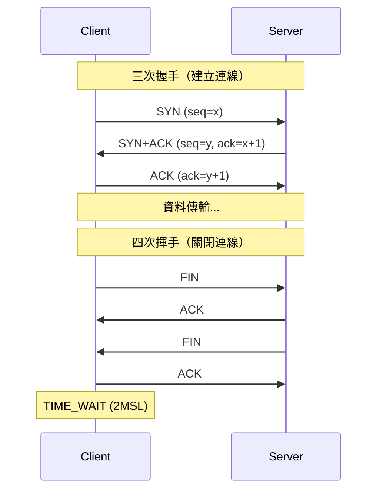

- **為什麼三次握手**：確保雙方都能收發。兩次不夠（Server 不確定 Client 能收到）
- **TIME_WAIT**：主動關閉方需等待 2MSL（通常 60 秒），確保最後一個 ACK 送達。高併發短連線場景會大量 TIME_WAIT，可用 `tcp_tw_reuse` 優化

#### TCP vs UDP

| | TCP | UDP |
|---|-----|-----|
| 連線 | 需要建立連線（三次握手） | 無連線 |
| 可靠性 | 可靠（重傳、排序、流控） | 不可靠（可能丟包、亂序） |
| 順序 | 保證順序 | 不保證 |
| 速度 | 較慢（握手 + ACK） | 更快（無額外開銷） |
| 適用 | HTTP、API、檔案傳輸 | DNS、視訊串流、遊戲、VoIP |

#### HTTP 版本演進

| | HTTP/1.1 | HTTP/2 | HTTP/3 |
|---|---------|--------|--------|
| 傳輸層 | TCP | TCP | **QUIC（基於 UDP）** |
| 多路複用 | 不支援（管線化有限） | 支援（共用一個 TCP） | 支援（各 Stream 獨立） |
| 隊頭阻塞 | HTTP 層 + TCP 層 | TCP 層仍有 | **無**（Stream 獨立） |
| 握手延遲 | TCP + TLS（3 RTT） | TCP + TLS（3 RTT） | **0-1 RTT**（已建立過的連線） |
| Header 壓縮 | 無 | HPACK | QPACK |

#### TLS 握手流程

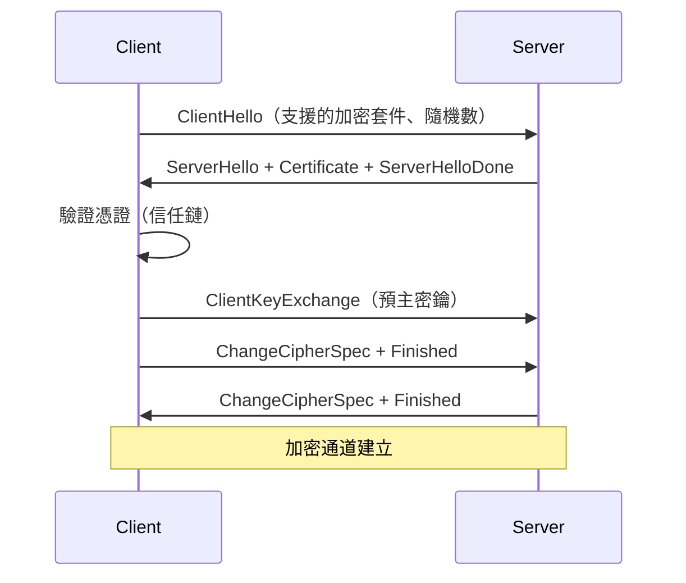

- **TLS 1.3 改進**：握手從 2-RTT 縮減為 1-RTT，移除不安全的加密套件（RC4、SHA-1 等）
- **憑證鏈驗證**：Server Certificate → Intermediate CA → Root CA（瀏覽器/OS 內建信任）

#### 網路除錯工具

| 工具 | 用途 | 範例 |
|------|------|------|
| `curl -v` | HTTP 請求/回應詳情 | `curl -v https://api.example.com` |
| `tcpdump` | 抓取網路封包 | `tcpdump -i eth0 port 443` |
| `dig` / `nslookup` | DNS 查詢 | `dig example.com` |
| `traceroute` / `mtr` | 追蹤路由路徑 | `mtr example.com` |
| `openssl s_client` | 測試 TLS 連線與憑證 | `openssl s_client -connect host:443` |
| `ab` / `wrk` | HTTP 壓力測試 | `wrk -t4 -c100 -d30s http://localhost` |

### 認證授權進階

#### SSO (Single Sign-On)

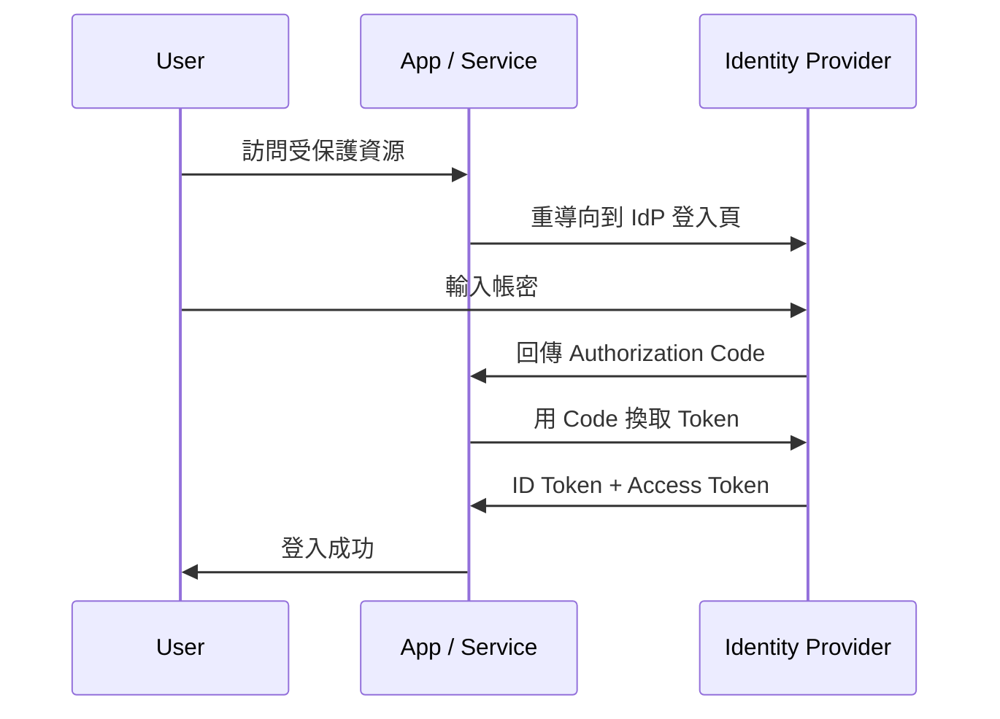

#### OIDC vs SAML vs OAuth 2.0

| | OAuth 2.0 | OIDC | SAML |
|---|-----------|------|------|
| 定位 | 授權框架 | 身份認證（建構在 OAuth 上） | 身份認證 |
| Token 格式 | Access Token（任意格式） | ID Token（JWT） | XML Assertion |
| 資料格式 | JSON | JSON (JWT) | XML |
| 適用場景 | API 授權、第三方登入 | 現代 Web / Mobile SSO | 企業級 SSO（如公司內網） |
| 複雜度 | 中 | 中 | 高 |

**OIDC 核心概念**：
- **ID Token**：JWT 格式，包含使用者身份資訊（sub, email, name）
- **UserInfo Endpoint**：用 Access Token 取得更多使用者資訊
- **Discovery**：`/.well-known/openid-configuration` 自動發現 IdP 端點

#### Token 管理（後端實作）

**JWT 結構**：`Header.Payload.Signature`

```
Header:  {"alg": "RS256", "typ": "JWT"}
Payload: {"sub": "user123", "exp": 1700000000, "iss": "auth.example.com"}
Signature: RSA-SHA256(base64(header) + "." + base64(payload), privateKey)
```

| 面向 | Access Token | Refresh Token |
|------|-------------|---------------|
| 有效期 | 15 分鐘 ~ 1 小時 | 7 ~ 30 天 |
| 儲存 | 不需要存（JWT 自驗證）或 Redis | 資料庫（可撤銷） |
| 驗證 | 驗簽 + 檢查 exp / iss | 查詢資料庫比對 |
| 撤銷 | 等待過期 或 黑名單（Redis） | 直接刪除記錄 |

**Refresh Token Rotation**：
- 每次刷新時發放新的 Refresh Token，舊的立即失效
- 偵測到舊 Refresh Token 被使用 → 可能被盜用 → 撤銷該使用者所有 Token
- 防止 Token 被竊取後長期使用

#### 多租戶認證 (Multi-tenancy)

| 隔離策略 | 說明 | 隔離度 | 運維成本 |
|---------|------|--------|---------|
| 共用 DB + `tenant_id` 欄位 | 所有租戶同一張表，WHERE 過濾 | 低 | 低 |
| 共用 DB + 各租戶獨立 Schema | 每個租戶獨立 Schema | 中 | 中 |
| 各租戶獨立 DB | 完全隔離 | 高 | 高 |

### 推播系統後端架構

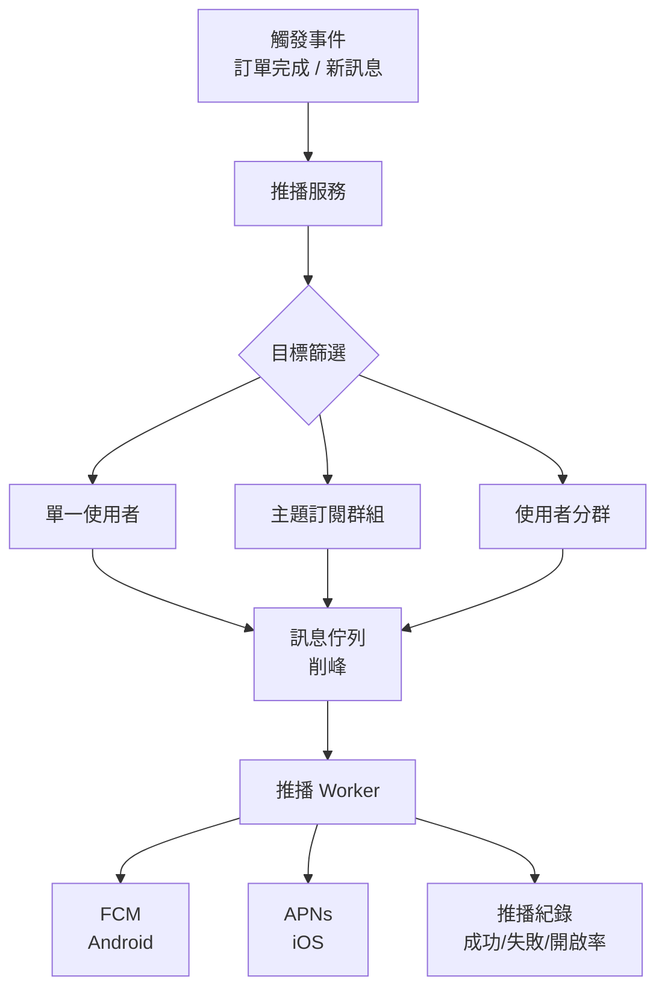

**後端關鍵設計**：

| 面向 | 說明 |
|------|------|
| **Token 管理** | 儲存裝置 FCM/APNs Token 並綁定使用者。Token 失效（平台回傳 410）時自動清除 |
| **批次推播** | FCM 支援單次推送 500 個 Token。大量推播用 Topic 或 MQ 分批處理 |
| **排程推播** | 用 Job Queue（Bull / Sidekiq / Celery）排定時間推播 |
| **推播模板** | 多語系模板，依使用者語言動態替換內容 |
| **頻率控制** | 每個使用者單位時間內推播上限，避免騷擾導致關閉權限 |
| **推播追蹤** | 記錄送達/開啟/點擊率，供產品分析 |

**FCM 後端發送 (Node.js)**：

```javascript
const admin = require('firebase-admin');

await admin.messaging().send({
  token: userFcmToken,
  notification: { title: '訂單完成', body: '您的訂單 #1234 已出貨' },
  data: { orderId: '1234', type: 'order_shipped' },
  android: { priority: 'high' },
  apns: { payload: { aps: { sound: 'default' } } }
});
```

### IAP 後端驗證與訂閱管理

#### 收據驗證流程

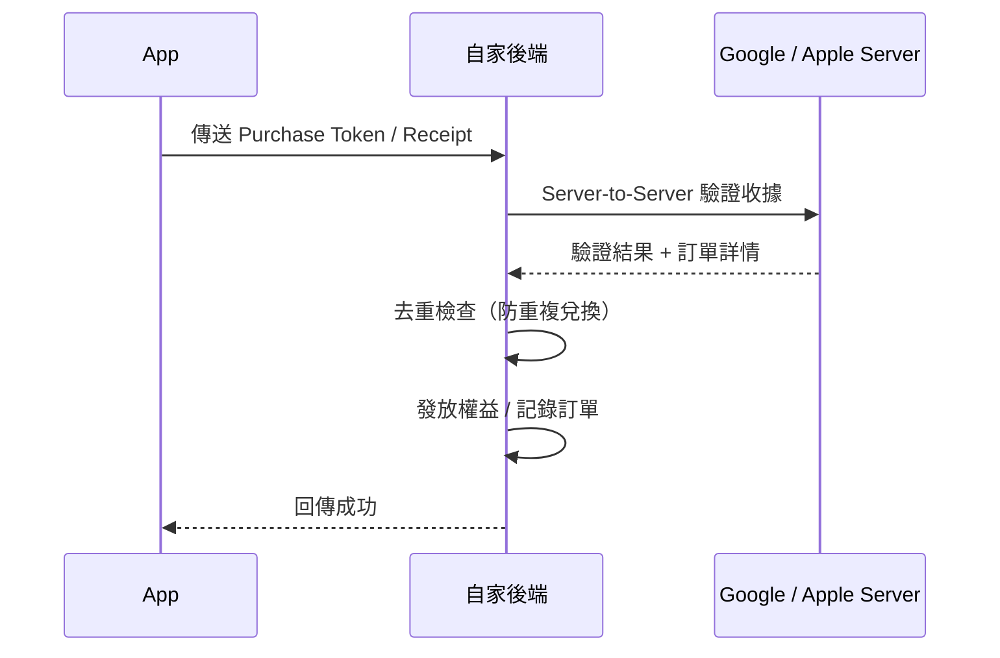

**為何不能只在 App 端驗證**：
- App 端可被竄改，偽造購買結果
- 後端直接跟 Google/Apple Server 確認才可靠
- 訂閱狀態變更（續訂、退款）由平台 Server 主動通知後端

#### 訂閱 Webhook 處理

| 平台 | Webhook 機制 | 關鍵事件 |
|------|-------------|---------|
| **Google Play** | RTDN via Cloud Pub/Sub | 續訂、取消、暫停、恢復、退款 |
| **Apple** | App Store Server Notifications V2 | 續訂、過期、退款、升降級、Offer 兌換 |

**後端處理邏輯**：

| 事件 | 處理方式 |
|------|---------|
| 訂閱續訂 | 更新到期日，延續權益 |
| 訂閱取消 | 標記取消，當期結束後關閉權益 |
| 退款 | 立即撤銷權益，記錄退款原因 |
| 升級 / 降級 | 切換方案，按比例計算費用 |
| 寬限期 (Grace Period) | 扣款失敗但保留權益數天，等待重試 |
| 帳單重試 (Billing Retry) | 平台自動重試扣款，維持權益直到最終失敗 |

### 檔案與圖片處理

#### 檔案上傳架構

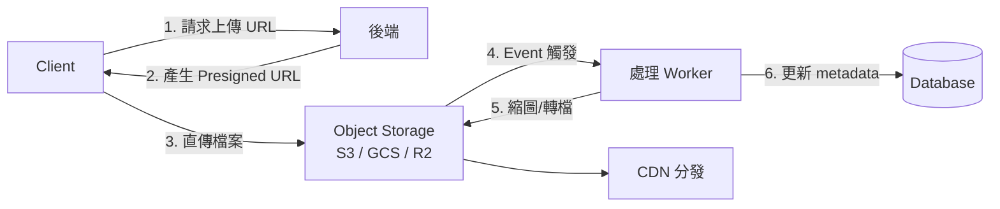

**Presigned URL 上傳（推薦）**：
- 後端產生帶簽章的上傳 URL，Client 直傳 Object Storage
- 避免檔案經過後端，減少頻寬和 CPU 壓力
- 設定過期時間、檔案大小限制、Content-Type 限制

**圖片處理**：

| 處理 | 說明 | 工具 |
|------|------|------|
| 縮圖生成 | 多種尺寸（thumbnail / medium / large） | Sharp (Node.js)、Pillow (Python)、ImageMagick |
| 格式轉換 | 原圖 → WebP / AVIF（更小體積） | Sharp、libvips |
| EXIF 清除 | 移除 GPS、裝置等敏感資訊 | Sharp、ExifTool |
| CDN 即時處理 | URL 參數動態調整尺寸與格式 | Cloudflare Images、imgproxy、Cloudinary |

**Object Storage 比較**：

| 服務 | 提供者 | 特色 |
|------|--------|------|
| S3 | AWS | 業界標準，生態最完整 |
| GCS | GCP | 與 Google 生態整合 |
| R2 | Cloudflare | S3 相容，**無出站流量費** |
| MinIO | 自建 | S3 相容的開源方案 |

### 應用層效能調優

#### Profiling 方法論

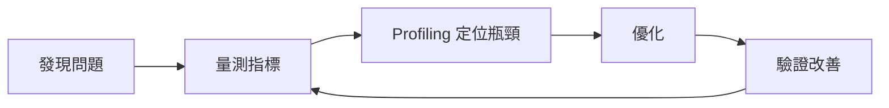

#### Profiling 工具

| 語言/平台 | 工具 | 用途 |
|----------|------|------|
| Java/Kotlin | Async Profiler、JFR (Flight Recorder) | CPU / 記憶體 / 鎖 |
| Go | `pprof`（內建） | CPU / 記憶體 / goroutine |
| Node.js | `--inspect` + Chrome DevTools、Clinic.js | CPU / 記憶體 |
| Python | cProfile、py-spy | CPU profiling |
| 通用 | **Flame Graph** | 視覺化 CPU 時間分佈 |

#### USE Method（系統資源導向）

對每個資源檢查三個面向：

| 資源 | Utilization（使用率） | Saturation（飽和度） | Errors（錯誤） |
|------|---------------------|---------------------|----------------|
| CPU | 使用率 % | Run queue 長度 | 硬體錯誤 |
| 記憶體 | 使用量 / 總量 | Swap 使用量 | OOM kills |
| 磁碟 | I/O 使用率 | I/O wait queue | 讀寫錯誤 |
| 網路 | 頻寬使用率 | 重傳率 | 丟包率 |

#### RED Method（服務導向）

對每個服務監控三個指標：

| 指標 | 說明 | 監控方式 |
|------|------|---------|
| **Rate** | 每秒請求數 (RPS) | Prometheus Counter |
| **Errors** | 錯誤率 (5xx / total) | Prometheus Counter |
| **Duration** | 延遲分佈 (P50 / P95 / P99) | Prometheus Histogram |

#### 常見效能瓶頸與解法

| 瓶頸 | 症狀 | 解法 |
|------|------|------|
| N+1 查詢 | 大量簡單 SQL、回應慢 | DataLoader、JOIN、Eager Loading |
| 快取未命中 | DB 負載高 | 檢查快取策略、預熱 |
| 序列化成本 | CPU 高、大 Payload | Protobuf 取代 JSON、減少回傳欄位 |
| 連線池耗盡 | 間歇性 Connection Timeout | 調整 pool size、縮短交易時間 |
| GC 暫停 | 延遲毛刺 (P99 飆高) | 調整 GC 參數、減少物件分配 |
| 慢 I/O | 吞吐量低 | 非同步 I/O、批次處理 |

#### 記憶體洩漏排查

- **症狀**：RSS 持續成長不下降、最終 OOM Kill
- **排查工具**：
  - Java：`jmap -histo` → Heap Dump → Eclipse MAT 分析
  - Go：`pprof heap` 查看記憶體分配
  - Node.js：`--inspect` + Chrome DevTools Memory 快照比對
- **常見原因**：未關閉的連線/串流、無上限的快取 Map、事件監聯器未移除、閉包持有大物件

---

## 資料庫進階

### 效能調校

#### 慢查詢分析

- **EXPLAIN / EXPLAIN ANALYZE**：查看查詢執行計畫
- **關注指標**：Seq Scan vs Index Scan、Rows Estimated vs Actual、Sort Method

#### 索引策略

| 索引類型 | 適用場景 |
|---------|---------|
| B-Tree | 預設，等值/範圍查詢 |
| Hash | 等值查詢 |
| GiST | 幾何、全文搜尋 |
| GIN | 陣列、JSONB、全文搜尋 |
| BRIN | 大表且資料有序 |

- **複合索引**：欄位順序影響效能（最左前綴原則）
- **覆蓋索引 (Covering Index)**：`INCLUDE` 子句避免回表查詢
- **部分索引 (Partial Index)**：只索引符合條件的列

#### 查詢優化技巧

- 避免 `SELECT *`，只查需要的欄位
- 避免在 WHERE 條件的欄位上使用函式
- 適當使用 `EXISTS` 替代 `IN`
- 大表分頁使用 Cursor-based Pagination 替代 OFFSET

### 資料庫複製與分片

#### 複製 (Replication)

- **主從複製 (Primary-Replica)**：寫入主庫，讀取從庫 — 讀寫分離
- **同步 vs 非同步複製**：一致性 vs 效能的取捨
- **串聯複製 (Cascading Replication)**：減少主庫的複製壓力

#### 分片 (Sharding)

- **水平分片**：依某個 Key（如 user_id）將資料分散到不同資料庫
- **分片策略**：
  - Hash-based：均勻分布，但範圍查詢困難
  - Range-based：範圍查詢友好，但可能熱點
  - Directory-based：靈活但引入單點故障
- **挑戰**：跨分片 JOIN、分散式交易、重新分片

### 事務隔離等級

| 隔離等級 | 髒讀 | 不可重複讀 | 幻讀 | 效能 |
|---------|------|-----------|------|------|
| Read Uncommitted | 可能 | 可能 | 可能 | 最高 |
| Read Committed | 防止 | 可能 | 可能 | 高 |
| Repeatable Read | 防止 | 防止 | 可能 | 中 |
| Serializable | 防止 | 防止 | 防止 | 最低 |

- PostgreSQL 預設 Read Committed
- MySQL InnoDB 預設 Repeatable Read（透過 MVCC + Gap Lock 防止幻讀）

### CQRS 與 Event Sourcing

#### CQRS (Command Query Responsibility Segregation)

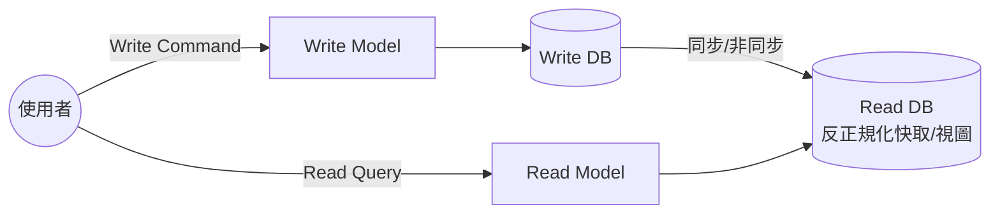

- 讀寫模型獨立擴展
- 讀模型可針對查詢優化（反正規化、物化視圖）

#### Event Sourcing

- 儲存事件序列而非當前狀態
- 可重播事件重建任意時間點的狀態
- 天然的審計日誌
- **挑戰**：事件 Schema 演進、快照 (Snapshot) 策略、最終一致性

### 時序資料庫

- **InfluxDB**：時間序列專用，InfluxQL / Flux 查詢語言
- **TimescaleDB**：PostgreSQL 擴充套件，相容 SQL
- **適用場景**：IoT 感測器資料、監控指標、金融行情

### 資料庫連線池管理

- **連線池原理**：預建連線、重複使用、避免頻繁建立/銷毀
- **參數調校**：最小/最大連線數、連線超時、閒置超時
- **工具**：PgBouncer (PostgreSQL)、ProxySQL (MySQL)、HikariCP (Java)

---

## 前端進階

### 效能優化

#### Core Web Vitals

Google 定義的三大核心指標：

| 指標 | 全名 | 目標 | 衡量面向 |
|------|------|------|---------|
| LCP | Largest Contentful Paint | < 2.5s | 載入效能 |
| INP | Interaction to Next Paint | < 200ms | 互動回應性 |
| CLS | Cumulative Layout Shift | < 0.1 | 視覺穩定性 |

#### 載入優化技術

- **Code Splitting**：依路由或元件拆分打包，`React.lazy()` + `Suspense` 或動態 `import()`
- **Tree Shaking**：透過 ESM 靜態分析移除未使用的程式碼，需避免副作用匯出
- **Lazy Loading**：圖片 `loading="lazy"`、路由懶載入、Intersection Observer API
- **圖片優化**：WebP/AVIF 格式、`<picture>` 標籤多格式 fallback、srcset 響應式圖片
- **資源提示**：`<link rel="preload">`、`<link rel="prefetch">`、`<link rel="preconnect">`
- **Critical CSS**：內嵌首屏關鍵 CSS、延遲載入非關鍵樣式

#### 執行時優化

- **虛擬捲動 (Virtual Scrolling)**：只渲染可見區域的列表項目（react-virtualized / tanstack-virtual）
- **防抖 (Debounce) 與節流 (Throttle)**：控制高頻事件觸發頻率
- **Web Worker**：將耗時運算移至背景執行緒，避免阻塞主執行緒
- **requestAnimationFrame**：平滑動畫渲染

### SSR / SSG / ISR

| 渲染模式 | 全名 | 時機 | 適用場景 |
|---------|------|------|---------|
| CSR | Client-Side Rendering | 瀏覽器端 | SPA、管理後台 |
| SSR | Server-Side Rendering | 每次請求時 | SEO 需求、動態內容 |
| SSG | Static Site Generation | 建構時 | 部落格、文件網站 |
| ISR | Incremental Static Regeneration | 背景重新生成 | 電商、新聞 |

**框架選擇**：
- React → Next.js (App Router / Pages Router)
- Vue → Nuxt.js
- Svelte → SvelteKit

### 前端狀態管理進階

#### 有限狀態機 (FSM) 與 XState

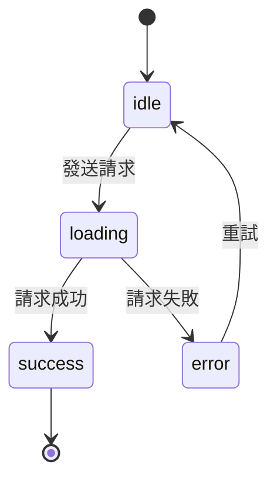

- 明確定義所有可能狀態與轉換，消除「不可能的狀態」
- 適合複雜 UI 流程：多步驟表單、支付流程、媒體播放器

#### 狀態管理演進

- **Server State vs Client State** 分離：TanStack Query / SWR 管理 Server State
- **原子化狀態**：Jotai / Recoil，每個狀態獨立、按需訂閱
- **Proxy-based**：Valtio / MobX，透過 Proxy 自動追蹤依賴

### Web Worker / Service Worker / PWA

- **Web Worker**：背景執行 CPU 密集任務，透過 `postMessage` 與主執行緒通訊
- **Service Worker**：
  - 攔截網路請求、實現離線快取
  - 快取策略：Cache First、Network First、Stale While Revalidate
  - 推播通知 (Push Notification)
- **PWA (Progressive Web App)**：
  - `manifest.json` 配置
  - 可安裝到桌面 (A2HS)
  - 離線體驗

### 微前端 (Micro Frontend)

- **Module Federation**：Webpack 5 / Vite 原生支援，運行時動態載入遠端模組
- **Single-SPA**：框架無關的微前端編排器
- **qiankun**：螞蟻金服開源，基於 Single-SPA 的微前端方案
- **設計考量**：
  - 共用依賴管理（避免重複載入 React/Vue）
  - CSS 隔離（Shadow DOM / CSS Modules）
  - 跨應用通訊（Custom Events / 共用狀態）
  - 路由整合

### 前端測試

| 層級 | 工具 | 測試對象 | 速度 |
|------|------|---------|------|
| Unit Test | Jest / Vitest | 函式、工具方法 | 最快 |
| Component Test | Testing Library | 元件行為 | 快 |
| Integration Test | Testing Library + MSW | 元件 + API 互動 | 中 |
| E2E Test | Cypress / Playwright | 完整用戶流程 | 慢 |

- **測試金字塔**：Unit > Integration > E2E（數量由多到少）
- **MSW (Mock Service Worker)**：攔截 API 請求，提供穩定的測試環境
- **Visual Regression Testing**：Chromatic / Percy，截圖比對 UI 變化

### 前端監控與可觀測性

- **Real User Monitoring (RUM)**：收集真實使用者的效能指標
- **Performance API**：`performance.mark()`, `performance.measure()`, `PerformanceObserver`
- **Error Boundary (React)**：捕獲元件樹中的 JavaScript 錯誤
- **Source Map**：生產環境錯誤追蹤回原始碼
- **工具**：Sentry、Datadog RUM、Google Analytics 4

### WebAssembly (Wasm)

- **用途**：在瀏覽器中執行接近原生效能的程式碼
- **語言**：Rust (wasm-pack)、C/C++ (Emscripten)、AssemblyScript
- **適用場景**：影像/音訊處理、遊戲引擎、PDF 渲染、密碼學運算
- **與 JavaScript 互操作**：透過 JS 膠合碼 (glue code) 呼叫 Wasm 函式

---

## DevOps 與雲端進階

### Kubernetes (K8s)

#### 核心物件

| 物件 | 用途 |
|------|------|
| Pod | 最小部署單位，一個或多個容器 |
| Deployment | 管理 Pod 的宣告式更新 |
| Service | Pod 的穩定網路端點（ClusterIP / NodePort / LoadBalancer） |
| Ingress | HTTP 路由、SSL 終止 |
| ConfigMap | 非機密配置 |
| Secret | 機密資料（Base64 編碼） |
| HPA | 水平自動擴展（依 CPU / 自訂指標） |
| PVC | 持久化儲存宣告 |

#### 進階概念

- **Namespace**：資源隔離
- **RBAC**：角色型存取控制
- **Helm**：K8s 套件管理器
- **Kustomize**：原生配置客製化
- **Operator Pattern**：自訂控制器管理複雜應用

### Infrastructure as Code (IaC)

- **Terraform**：
  - HCL 語法、State 管理
  - Provider 生態系（AWS / GCP / Azure）
  - Module 重用、Remote State
  - `plan` → `apply` 工作流程
- **Pulumi**：使用通用程式語言（TypeScript/Python/Go）定義基礎設施
- **AWS CDK**：TypeScript/Python 定義 AWS 資源

### 可觀測性三大支柱

```mermaid
graph TD
    O[可觀測性] --> L[Logs 日誌<br/>ELK Stack / Loki + Grafana]
    O --> M[Metrics 指標<br/>Prometheus + Grafana<br/>RED / USE Method]
    O --> T[Traces 追蹤<br/>Jaeger / Zipkin / Tempo<br/>OpenTelemetry]
```

- **ELK Stack**：Elasticsearch + Logstash + Kibana
- **PLG Stack**：Promtail + Loki + Grafana（更輕量）
- **SLA / SLO / SLI**：服務等級協議、目標、指標

### 部署策略

| 策略 | 說明 | 風險 | 回滾速度 |
|------|------|------|---------|
| 滾動更新 (Rolling) | 逐步替換舊版本 | 中 | 中 |
| 藍綠部署 (Blue-Green) | 兩套環境切換 | 低 | 快 |
| 金絲雀部署 (Canary) | 少量流量驗證新版 | 最低 | 快 |
| A/B Testing | 依條件分流 | 低 | 快 |

### CDN 原理與配置

- **邊緣節點快取**：靜態資源就近回應
- **快取策略**：Cache-Control Header、快取失效（Purge）
- **常見 CDN**：CloudFront、Cloudflare、Fastly、Akamai
- **進階功能**：Edge Functions、WAF、DDoS 防護

### 多環境管理策略

```mermaid
graph LR
    Dev[Development<br/>開發測試] --> Staging[Staging<br/>整合驗證] --> Prod[Production<br/>正式環境]
```

- 環境配置分離（環境變數 / ConfigMap）
- Feature Flags 控制功能開關
- 資料庫 Migration 在各環境的執行順序

### GitOps

```mermaid
graph LR
    Dev[開發者提交程式碼] --> CI[CI 建構映像檔]
    CI --> Git[更新 K8s manifest<br/>Git Repo]
    Git --> Argo[ArgoCD / Flux<br/>自動同步至叢集]
    Argo --> K8s[Kubernetes Cluster]
```

- **原則**：Git 為唯一真實來源 (Single Source of Truth)
- **ArgoCD**：Kubernetes 的 GitOps 持續部署工具
- **Flux**：CNCF 的 GitOps 工具集

### 容災與高可用

- **Multi-AZ**：跨可用區部署，單區故障不影響服務
- **Multi-Region**：跨地區部署，應對區域級故障
- **RTO vs RPO**：
  - RTO (Recovery Time Objective)：可容忍的恢復時間
  - RPO (Recovery Point Objective)：可容忍的資料丟失量
- **DR 策略**：Backup & Restore → Pilot Light → Warm Standby → Hot Standby
- **Chaos Engineering**：Netflix Chaos Monkey，主動注入故障測試韌性

---

## 資安進階

### Zero Trust 架構

- **核心原則**：永不信任、始終驗證 (Never Trust, Always Verify)
- **實踐要素**：
  - 身份驗證每一次請求
  - 最小權限原則 (Principle of Least Privilege)
  - 微分段 (Micro-segmentation)
  - 持續監控與驗證

### 權限模型

#### RBAC (Role-Based Access Control)

```mermaid
graph LR
    U1[User] --> R1[Admin Role]
    U2[User] --> R2[Viewer Role]
    R1 --> P1[create]
    R1 --> P2[read]
    R1 --> P3[update]
    R1 --> P4[delete]
    R2 --> P2
```

#### ABAC (Attribute-Based Access Control)

- 基於屬性的動態權限判斷
- 屬性來源：使用者（部門、職級）、資源（分類、擁有者）、環境（時間、IP）
- 更靈活但更複雜

### API Security

- **API Key 管理**：金鑰輪換 (Rotation)、Scope 限制
- **Request Signing**：HMAC 簽章驗證請求完整性
- **mTLS (Mutual TLS)**：客戶端與伺服器雙向驗證
- **API Rate Limiting**：依 API Key / IP / User 限流
- **Input Validation**：嚴格的 Schema 驗證（Zod / Joi / JSON Schema）

### 密碼學基礎

| 類型 | 演算法 | 用途 |
|------|--------|------|
| 對稱加密 | AES-256-GCM | 資料加密（快速） |
| 非對稱加密 | RSA、ECDSA | 金鑰交換、數位簽章 |
| 雜湊 | SHA-256、bcrypt、Argon2 | 密碼儲存、完整性檢查 |
| HMAC | HMAC-SHA256 | 訊息認證 |

- **數位簽章**：私鑰簽名、公鑰驗證 — 確保來源與完整性
- **憑證鏈**：Root CA → Intermediate CA → Server Certificate

### OWASP API Security Top 10

1. Broken Object Level Authorization (BOLA)
2. Broken Authentication
3. Broken Object Property Level Authorization
4. Unrestricted Resource Consumption
5. Broken Function Level Authorization
6. Unrestricted Access to Sensitive Business Flows
7. Server Side Request Forgery (SSRF)
8. Security Misconfiguration
9. Improper Inventory Management
10. Unsafe Consumption of APIs

### Secret Management

- **HashiCorp Vault**：動態密鑰、密鑰輪換、審計日誌
- **AWS Secrets Manager / SSM Parameter Store**：雲端密鑰管理
- **GCP Secret Manager**：Google Cloud 密鑰管理
- **原則**：
  - 程式碼中永遠不放密鑰
  - 密鑰加密儲存、傳輸加密
  - 定期輪換
  - 最小權限存取

