# Clean Code 與設計模式

> 涵蓋 GoF 23 種設計模式、Clean Architecture 跨平台比較、DDD、單向資料流架構設計、Clean Code 核心原則、12-Factor App

---

## 目錄

- [一、設計模式總覽（GoF 23 種）](#一設計模式總覽gof-23-種)
  - [1.1 創建型模式（Creational）](#11-創建型模式creational)
  - [1.2 結構型模式（Structural）](#12-結構型模式structural)
  - [1.3 行為型模式（Behavioral）](#13-行為型模式behavioral)
  - [1.4 複合模式實務：限流與熔斷](#14-複合模式實務限流與熔斷)
- [二、跨平台設計模式對照表](#二跨平台設計模式對照表)
- [三、Clean Architecture 跨平台比較](#三clean-architecture-跨平台比較)
  - [3.1 核心原則](#31-核心原則)
  - [3.2 三層架構對照](#32-三層架構對照)
  - [3.3 技術棧對照](#33-技術棧對照)
- [四、DDD（Domain-Driven Design）](#四ddddomain-driven-design)
  - [4.1 戰略設計](#41-戰略設計)
  - [4.2 戰術設計](#42-戰術設計)
  - [4.3 DDD 與 Clean Architecture 的關係](#43-ddd-與-clean-architecture-的關係)
- [五、單向資料流架構設計](#五單向資料流架構設計)
  - [5.1 核心概念](#51-核心概念)
  - [5.2 跨平台對應架構](#52-跨平台對應架構)
- [六、Clean Code 核心原則](#六clean-code-核心原則)
  - [6.1 SOLID 原則](#61-solid-原則)
  - [6.2 命名規範](#62-命名規範)
  - [6.3 函數設計](#63-函數設計)
  - [6.4 錯誤處理](#64-錯誤處理)
  - [6.5 其他重要原則](#65-其他重要原則)
  - [6.6 Code Review 最佳實踐](#66-code-review-最佳實踐)
  - [6.7 技術債管理](#67-技術債管理)
- [七、12-Factor App](#七12-factor-app)
- [八、API 版本管理策略](#八api-版本管理策略)
- [九、架構模式演進與選擇指南](#九架構模式演進與選擇指南)

---

## 一、設計模式總覽（GoF 23 種）

> ⭐ = 行動開發中高頻使用

### 1.1 創建型模式（Creational）

負責物件的創建機制，將物件的創建與使用分離。

| 模式 | 說明 | 常用度 | 行動開發典型場景 |
|------|------|--------|-----------------|
| **Singleton** | 確保一個類別只有一個實例 | ⭐⭐⭐ | DI Container、Database Instance、SharedPreferences |
| **Factory Method** | 定義創建物件的介面，讓子類別決定實例化哪個類別 | ⭐⭐⭐ | ViewModel Factory、API Service 建構 |
| **Abstract Factory** | 提供建立一系列相關物件的介面 | ⭐⭐ | 主題切換（Light/Dark Theme 元件工廠） |
| **Builder** | 將複雜物件的建構與表示分離 | ⭐⭐⭐ | Retrofit.Builder、AlertDialog.Builder、Notification |
| **Prototype** | 通過複製現有物件來建立新物件 | ⭐ | data class copy()、深拷貝狀態物件 |

#### Singleton — 單例模式

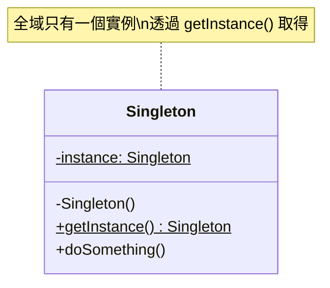

**核心概念**：確保一個類別在整個應用程式生命週期中只有一個實例，並提供全域存取點。

**使用時機**：
- 資料庫連線、網路客戶端等需要共享的資源
- 全域狀態管理（如使用者 Session）
- DI 框架中的 `@Singleton` scope

**注意事項**：過度使用會導致全域狀態難以測試，優先使用 DI 框架管理。

---

#### Factory Method — 工廠方法模式

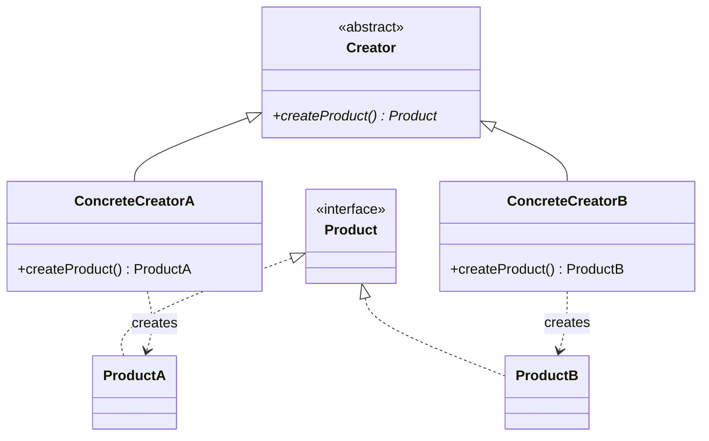

**核心概念**：定義一個建立物件的介面，但讓子類別決定要實例化的類別。

**使用時機**：
- 不確定需要建立哪種具體物件時
- ViewModelProvider.Factory 決定建立哪個 ViewModel
- 根據平台或設定建立不同的 Service 實作

---

#### Abstract Factory — 抽象工廠模式

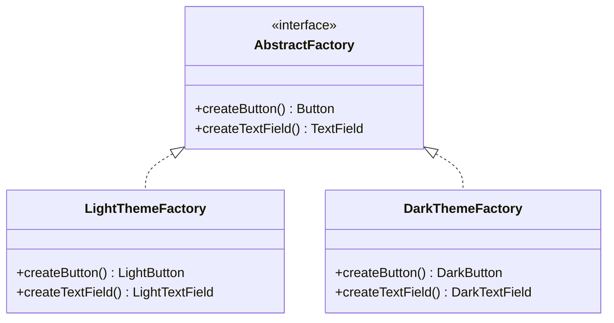

**核心概念**：提供一個介面，用來建立一系列相關或相互依賴的物件，而不需要指定具體類別。

**使用時機**：
- UI 主題系統（同時切換一整組 UI 元件風格）
- 跨平台 API 抽象層

---

#### Builder — 建造者模式

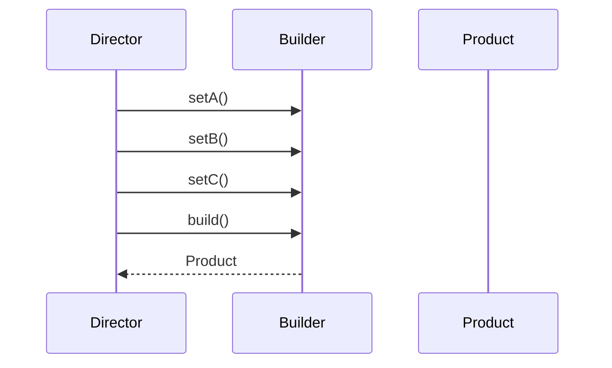

**核心概念**：將複雜物件的建構過程與其表示分離，使同樣的建構過程可以創建不同的表示。

**使用時機**：
- 物件有多個可選參數時（避免 telescoping constructor）
- `Retrofit.Builder()`, `OkHttpClient.Builder()`, `Notification.Builder()`
- Kotlin 中 `data class` + 具名參數 + 預設值常可取代 Builder

---

#### Prototype — 原型模式

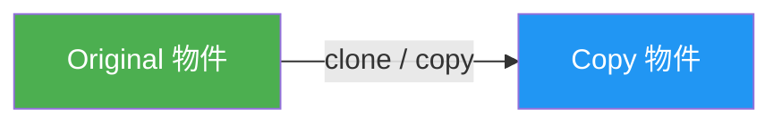

**核心概念**：透過複製既有物件來建立新物件，避免重複的初始化開銷。

**使用時機**：
- Kotlin `data class` 的 `copy()` 方法
- MVI 架構中複製 State 並修改部分欄位
- 需要保留原始物件做 undo/redo 時

---

### 1.2 結構型模式（Structural）

處理類別或物件的組合方式，形成更大的結構。

| 模式 | 說明 | 常用度 | 行動開發典型場景 |
|------|------|--------|-----------------|
| **Adapter** | 將一個介面轉換成另一個介面 | ⭐⭐⭐ | RecyclerView.Adapter、DTO ↔ Domain Model 轉換 |
| **Bridge** | 將抽象與實作分離，使兩者可以獨立變化 | ⭐ | 跨平台渲染引擎抽象 |
| **Composite** | 將物件組合成樹狀結構 | ⭐⭐ | View 樹狀結構、Compose UI 組合 |
| **Decorator** | 動態地為物件添加責任 | ⭐⭐⭐ | OkHttp Interceptor 鏈、Middleware |
| **Facade** | 為複雜子系統提供一個簡單介面 | ⭐⭐⭐ | Repository（封裝 API + Cache + DB）、SDK 封裝 |
| **Flyweight** | 共享細粒度物件以節省記憶體 | ⭐ | 字型快取、圖片池、RecycledViewPool |
| **Proxy** | 為其他物件提供代理以控制存取 | ⭐⭐ | Retrofit 動態代理、LazyLoading、圖片佔位符 |

#### Adapter — 適配器模式

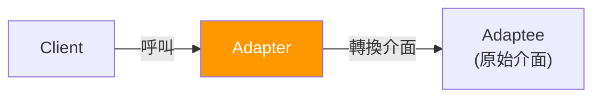

**核心概念**：將一個類別的介面轉換成客戶端期望的另一個介面，使原本不相容的類別可以合作。

**使用時機**：
- `RecyclerView.Adapter`：將資料轉換為 View 可以顯示的格式
- DTO → Domain Model 的 Mapper
- 包裝第三方 SDK 介面以符合專案規範

---

#### Decorator — 裝飾者模式

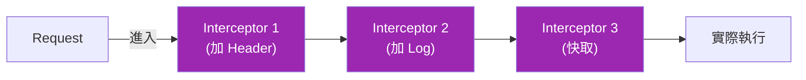

**核心概念**：動態地為物件添加額外的責任，比繼承更有彈性的擴展功能方式。

**使用時機**：
- OkHttp Interceptor Chain（認證、日誌、快取逐層裝飾）
- Kotlin 的 `by` 委託 + 介面裝飾
- Stream/Flow 的 operator chaining（`.map().filter().catch()`）

---

#### Facade — 外觀模式

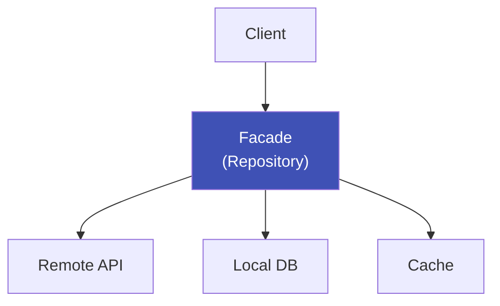

**核心概念**：為一組複雜的子系統介面提供一個統一的高層介面，降低使用複雜度。

**使用時機**：
- Repository 封裝 Remote API + Local DB + Cache 邏輯
- UseCase 封裝多個 Repository 操作
- SDK 對外暴露簡潔 API

---

#### Composite — 組合模式

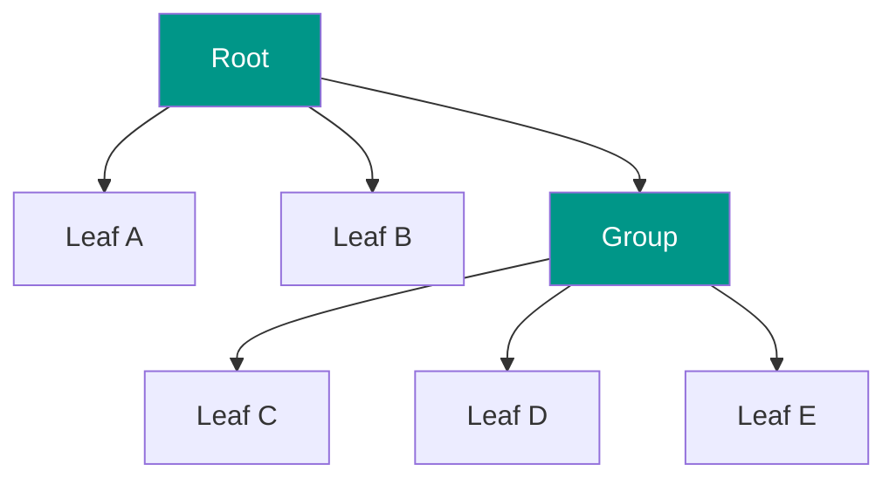

**核心概念**：將物件組合成樹狀結構，讓客戶端以一致的方式處理個別物件與組合物件。

**使用時機**：
- Android View 樹（ViewGroup 包含 View）
- Jetpack Compose UI 樹狀組合
- Flutter Widget Tree

---

#### Proxy — 代理模式

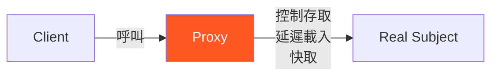

**核心概念**：提供一個代理物件來控制對另一個物件的存取。

**使用時機**：
- Retrofit 使用 Java 動態代理生成 API 介面實作
- 圖片懶載入（先顯示佔位符，再載入實際圖片）
- Kotlin `by lazy` 延遲初始化

---

### 1.3 行為型模式（Behavioral）

關注物件之間的職責分配與溝通方式。

| 模式 | 說明 | 常用度 | 行動開發典型場景 |
|------|------|--------|-----------------|
| **Observer** | 定義一對多依賴，狀態變化時通知所有觀察者 | ⭐⭐⭐ | LiveData、StateFlow、Combine、Stream |
| **Strategy** | 定義一系列演算法，使它們可互換 | ⭐⭐⭐ | 排序策略、驗證策略、網路請求重試策略 |
| **Command** | 將請求封裝為物件 | ⭐⭐ | Intent/Event in MVI、undo/redo |
| **State** | 允許物件在狀態改變時改變行為 | ⭐⭐ | 播放器狀態（Playing/Paused/Stopped）、登入流程 |
| **Template Method** | 定義演算法骨架，讓子類別覆寫特定步驟 | ⭐⭐ | BaseActivity/BaseFragment 的生命週期 |
| **Chain of Responsibility** | 將請求沿處理鏈傳遞 | ⭐⭐⭐ | OkHttp Interceptor、Touch 事件分發 |
| **Iterator** | 提供逐一存取集合元素的方法 | ⭐⭐ | Kotlin Sequence、Cursor、Paging |
| **Mediator** | 用中介者封裝物件間的互動 | ⭐⭐ | Navigation Component、EventBus |
| **Memento** | 捕獲並外部化物件內部狀態 | ⭐ | onSaveInstanceState、undo 功能 |
| **Visitor** | 在不修改元素的前提下定義新操作 | ⭐ | AST 遍歷、Lint 規則 |
| **Interpreter** | 為語言定義文法及直譯器 | ⭐ | 正則表達式、DSL 解析 |

#### Observer — 觀察者模式

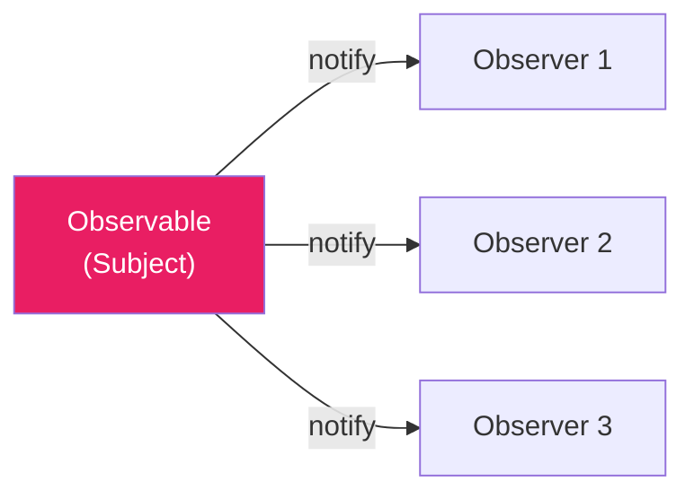

**核心概念**：定義物件間一對多的依賴關係，當一個物件狀態改變時，所有依賴者都會收到通知並自動更新。

**使用時機**：
- Android: `LiveData`, `StateFlow`, `SharedFlow`
- iOS: `@Published`, `Combine Publisher`
- Flutter: `Stream`, `ChangeNotifier`
- 任何 UI 需要響應資料變化的場景

---

#### Strategy — 策略模式

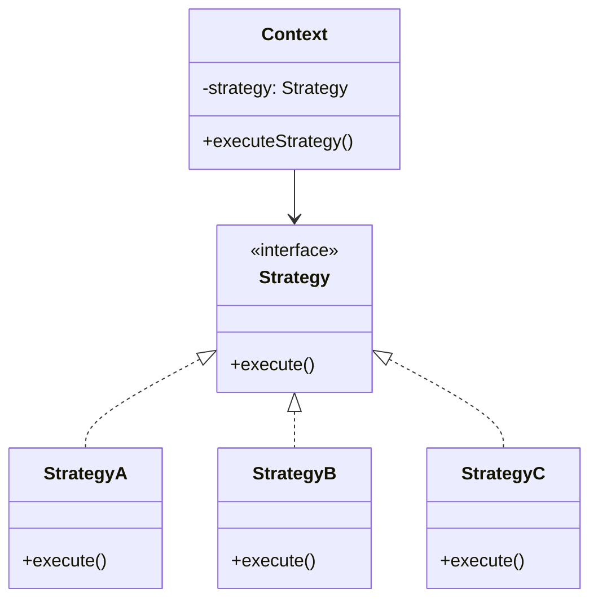

**核心概念**：定義一系列演算法，把每個演算法封裝起來，使它們可以互相替換。

**使用時機**：
- 不同的表單驗證規則
- 不同的圖片載入策略（快取優先 / 網路優先）
- 不同的重試策略（指數退避 / 固定間隔）
- Kotlin 中常用高階函數取代策略類別

---

#### Command — 命令模式

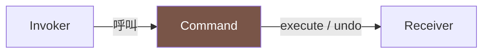

**核心概念**：將請求封裝成物件，使你可以用不同的請求參數化客戶端、佇列化請求、或支援 undo 操作。

**使用時機**：
- MVI 中的 Intent / Event 就是 Command 模式
- 文字編輯器的 undo/redo
- 任務佇列、排程執行

---

#### Chain of Responsibility — 責任鏈模式

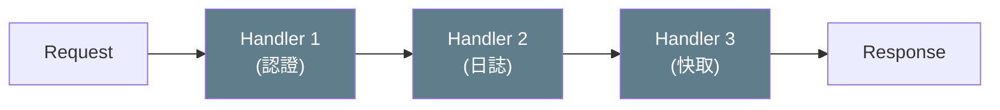

**核心概念**：將請求沿著處理者鏈傳遞，直到有一個處理者處理它為止。

**使用時機**：
- OkHttp Interceptor Chain
- Android Touch 事件分發（Activity → ViewGroup → View）
- Middleware pipeline

---

#### State — 狀態模式

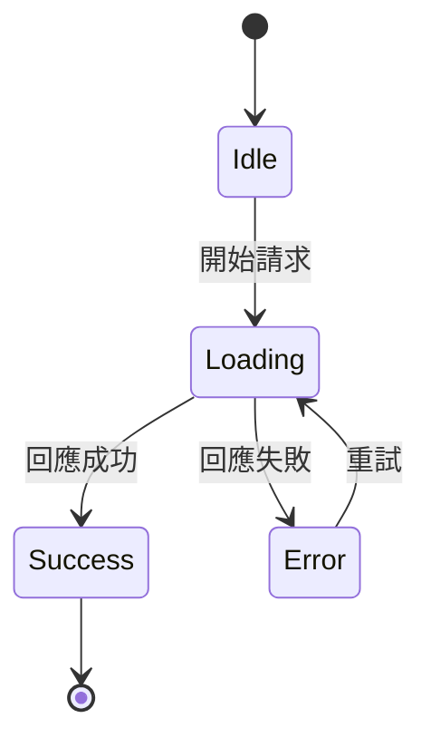

**核心概念**：允許物件在其內部狀態改變時改變其行為，看起來好像改變了類別。

**使用時機**：
- 播放器狀態機（Idle → Loading → Playing → Paused）
- 網路請求狀態（Idle → Loading → Success/Error）
- 登入流程狀態管理

---

#### Template Method — 模板方法模式

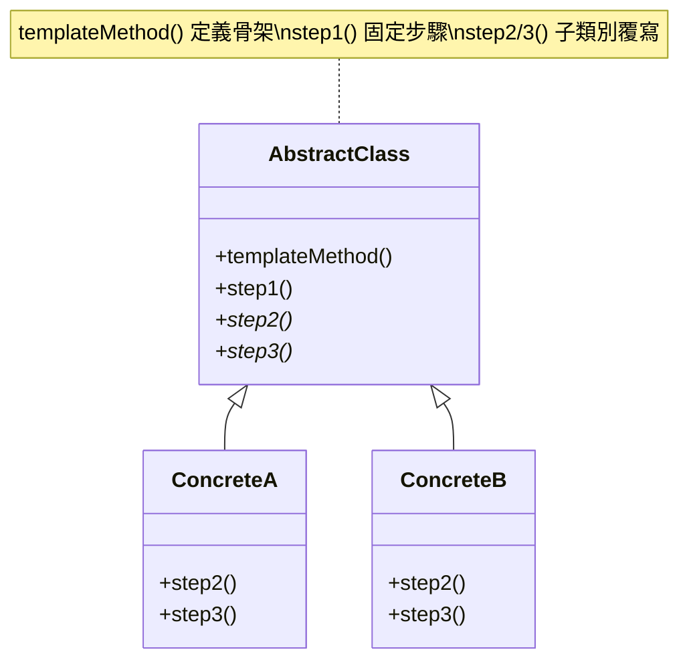

**核心概念**：在父類別中定義演算法的骨架，將某些步驟延遲到子類別實作。

**使用時機**：
- `BaseActivity` / `BaseFragment` 定義生命週期模板
- `BaseViewModel` 定義初始化流程
- `BaseUseCase` 定義 `execute()` 骨架，子類別只覆寫業務邏輯

---

#### Mediator — 中介者模式

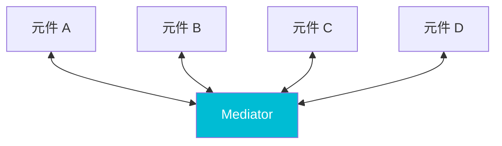

**核心概念**：用一個中介物件封裝一組物件之間的互動，使物件之間不需要顯式引用彼此。

**使用時機**：
- Navigation Component（Fragment 之間不直接跳轉）
- EventBus / AppEventBus
- ViewModel 作為 View 與 Model 之間的中介者

---

### 1.4 複合模式實務：限流與熔斷

限流與熔斷是 State 模式 + Strategy 模式的經典複合應用，在 App 與後端交互時經常遇到。

#### 限流演算法（Strategy 模式）

| 演算法 | 原理 | 特點 |
|--------|------|------|
| 固定視窗 (Fixed Window) | 時間窗口內計數 | 簡單，但邊界突發 |
| 滑動視窗 (Sliding Window) | 加權計算跨窗口 | 更平滑 |
| 漏桶 (Leaky Bucket) | 固定速率處理 | 平滑流量 |
| 令牌桶 (Token Bucket) | 固定速率產生令牌 | 允許突發 |

不同的限流演算法是 **Strategy 模式** 的典型應用 — 封裝可互換的演算法，根據場景選擇策略。

#### 熔斷器（State 模式）

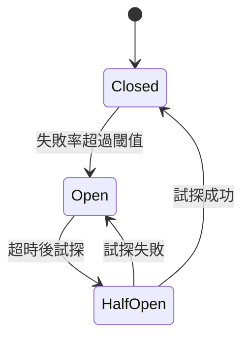

熔斷器是 **State 模式** 的經典實現：
- **Closed**：正常狀態，放行所有請求，但持續監控失敗率
- **Open**：熔斷狀態，直接拒絕請求，避免持續打到已故障的服務
- **Half-Open**：試探狀態，放行少量請求測試服務是否恢復

**行動開發中的應用**：
- 網路請求的重試策略搭配熔斷（避免在伺服器已故障時持續重試）
- Resilience4j（Android）、自定義 Interceptor 實現
- App 端偵測到連續 API 失敗後，暫時切換到離線模式或快取資料

---

## 二、跨平台設計模式對照表

### 常用設計模式在三大平台的具體實現

| 設計模式 | Android (Kotlin) | iOS (Swift) | Flutter (Dart) |
|---------|-----------------|-------------|----------------|
| **Singleton** | `object` / `@Singleton` (Hilt) | `static let shared` | `factory constructor` / `get_it` |
| **Factory** | `ViewModelProvider.Factory` | Protocol + Factory class | `Widget.builder()` pattern |
| **Builder** | `Retrofit.Builder()` / named params | Method chaining / Result builders | Cascade notation `..` / named params |
| **Observer** | `StateFlow` / `LiveData` | `Combine` / `@Published` | `Stream` / `ChangeNotifier` |
| **Strategy** | Interface + Lambda | Protocol + Closure | Abstract class + Function type |
| **Adapter** | `RecyclerView.Adapter` | `UITableViewDataSource` | 不需要（Widget 直接建構） |
| **Decorator** | `OkHttp Interceptor` | URLProtocol / Middleware | `dio Interceptor` |
| **Facade** | `Repository` | `Repository` / `Manager` | `Repository` |
| **Command** | MVI `Intent` / `Event` | TCA `Action` | BLoC `Event` |
| **State** | `sealed class UiState` | `enum State` | `sealed class` / `freezed` |
| **Chain of Resp.** | Interceptor / Touch dispatch | Responder Chain | Middleware chain |
| **Template Method** | `BaseActivity` / `BaseFragment` | `UIViewController` lifecycle | `StatefulWidget` lifecycle |
| **Composite** | `ViewGroup` / Compose | `UIView` hierarchy / SwiftUI | `Widget` tree |
| **Mediator** | `NavController` / EventBus | `Coordinator` pattern | `Navigator` / `GoRouter` |
| **Proxy** | Retrofit dynamic proxy | `lazy var` / Proxy pattern | Lazy initialization |

---

## 三、Clean Architecture 跨平台比較

### 3.1 核心原則

所有平台共同遵循的原則：

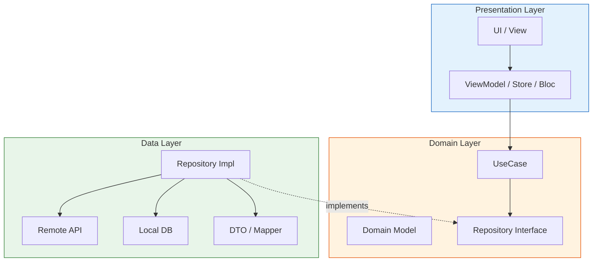

1. **依賴規則（Dependency Rule）**：外層依賴內層，內層不知道外層的存在
2. **依賴反轉（DIP）**：Domain 層定義 Repository 介面，Data 層負責實作
3. **關注點分離（SoC）**：每一層只處理自己該負責的事情
4. **可測試性**：Domain 層不依賴任何框架，可以純粹用單元測試驗證

### 3.2 三層架構對照

#### Data Layer — 資料層

| 職責 | Android | iOS | Flutter |
|------|---------|-----|---------|
| **API 呼叫** | Retrofit `@GET/@POST` 介面 | URLSession / Alamofire | dio / http package |
| **DTO 定義** | `data class XxxDto` | `struct XxxDTO: Codable` | `class XxxDto` + `json_serializable` |
| **本地儲存** | Room / DataStore | CoreData / UserDefaults | sqflite / shared_preferences |
| **Repository 實作** | `class XxxRepositoryImpl` | `class XxxRepositoryImpl` | `class XxxRepositoryImpl` |
| **Mapper** | `fun XxxDto.toDomain()` | `extension XxxDTO` | `XxxMapper.toDomain()` |

#### Domain Layer — 領域層

| 職責 | Android | iOS | Flutter |
|------|---------|-----|---------|
| **Model** | `data class Xxx` | `struct Xxx` | `class Xxx` / `freezed` |
| **Repository 介面** | `interface XxxRepository` | `protocol XxxRepository` | `abstract class XxxRepository` |
| **UseCase** | `class XxxUseCase(repo)` | `class XxxUseCase` | `class XxxUseCase` |
| **結果封裝** | `sealed class Result` | `Result<T, Error>` | `Either<Failure, T>` (dartz) |

#### Presentation Layer — 展示層

| 職責 | Android | iOS | Flutter |
|------|---------|-----|---------|
| **UI** | Compose / XML | SwiftUI / UIKit | Widget |
| **狀態管理** | ViewModel + StateFlow | ObservableObject / TCA Store | BLoC / Cubit / Riverpod |
| **導航** | Navigation Component | NavigationStack / Coordinator | GoRouter / Navigator |
| **DI** | Hilt (`@Inject`) | Swinject / 手動 | get_it / injectable |

### 3.3 技術棧對照

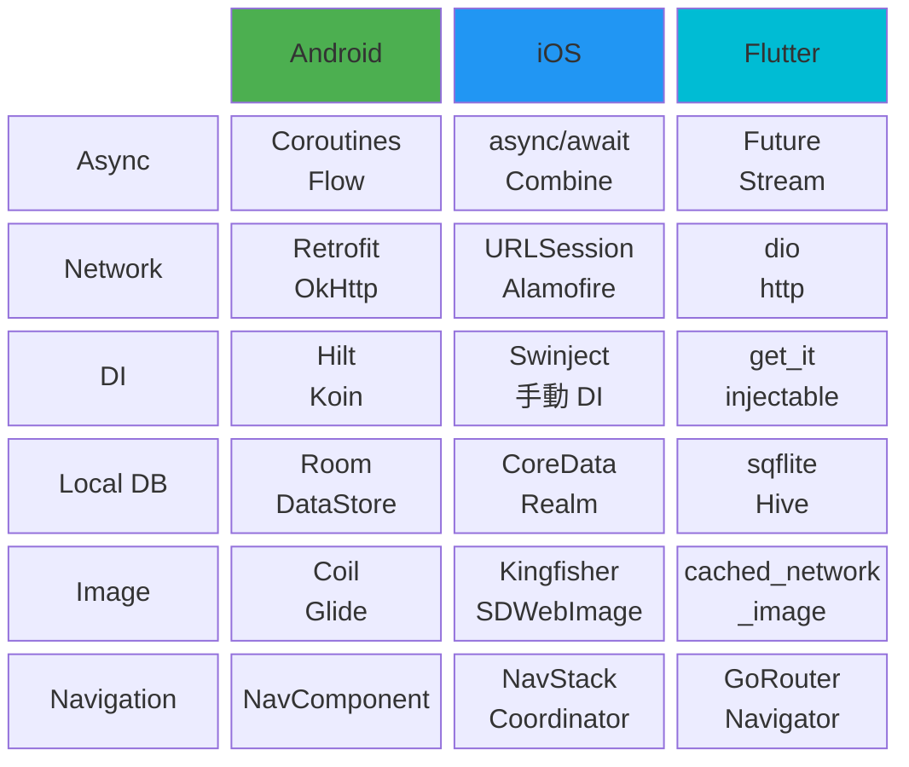

---

## 四、DDD（Domain-Driven Design）

DDD 是 Clean Architecture 中 Domain Layer 的設計方法論，幫助團隊用統一的語言理解和建模業務邏輯。

### 4.1 戰略設計

戰略設計關注「大方向」— 如何劃分系統邊界、如何讓團隊溝通一致。

```mermaid
flowchart TD
    subgraph 戰略設計
        UL["Ubiquitous Language\n統一語言"]
        BC["Bounded Context\n限界上下文"]
        CM["Context Map\n上下文映射"]
    end
    UL --> BC
    BC --> CM
    style 戰略設計 fill:#FFF3E0,stroke:#E65100
```

| 概念 | 說明 | 行動開發中的體現 |
|------|------|----------------|
| **Bounded Context** | 明確的領域邊界，每個 Context 有自己的模型與語言 | 每個 feature module 可視為一個 Bounded Context |
| **Ubiquitous Language** | 開發者、設計師、PM 使用統一的領域語言 | 程式碼中的命名與 PRD / Figma 一致 |
| **Context Map** | Bounded Context 之間的關係與整合方式 | module 之間的依賴關係、API 契約 |

#### Context Map 關係類型

| 關係 | 說明 | 範例 |
|------|------|------|
| **Shared Kernel** | 兩個 Context 共享一部分模型 | 共用的 User Model |
| **Customer-Supplier** | 上游提供、下游消費 | 後端 API ↔ App Client |
| **Anti-Corruption Layer** | 透過轉換層隔離外部模型 | DTO → Domain Model 的 Mapper |
| **Conformist** | 下游完全遵循上游模型 | 直接使用第三方 SDK 的資料結構 |

### 4.2 戰術設計

戰術設計關注「具體實現」— 如何在程式碼中體現領域模型。

```mermaid
flowchart TD
    subgraph 戰術設計["戰術設計元素"]
        Entity["Entity\n有唯一 ID"]
        VO["Value Object\n由屬性定義"]
        Agg["Aggregate\n一致性邊界"]
        Repo["Repository\n持久化介面"]
        DS["Domain Service\n跨 Entity 邏輯"]
        DE["Domain Event\n領域事件"]
    end
    Agg -->|包含| Entity
    Agg -->|包含| VO
    Repo -->|管理| Agg
    DS -->|操作| Agg
    Agg -->|發布| DE
    style 戰術設計 fill:#E8F5E9,stroke:#2E7D32
```

| 元素 | 說明 | 行動開發範例 |
|------|------|------------|
| **Entity** | 有唯一識別碼的物件，即使屬性完全一樣，ID 不同就是不同物件 | `User(id)`, `Order(id)` |
| **Value Object** | 由屬性值定義的不可變物件，沒有 ID | `Money(amount, currency)`, `Address(city, street)` |
| **Aggregate** | 一致性邊界內的物件群，外部只能透過 Aggregate Root 操作 | `Order`（包含 `OrderItem` 清單） |
| **Repository** | Aggregate 的持久化介面，Domain 層只定義介面 | `interface OrderRepository` |
| **Domain Event** | 領域中發生的重要事件，用於跨 Aggregate 溝通 | `OrderPlaced`, `PaymentCompleted` |
| **Domain Service** | 不屬於任何 Entity 的領域邏輯 | `PricingService`, `TransferService` |

### 4.3 DDD 與 Clean Architecture 的關係

```mermaid
flowchart TD
    subgraph CleanArch["Clean Architecture 分層"]
        subgraph Presentation["Presentation"]
            UI2["UI / ViewModel"]
        end
        subgraph Domain2["Domain（DDD 戰術設計在此）"]
            E2["Entity / Value Object"]
            AGG["Aggregate"]
            UC2["UseCase / Domain Service"]
            RI["Repository Interface"]
        end
        subgraph Data2["Data"]
            IMPL["Repository Impl"]
            ACL["Anti-Corruption Layer\n(DTO Mapper)"]
        end
    end

    UI2 --> UC2
    UC2 --> AGG
    UC2 --> RI
    IMPL -.->|implements| RI
    IMPL --> ACL

    style Presentation fill:#E3F2FD,stroke:#1565C0
    style Domain2 fill:#FFF3E0,stroke:#E65100
    style Data2 fill:#E8F5E9,stroke:#2E7D32
```

- **Clean Architecture** 定義「分層方式」和「依賴方向」
- **DDD** 定義「Domain 層內部怎麼建模」
- 兩者互補：Clean Architecture 告訴你「放在哪一層」，DDD 告訴你「這一層裡面怎麼設計」

---

## 五、單向資料流架構設計

### 5.1 核心概念

單向資料流（Unidirectional Data Flow, UDF）確保資料只朝一個方向流動，使狀態變化可預測、可追蹤。

```mermaid
flowchart TD
    UserAction["User Action\n(點擊、輸入)"] --> Event["Event / Intent"]
    Event --> Reducer["Reduce State\n(ViewModel / Store / Bloc)"]
    Reducer --> State["New State\n(不可變)"]
    State --> UI["UI Render"]
    UI --> UserAction

    style Event fill:#FF9800,color:#fff
    style Reducer fill:#9C27B0,color:#fff
    style State fill:#4CAF50,color:#fff
    style UI fill:#2196F3,color:#fff
```

**三大要素**：
1. **State（狀態）**：不可變的資料，描述 UI 在某一時刻應該呈現的樣貌
2. **Event / Intent / Action（事件）**：使用者操作或系統事件，觸發狀態變化的唯一途徑
3. **Effect / Side Effect（副作用）**：一次性事件（導航、Toast、對話框），不屬於持續性狀態

### 5.2 跨平台對應架構

| 概念 | Android (MVI) | iOS (TCA) | Flutter (BLoC) |
|------|--------------|-----------|----------------|
| **架構名稱** | MVI (Model-View-Intent) | TCA (The Composable Architecture) | BLoC (Business Logic Component) |
| **狀態容器** | ViewModel | Store | Bloc / Cubit |
| **狀態** | `data class UiState` | `struct State` | `class XxxState` |
| **使用者動作** | `sealed class Event` | `enum Action` | `sealed class XxxEvent` |
| **副作用** | `sealed class Effect` + `SharedFlow` | `Effect<Action>` | 在 `mapEventToState` 中 emit |
| **狀態更新** | `reduce()` in ViewModel | `Reducer` | `on<Event>()` handler |
| **UI 訂閱** | `collectAsState()` / `collect {}` | `WithViewStore` / `@Observable` | `BlocBuilder` / `BlocListener` |
| **組合性** | 手動組合 | `Scope` + child store | `MultiBlocProvider` |

---

## 六、Clean Code 核心原則

Clean Code 的原則跨平台通用，不分 Android、iOS 或 Flutter。以下整理最重要的核心原則。

### 6.1 SOLID 原則

```mermaid
flowchart TD
    SOLID --> S["S — Single Responsibility\n單一職責原則"]
    SOLID --> O["O — Open/Closed\n開放封閉原則"]
    SOLID --> L["L — Liskov Substitution\nLiskov 替換原則"]
    SOLID --> I["I — Interface Segregation\n介面隔離原則"]
    SOLID --> D["D — Dependency Inversion\n依賴反轉原則"]
    style SOLID fill:#FF9800,color:#fff
```

| 原則 | 說明 | 行動開發中的體現 |
|------|------|----------------|
| **S — 單一職責** | 一個類別只應該有一個改變的理由 | ViewModel 只處理 UI 邏輯、UseCase 只處理業務邏輯、Repository 只處理資料存取 |
| **O — 開放封閉** | 對擴展開放，對修改封閉 | 使用 Strategy 模式新增驗證規則，不修改既有程式碼 |
| **L — Liskov 替換** | 子類別必須能替換父類別而不影響程式正確性 | Repository 介面的不同實作（MockRepo / RealRepo）可互換 |
| **I — 介面隔離** | 不應強迫客戶端依賴它不需要的介面 | 將大介面拆成小介面，如 `Readable` + `Writable` 而非一個大 `Storage` |
| **D — 依賴反轉** | 高層模組不應依賴低層模組，兩者都應依賴抽象 | Domain 層定義 Repository 介面，Data 層實作，透過 DI 注入 |

#### S — 單一職責原則（Single Responsibility Principle）

```mermaid
flowchart LR
    subgraph Bad["違反 SRP"]
        God["GodActivity\n處理 UI + 網路 + DB + 驗證"]
    end
    subgraph Good["遵守 SRP"]
        View["View\n只負責 UI"]
        VM2["ViewModel\n只負責狀態"]
        UC2["UseCase\n只負責業務邏輯"]
        Repo["Repository\n只負責資料"]
    end
    style Bad fill:#F44336,color:#fff
    style Good fill:#4CAF50,color:#fff
```

**關鍵判斷**：如果你描述一個類別的功能時用了「而且」，它可能違反了 SRP。

---

#### O — 開放封閉原則（Open/Closed Principle）

**核心**：透過抽象和多型來擴展行為，而不是修改現有程式碼。

```mermaid
flowchart TD
    subgraph 擴展["新增需求時"]
        Interface["抽象介面"] --> ImplA["實作 A\n（既有）"]
        Interface --> ImplB["實作 B\n（新增）"]
    end
    style 擴展 fill:#E8F5E9,stroke:#2E7D32
```

**實踐方式**：
- 新增驗證規則 → 新增一個 `Validator` 實作，不改現有的
- 新增 API 來源 → 新增一個 `DataSource` 實作，不改 Repository

---

#### L — Liskov 替換原則（Liskov Substitution Principle）

**核心**：子類別必須完全遵守父類別的契約，不能破壞預期行為。

**違反範例**：`正方形 extends 長方形` — 設定寬度時連高度一起改，破壞了長方形的行為契約

**行動開發中的實踐**：
- `MockRepository` 替換 `RealRepository` 做測試時，行為契約必須一致
- `sealed class` / `enum` 比繼承更安全，編譯器幫你檢查所有情況

---

#### I — 介面隔離原則（Interface Segregation Principle）

```mermaid
flowchart TD
    subgraph Bad2["違反 ISP"]
        BigI["interface Storage\nread() + write() + delete()\n+ sync() + backup()"]
    end
    subgraph Good2["遵守 ISP"]
        R["Readable\nread()"]
        W["Writable\nwrite() + delete()"]
        Sy["Syncable\nsync()"]
    end
    style Bad2 fill:#F44336,color:#fff
    style Good2 fill:#4CAF50,color:#fff
```

**關鍵判斷**：如果實作一個介面時需要寫空方法或 `throw NotImplemented`，就該拆分介面。

---

#### D — 依賴反轉原則（Dependency Inversion Principle）

```mermaid
flowchart TD
    subgraph Bad3["違反 DIP"]
        VM3["ViewModel"] -->|直接依賴| API3["RetrofitApi"]
    end
    subgraph Good3["遵守 DIP"]
        VM4["ViewModel"] --> UC3["UseCase"]
        UC3 --> RepoI2["Repository\n(interface)"]
        RepoImpl3["RepositoryImpl"] -.->|implements| RepoI2
        RepoImpl3 --> API4["RetrofitApi"]
    end
    style Bad3 fill:#F44336,color:#fff
    style Good3 fill:#4CAF50,color:#fff
```

**核心**：高層模組（ViewModel）不應該知道低層模組（Retrofit）的存在，兩者透過抽象（Repository 介面）溝通。

---

### 6.2 命名規範

| 原則 | 說明 | 好的範例 | 不好的範例 |
|------|------|---------|-----------|
| **有意義的名稱** | 名稱應該表達意圖 | `userAge`, `isLoggedIn` | `a`, `flag`, `data` |
| **避免縮寫** | 除了業界通用縮寫外，不要自創縮寫 | `userRepository` | `usrRepo`, `uRp` |
| **類別用名詞** | 類別代表一個「東西」 | `UserProfile`, `OrderItem` | `ProcessData`, `HandleUser` |
| **函數用動詞** | 函數代表一個「動作」 | `fetchUser()`, `validateEmail()` | `user()`, `email()` |
| **布林值用 is/has/can** | 讓條件判斷讀起來像自然語言 | `isValid`, `hasPermission` | `valid`, `permission` |
| **常數全大寫** | 區分常數與變數 | `MAX_RETRY_COUNT` | `maxRetryCount` |
| **避免 magic number** | 用具名常數取代神秘數字 | `TIMEOUT_SECONDS = 30` | 直接寫 `30` |

### 6.3 函數設計

| 原則 | 說明 |
|------|------|
| **短小精悍** | 一個函數理想不超過 20 行，做一件事 |
| **單一層級抽象** | 函數內的操作應該在同一個抽象層級 |
| **參數越少越好** | 理想 0-2 個，超過 3 個考慮封裝成物件 |
| **避免副作用** | 函數名稱暗示做 A，實際上偷偷做了 B |
| **Command-Query 分離** | 修改狀態的函數不回傳值，回傳值的函數不修改狀態 |
| **DRY（Don't Repeat Yourself）** | 重複的邏輯抽取成共用函數 |
| **提早返回** | 用 guard clause / early return 減少巢狀層級 |

```mermaid
flowchart TD
    subgraph Bad4["深層巢狀"]
        N1["if (a)"] --> N2["if (b)"]
        N2 --> N3["if (c)"]
        N3 --> N4["實際邏輯"]
    end
    subgraph Good4["提早返回"]
        G1["if (!a) return"]
        G1 --> G2["if (!b) return"]
        G2 --> G3["if (!c) return"]
        G3 --> G4["實際邏輯"]
    end
    style Bad4 fill:#F44336,color:#fff
    style Good4 fill:#4CAF50,color:#fff
```

### 6.4 錯誤處理

| 原則 | 說明 |
|------|------|
| **使用型別系統** | 用 `sealed class Result` / `Either` 而非 try-catch 做業務錯誤處理 |
| **不吞掉例外** | 不要寫空的 `catch {}` 區塊 |
| **錯誤訊息要有意義** | 包含足夠的上下文讓開發者能定位問題 |
| **區分可恢復與不可恢復** | 網路逾時可重試（可恢復），NPE 是程式錯誤（不可恢復） |
| **邊界驗證** | 只在系統邊界（使用者輸入、API 回應）做驗證，內部信任型別系統 |

```mermaid
flowchart LR
    Input["外部輸入"] -->|驗證| Boundary["系統邊界"]
    Boundary -->|型別安全| Internal["內部邏輯"]
    Internal -->|Result/Either| Output["輸出結果"]
    style Boundary fill:#FF9800,color:#fff
```

### 6.5 其他重要原則

| 原則 | 說明 |
|------|------|
| **KISS** | Keep It Simple, Stupid — 用最簡單的方式解決問題 |
| **YAGNI** | You Aren't Gonna Need It — 不要為了假想的未來需求寫程式 |
| **Boy Scout Rule** | 離開時讓程式碼比你來時更乾淨 |
| **Composition over Inheritance** | 優先使用組合而非繼承，Kotlin 的 `by` 委託是好例子 |
| **Fail Fast** | 問題越早暴露越好，不要用 fallback 掩蓋錯誤 |
| **Law of Demeter** | 只與直接朋友溝通，避免 `a.b.c.d.doSomething()` 的鏈式呼叫 |
| **Immutability** | 優先使用不可變物件，減少共享可變狀態帶來的問題 |

```mermaid
flowchart TD
    subgraph 核心思維
        direction TB
        Simple["KISS\n保持簡單"] --- Needed["YAGNI\n只做需要的"]
        Needed --- Clean["Boy Scout\n持續改善"]
        Clean --- Safe["Immutability\n不可變優先"]
    end
    style 核心思維 fill:#E8EAF6,stroke:#283593
```

### 6.6 Code Review 最佳實踐

Code Review 是維持 Clean Code 的重要團隊機制，好的 Review 文化能持續提升程式碼品質。

#### Review 重點優先級

```mermaid
flowchart LR
    P1["1. 邏輯正確性"] --> P2["2. 安全性"]
    P2 --> P3["3. 效能"]
    P3 --> P4["4. 可讀性"]
    P4 --> P5["5. 風格"]
    style P1 fill:#F44336,color:#fff
    style P2 fill:#FF9800,color:#fff
    style P3 fill:#FFC107,color:#000
    style P4 fill:#4CAF50,color:#fff
    style P5 fill:#2196F3,color:#fff
```

#### Review Comment 三要素

好的 Review Comment = **指出問題** + **說明原因** + **建議改法**

| 類型 | 標記方式 | 說明 |
|------|---------|------|
| **Must Fix** | `[Must]` 或 blocking comment | 必須修改才能合併，如邏輯錯誤、安全漏洞 |
| **Suggestion** | `[Nit]` 或 non-blocking | 建議改進，不影響合併 |
| **Question** | `[Q]` | 不確定意圖，需要作者說明 |
| **Praise** | 👍 | 讚美好的設計決策，維持正向氛圍 |

#### PR 大小建議

- 單一 PR 不超過 **400 行**變更
- 大功能拆分成多個 PR，每個 PR 有獨立的意義
- 重構與功能變更**分開 PR**，避免混在一起難以 Review

### 6.7 技術債管理

技術債是為了短期速度而犧牲長期程式碼品質的決策，需要有意識地管理。

#### 技術債分類矩陣

```mermaid
quadrantChart
    title 技術債分類
    x-axis 魯莽 --> 謹慎
    y-axis 無意 --> 刻意
    quadrant-1 "刻意 + 謹慎\n明知有更好方案\n但有時程壓力"
    quadrant-2 "刻意 + 魯莽\n沒時間做設計\n先上線再說"
    quadrant-3 "無意 + 魯莽\n不知道什麼是分層\n寫出 God Class"
    quadrant-4 "無意 + 謹慎\n做完才發現\n原來有更好的方式"
```

#### 管理策略

| 策略 | 說明 |
|------|------|
| **Tech Debt Register** | 用文件或 issue tracker 記錄技術債，標註嚴重度和影響範圍 |
| **Sprint 分配比例** | 每個 Sprint 分配固定比例（如 15-20%）處理技術債 |
| **與 PM 溝通風險** | 將技術債的業務風險翻譯成 PM 能理解的語言（如：「影響上線速度」） |
| **Boy Scout Rule** | 不需要專門排時間，每次碰到的地方順手改善 |
| **漸進式重構** | 不一次大改，而是每次 PR 都小幅改善相關程式碼 |

---

## 七、12-Factor App

12-Factor App 是構建現代應用程式的方法論，雖然最初面向 SaaS，但其原則對行動應用（特別是與後端協作時）同樣適用。

| # | 原則 | 說明 | 行動開發相關性 |
|---|------|------|---------------|
| 1 | **Codebase** | 一個程式碼庫、多次部署 | 單一 repo 管理 dev/staging/prod 的 build variants |
| 2 | **Dependencies** | 明確宣告依賴 | `build.gradle` / `Podfile` / `pubspec.yaml` 明確列出所有依賴 |
| 3 | **Config** | 環境變數管理配置 | 不同環境的 API URL、API Key 用 BuildConfig / xcconfig / .env 管理 |
| 4 | **Backing Services** | 視為附加資源 | API 服務、推播服務、分析服務都應可替換（透過介面抽象） |
| 5 | **Build, Release, Run** | 嚴格分離建構、發佈、執行階段 | CI/CD pipeline：Build → QA 測試 → Release to Store |
| 6 | **Processes** | 以無狀態程序執行 | App 不應依賴 in-memory 狀態跨 session，持久化用 DB/SP |
| 7 | **Port Binding** | 透過埠號對外提供服務 | 較偏後端，但 local dev server / mock server 會用到 |
| 8 | **Concurrency** | 透過程序模型擴展 | 用 Coroutines / GCD / Isolate 處理並行任務 |
| 9 | **Disposability** | 快速啟動、優雅關閉 | App 的 Cold Start 優化、Process Death 後的狀態恢復 |
| 10 | **Dev/Prod Parity** | 開發與生產環境儘量一致 | dev / staging / prod 的 API 行為一致，避免 mock 與真實行為差異 |
| 11 | **Logs** | 視為事件串流 | App 日誌透過統一的 Logger 輸出，production 接 Crashlytics / Sentry |
| 12 | **Admin Processes** | 管理任務作為一次性程序 | DB migration、資料清理用獨立的腳本或工具執行 |

---

## 八、API 版本管理策略

App 開發者與後端協作時，API 版本管理是常見的設計決策。了解不同策略有助於更好地設計 App 端的網路層。

| 策略 | 範例 | 優點 | 缺點 |
|------|------|------|------|
| **URL Path** | `/v1/users` | 直觀、易於路由、App 端好切換 | URL 不穩定，舊版要維護多個 base URL |
| **Query Param** | `/users?version=1` | URL 較乾淨 | 容易忽略，快取行為需注意 |
| **Header** | `Accept: application/vnd.api+json;version=1` | URL 穩定 | 不直觀，除錯較困難 |
| **Content Negotiation** | `Accept: application/vnd.company.v1+json` | 最 RESTful | 較複雜，App 端 Interceptor 設定較多 |

#### App 端的實務考量

```mermaid
flowchart TD
    Q["API 版本策略選擇"]
    Q --> URL["URL Path 版本\n（最常見）"]
    Q --> Header["Header 版本\n（進階）"]
    URL --> Impl1["Retrofit baseUrl\n分版本管理"]
    Header --> Impl2["OkHttp Interceptor\n統一加 Header"]

    style URL fill:#4CAF50,color:#fff
    style Header fill:#2196F3,color:#fff
```

- **強制升級策略**：當 API 版本淘汰時，App 需要有機制強制使用者更新
- **版本協商**：App 啟動時透過 config API 取得支援的 API 版本清單
- **向後相容**：新增欄位不影響舊版 App（JSON 解析忽略未知欄位）

---

## 九、架構模式演進與選擇指南

### 架構演進路線

```mermaid
flowchart LR
    MVC --> MVP --> MVVM --> MVI["MVI\n(單向資料流)"]
    MVI -.->|搭配| CA["Clean Architecture"]
    style MVI fill:#4CAF50,color:#fff
    style CA fill:#FF9800,color:#fff
```

| 架構模式 | 資料流方向 | 狀態管理 | 複雜度 | 適用場景 |
|---------|-----------|---------|--------|---------|
| **MVC** | 雙向 | 分散 | 低 | 小型專案、快速原型 |
| **MVP** | 雙向 | Presenter | 中 | 中型專案、需要測試 Presenter |
| **MVVM** | 雙向綁定 | ViewModel | 中 | 大部分專案的起點 |
| **MVI** | 單向 | 集中式不可變 State | 高 | 複雜 UI 狀態、需要可預測性 |

### 如何選擇

```mermaid
flowchart TD
    Q["需要可預測的狀態管理？"]
    Q -->|是| UDF["MVI / TCA / BLoC\n(單向資料流)"]
    Q -->|否| MVVM["MVVM 就夠用"]
    UDF --> CA["搭配 Clean Architecture 分層"]
    MVVM --> Simple["狀態簡單的頁面\n不需要過度設計"]
    style UDF fill:#4CAF50,color:#fff
    style MVVM fill:#2196F3,color:#fff
```

### Clean Architecture + 單向資料流 = 最佳組合

```mermaid
flowchart TD
    subgraph Presentation["Presentation Layer"]
        direction LR
        Event["Event"] --> VM["ViewModel / Store / Bloc"]
        VM --> State["State"]
        State --> UIRender["UI"]
    end
    subgraph Domain["Domain Layer"]
        UseCase["UseCase"]
        RepoInterface["Repository Interface"]
    end
    subgraph Data["Data Layer"]
        RepoImpl2["Repository Impl"]
        API2["API"]
        DB2["DB"]
    end

    VM --> UseCase
    UseCase --> RepoInterface
    RepoImpl2 -.->|implements| RepoInterface
    RepoImpl2 --> API2
    RepoImpl2 --> DB2

    style Presentation fill:#E3F2FD,stroke:#1565C0
    style Domain fill:#FFF3E0,stroke:#E65100
    style Data fill:#E8F5E9,stroke:#2E7D32
```

---

> 最後更新：2026-05-25
