# 設計模式與跨平台架構比較

> 涵蓋 GoF 23 種設計模式、Clean Architecture 跨平台比較、單向資料流架構設計

---

## 目錄

- [一、設計模式總覽（GoF 23 種）](#一設計模式總覽gof-23-種)
  - [1.1 創建型模式（Creational）](#11-創建型模式creational)
  - [1.2 結構型模式（Structural）](#12-結構型模式structural)
  - [1.3 行為型模式（Behavioral）](#13-行為型模式behavioral)
- [二、跨平台設計模式對照表](#二跨平台設計模式對照表)
- [三、Clean Architecture 跨平台比較](#三clean-architecture-跨平台比較)
  - [3.1 核心原則](#31-核心原則)
  - [3.2 三層架構對照](#32-三層架構對照)
  - [3.3 技術棧對照](#33-技術棧對照)
  - [3.4 各平台 Repository Pattern 實作](#34-各平台-repository-pattern-實作)
- [四、單向資料流架構設計](#四單向資料流架構設計)
  - [4.1 核心概念](#41-核心概念)
  - [4.2 跨平台對應架構](#42-跨平台對應架構)
  - [4.3 各平台實作範例](#43-各平台實作範例)
- [五、架構模式演進與選擇指南](#五架構模式演進與選擇指南)

---

## 一、設計模式總覽（GoF 23 種）

> ⭐ = 行動開發中高頻使用

### 1.1 創建型模式（Creational）

負責物件的創建機制，將物件的創建與使用分離。

| 模式 | 說明 | 常用度 | 行動開發典型場景 |
|------|------|--------|-----------------|
| **Singleton** | 確保一個類別只有一個實例 | ⭐⭐⭐ | DI Container、Database Instance、SharedPreferences |
| **Factory Method** | 定義創建物件的介面，讓子類別決定實例化哪個類別 | ⭐⭐⭐ | ViewModel Factory、API Service 建構 |
| **Abstract Factory** | 提供建立一系列相關物件的介面 | ⭐⭐ | 主題切換（Light/Dark Theme 元件工廠） |
| **Builder** | 將複雜物件的建構與表示分離 | ⭐⭐⭐ | Retrofit.Builder、AlertDialog.Builder、Notification |
| **Prototype** | 通過複製現有物件來建立新物件 | ⭐ | data class copy()、深拷貝狀態物件 |

#### Singleton — 單例模式

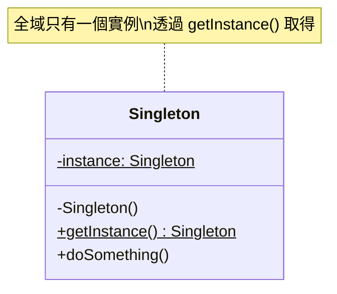

**核心概念**：確保一個類別在整個應用程式生命週期中只有一個實例，並提供全域存取點。

**使用時機**：
- 資料庫連線、網路客戶端等需要共享的資源
- 全域狀態管理（如使用者 Session）
- DI 框架中的 `@Singleton` scope

**注意事項**：過度使用會導致全域狀態難以測試，優先使用 DI 框架管理。

---

#### Factory Method — 工廠方法模式

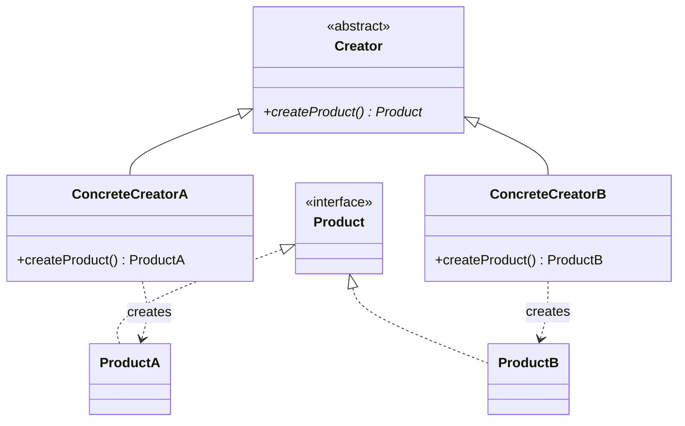

**核心概念**：定義一個建立物件的介面，但讓子類別決定要實例化的類別。

**使用時機**：
- 不確定需要建立哪種具體物件時
- ViewModelProvider.Factory 決定建立哪個 ViewModel
- 根據平台或設定建立不同的 Service 實作

---

#### Abstract Factory — 抽象工廠模式

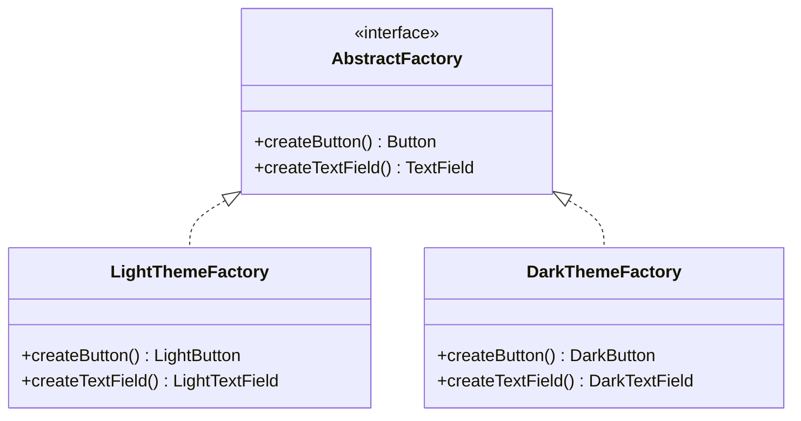

**核心概念**：提供一個介面，用來建立一系列相關或相互依賴的物件，而不需要指定具體類別。

**使用時機**：
- UI 主題系統（同時切換一整組 UI 元件風格）
- 跨平台 API 抽象層

---

#### Builder — 建造者模式

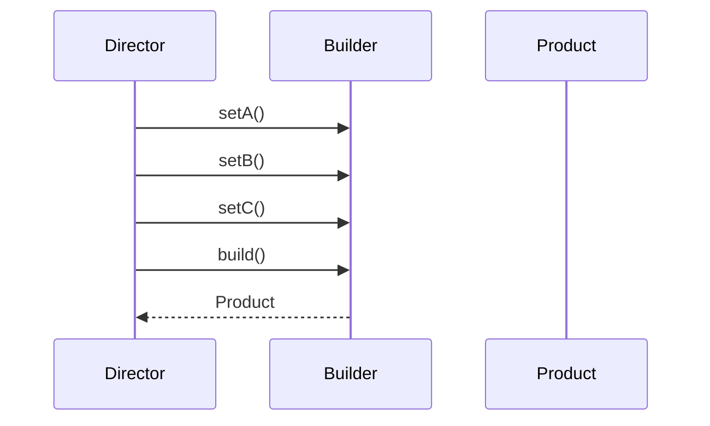

**核心概念**：將複雜物件的建構過程與其表示分離，使同樣的建構過程可以創建不同的表示。

**使用時機**：
- 物件有多個可選參數時（避免 telescoping constructor）
- `Retrofit.Builder()`, `OkHttpClient.Builder()`, `Notification.Builder()`
- Kotlin 中 `data class` + 具名參數 + 預設值常可取代 Builder

---

#### Prototype — 原型模式

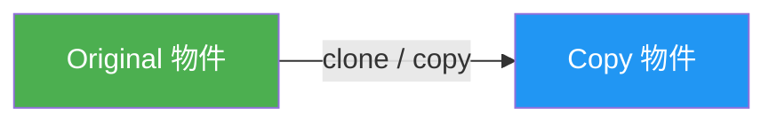

**核心概念**：透過複製既有物件來建立新物件，避免重複的初始化開銷。

**使用時機**：
- Kotlin `data class` 的 `copy()` 方法
- MVI 架構中複製 State 並修改部分欄位
- 需要保留原始物件做 undo/redo 時

---

### 1.2 結構型模式（Structural）

處理類別或物件的組合方式，形成更大的結構。

| 模式 | 說明 | 常用度 | 行動開發典型場景 |
|------|------|--------|-----------------|
| **Adapter** | 將一個介面轉換成另一個介面 | ⭐⭐⭐ | RecyclerView.Adapter、DTO ↔ Domain Model 轉換 |
| **Bridge** | 將抽象與實作分離，使兩者可以獨立變化 | ⭐ | 跨平台渲染引擎抽象 |
| **Composite** | 將物件組合成樹狀結構 | ⭐⭐ | View 樹狀結構、Compose UI 組合 |
| **Decorator** | 動態地為物件添加責任 | ⭐⭐⭐ | OkHttp Interceptor 鏈、Middleware |
| **Facade** | 為複雜子系統提供一個簡單介面 | ⭐⭐⭐ | Repository（封裝 API + Cache + DB）、SDK 封裝 |
| **Flyweight** | 共享細粒度物件以節省記憶體 | ⭐ | 字型快取、圖片池、RecycledViewPool |
| **Proxy** | 為其他物件提供代理以控制存取 | ⭐⭐ | Retrofit 動態代理、LazyLoading、圖片佔位符 |

#### Adapter — 適配器模式

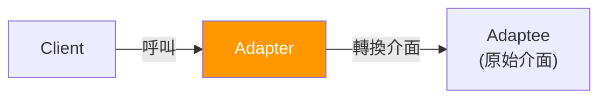

**核心概念**：將一個類別的介面轉換成客戶端期望的另一個介面，使原本不相容的類別可以合作。

**使用時機**：
- `RecyclerView.Adapter`：將資料轉換為 View 可以顯示的格式
- DTO → Domain Model 的 Mapper
- 包裝第三方 SDK 介面以符合專案規範

---

#### Decorator — 裝飾者模式

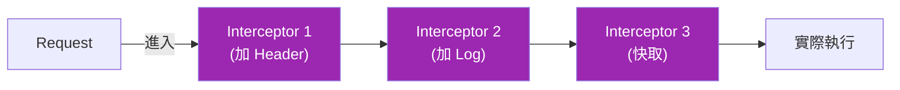

**核心概念**：動態地為物件添加額外的責任，比繼承更有彈性的擴展功能方式。

**使用時機**：
- OkHttp Interceptor Chain（認證、日誌、快取逐層裝飾）
- Kotlin 的 `by` 委託 + 介面裝飾
- Stream/Flow 的 operator chaining（`.map().filter().catch()`）

---

#### Facade — 外觀模式

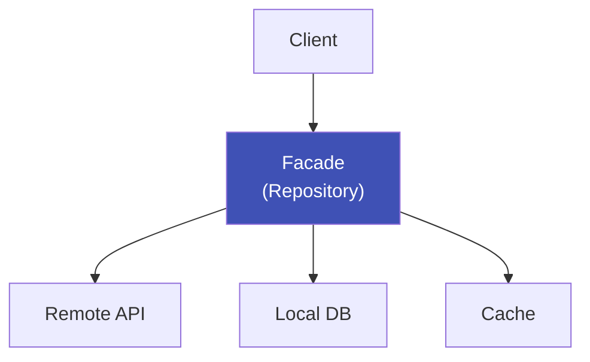

**核心概念**：為一組複雜的子系統介面提供一個統一的高層介面，降低使用複雜度。

**使用時機**：
- Repository 封裝 Remote API + Local DB + Cache 邏輯
- UseCase 封裝多個 Repository 操作
- SDK 對外暴露簡潔 API

---

#### Composite — 組合模式

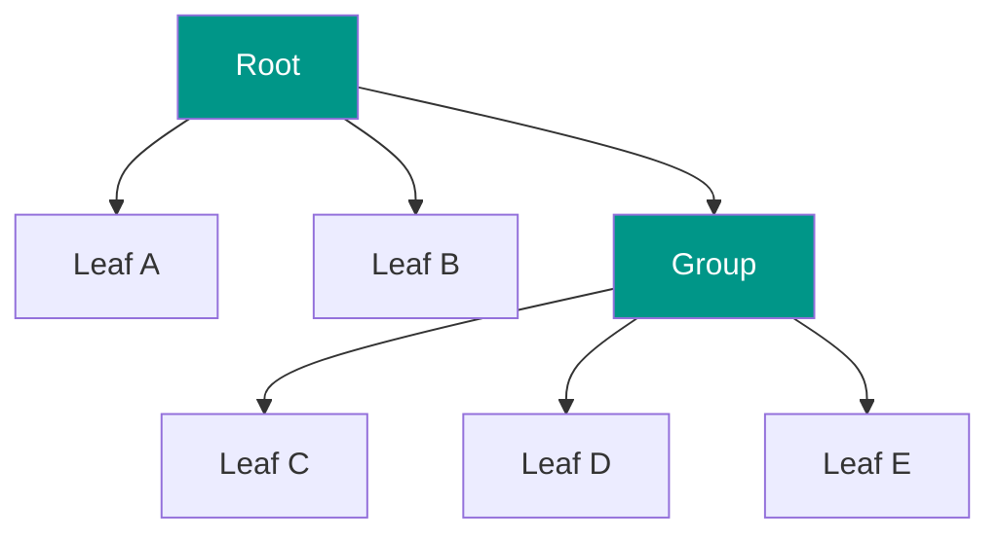

**核心概念**：將物件組合成樹狀結構，讓客戶端以一致的方式處理個別物件與組合物件。

**使用時機**：
- Android View 樹（ViewGroup 包含 View）
- Jetpack Compose UI 樹狀組合
- Flutter Widget Tree

---

#### Proxy — 代理模式

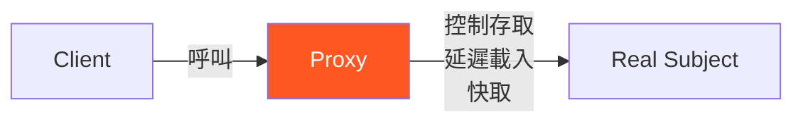

**核心概念**：提供一個代理物件來控制對另一個物件的存取。

**使用時機**：
- Retrofit 使用 Java 動態代理生成 API 介面實作
- 圖片懶載入（先顯示佔位符，再載入實際圖片）
- Kotlin `by lazy` 延遲初始化

---

### 1.3 行為型模式（Behavioral）

關注物件之間的職責分配與溝通方式。

| 模式 | 說明 | 常用度 | 行動開發典型場景 |
|------|------|--------|-----------------|
| **Observer** | 定義一對多依賴，狀態變化時通知所有觀察者 | ⭐⭐⭐ | LiveData、StateFlow、Combine、Stream |
| **Strategy** | 定義一系列演算法，使它們可互換 | ⭐⭐⭐ | 排序策略、驗證策略、網路請求重試策略 |
| **Command** | 將請求封裝為物件 | ⭐⭐ | Intent/Event in MVI、undo/redo |
| **State** | 允許物件在狀態改變時改變行為 | ⭐⭐ | 播放器狀態（Playing/Paused/Stopped）、登入流程 |
| **Template Method** | 定義演算法骨架，讓子類別覆寫特定步驟 | ⭐⭐ | BaseActivity/BaseFragment 的生命週期 |
| **Chain of Responsibility** | 將請求沿處理鏈傳遞 | ⭐⭐⭐ | OkHttp Interceptor、Touch 事件分發 |
| **Iterator** | 提供逐一存取集合元素的方法 | ⭐⭐ | Kotlin Sequence、Cursor、Paging |
| **Mediator** | 用中介者封裝物件間的互動 | ⭐⭐ | Navigation Component、EventBus |
| **Memento** | 捕獲並外部化物件內部狀態 | ⭐ | onSaveInstanceState、undo 功能 |
| **Visitor** | 在不修改元素的前提下定義新操作 | ⭐ | AST 遍歷、Lint 規則 |
| **Interpreter** | 為語言定義文法及直譯器 | ⭐ | 正則表達式、DSL 解析 |

#### Observer — 觀察者模式

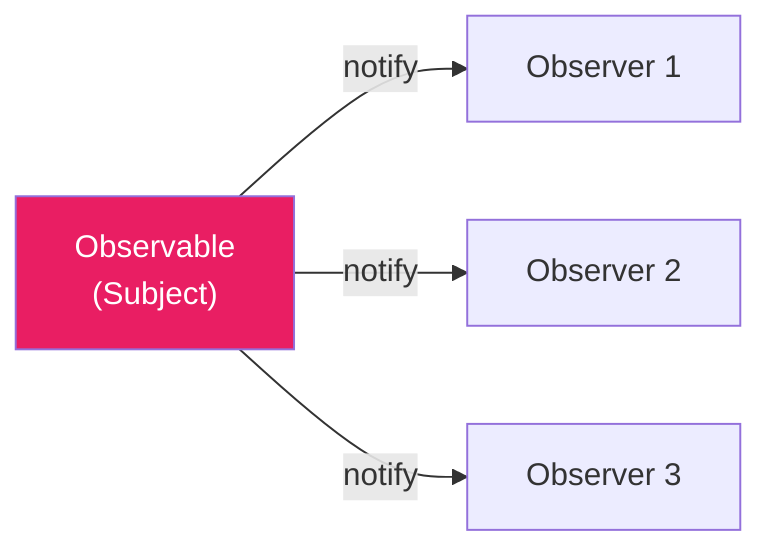

**核心概念**：定義物件間一對多的依賴關係，當一個物件狀態改變時，所有依賴者都會收到通知並自動更新。

**使用時機**：
- Android: `LiveData`, `StateFlow`, `SharedFlow`
- iOS: `@Published`, `Combine Publisher`
- Flutter: `Stream`, `ChangeNotifier`
- 任何 UI 需要響應資料變化的場景

---

#### Strategy — 策略模式

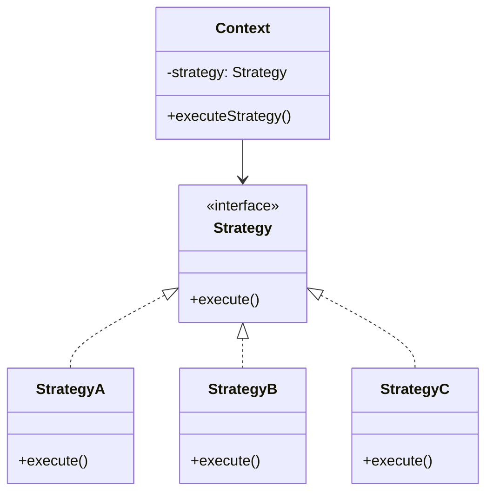

**核心概念**：定義一系列演算法，把每個演算法封裝起來，使它們可以互相替換。

**使用時機**：
- 不同的表單驗證規則
- 不同的圖片載入策略（快取優先 / 網路優先）
- 不同的重試策略（指數退避 / 固定間隔）
- Kotlin 中常用高階函數取代策略類別

---

#### Command — 命令模式

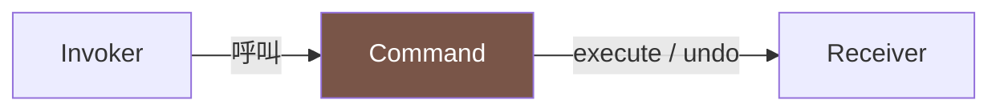

**核心概念**：將請求封裝成物件，使你可以用不同的請求參數化客戶端、佇列化請求、或支援 undo 操作。

**使用時機**：
- MVI 中的 Intent / Event 就是 Command 模式
- 文字編輯器的 undo/redo
- 任務佇列、排程執行

---

#### Chain of Responsibility — 責任鏈模式

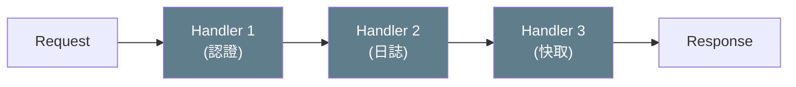

**核心概念**：將請求沿著處理者鏈傳遞，直到有一個處理者處理它為止。

**使用時機**：
- OkHttp Interceptor Chain
- Android Touch 事件分發（Activity → ViewGroup → View）
- Middleware pipeline

---

#### State — 狀態模式

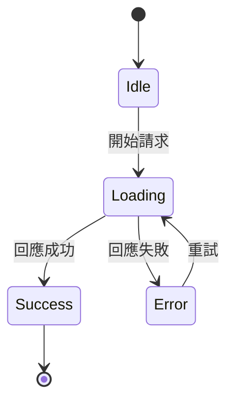

**核心概念**：允許物件在其內部狀態改變時改變其行為，看起來好像改變了類別。

**使用時機**：
- 播放器狀態機（Idle → Loading → Playing → Paused）
- 網路請求狀態（Idle → Loading → Success/Error）
- 登入流程狀態管理

---

#### Template Method — 模板方法模式

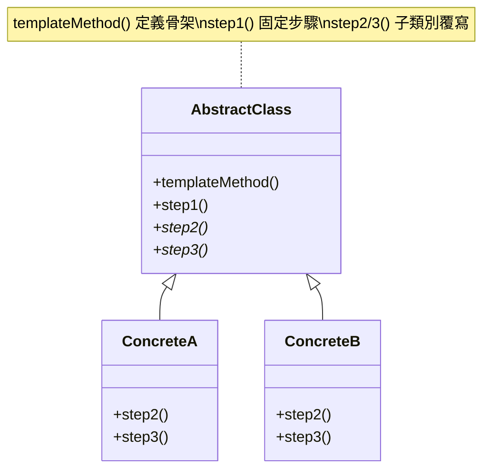

**核心概念**：在父類別中定義演算法的骨架，將某些步驟延遲到子類別實作。

**使用時機**：
- `BaseActivity` / `BaseFragment` 定義生命週期模板
- `BaseViewModel` 定義初始化流程
- `BaseUseCase` 定義 `execute()` 骨架，子類別只覆寫業務邏輯

---

#### Mediator — 中介者模式

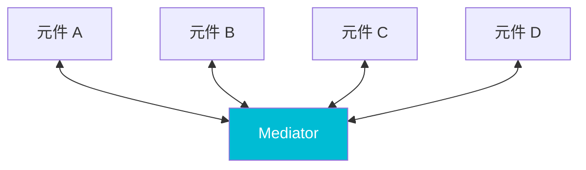

**核心概念**：用一個中介物件封裝一組物件之間的互動，使物件之間不需要顯式引用彼此。

**使用時機**：
- Navigation Component（Fragment 之間不直接跳轉）
- EventBus / AppEventBus
- ViewModel 作為 View 與 Model 之間的中介者

---

## 二、跨平台設計模式對照表

### 常用設計模式在三大平台的具體實現

| 設計模式 | Android (Kotlin) | iOS (Swift) | Flutter (Dart) |
|---------|-----------------|-------------|----------------|
| **Singleton** | `object` / `@Singleton` (Hilt) | `static let shared` | `factory constructor` / `get_it` |
| **Factory** | `ViewModelProvider.Factory` | Protocol + Factory class | `Widget.builder()` pattern |
| **Builder** | `Retrofit.Builder()` / named params | Method chaining / Result builders | Cascade notation `..` / named params |
| **Observer** | `StateFlow` / `LiveData` | `Combine` / `@Published` | `Stream` / `ChangeNotifier` |
| **Strategy** | Interface + Lambda | Protocol + Closure | Abstract class + Function type |
| **Adapter** | `RecyclerView.Adapter` | `UITableViewDataSource` | 不需要（Widget 直接建構） |
| **Decorator** | `OkHttp Interceptor` | URLProtocol / Middleware | `dio Interceptor` |
| **Facade** | `Repository` | `Repository` / `Manager` | `Repository` |
| **Command** | MVI `Intent` / `Event` | TCA `Action` | BLoC `Event` |
| **State** | `sealed class UiState` | `enum State` | `sealed class` / `freezed` |
| **Chain of Resp.** | Interceptor / Touch dispatch | Responder Chain | Middleware chain |
| **Template Method** | `BaseActivity` / `BaseFragment` | `UIViewController` lifecycle | `StatefulWidget` lifecycle |
| **Composite** | `ViewGroup` / Compose | `UIView` hierarchy / SwiftUI | `Widget` tree |
| **Mediator** | `NavController` / EventBus | `Coordinator` pattern | `Navigator` / `GoRouter` |
| **Proxy** | Retrofit dynamic proxy | `lazy var` / Proxy pattern | Lazy initialization |

---

## 三、Clean Architecture 跨平台比較

### 3.1 核心原則

所有平台共同遵循的原則：

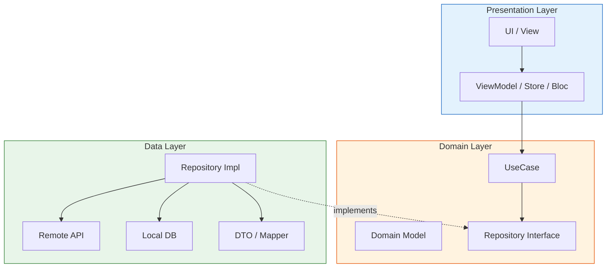

1. **依賴規則（Dependency Rule）**：外層依賴內層，內層不知道外層的存在
2. **依賴反轉（DIP）**：Domain 層定義 Repository 介面，Data 層負責實作
3. **關注點分離（SoC）**：每一層只處理自己該負責的事情
4. **可測試性**：Domain 層不依賴任何框架，可以純粹用單元測試驗證

### 3.2 三層架構對照

#### Data Layer — 資料層

| 職責 | Android | iOS | Flutter |
|------|---------|-----|---------|
| **API 呼叫** | Retrofit `@GET/@POST` 介面 | URLSession / Alamofire | dio / http package |
| **DTO 定義** | `data class XxxDto` | `struct XxxDTO: Codable` | `class XxxDto` + `json_serializable` |
| **本地儲存** | Room / DataStore | CoreData / UserDefaults | sqflite / shared_preferences |
| **Repository 實作** | `class XxxRepositoryImpl` | `class XxxRepositoryImpl` | `class XxxRepositoryImpl` |
| **Mapper** | `fun XxxDto.toDomain()` | `extension XxxDTO` | `XxxMapper.toDomain()` |

#### Domain Layer — 領域層

| 職責 | Android | iOS | Flutter |
|------|---------|-----|---------|
| **Model** | `data class Xxx` | `struct Xxx` | `class Xxx` / `freezed` |
| **Repository 介面** | `interface XxxRepository` | `protocol XxxRepository` | `abstract class XxxRepository` |
| **UseCase** | `class XxxUseCase(repo)` | `class XxxUseCase` | `class XxxUseCase` |
| **結果封裝** | `sealed class Result` | `Result<T, Error>` | `Either<Failure, T>` (dartz) |

#### Presentation Layer — 展示層

| 職責 | Android | iOS | Flutter |
|------|---------|-----|---------|
| **UI** | Compose / XML | SwiftUI / UIKit | Widget |
| **狀態管理** | ViewModel + StateFlow | ObservableObject / TCA Store | BLoC / Cubit / Riverpod |
| **導航** | Navigation Component | NavigationStack / Coordinator | GoRouter / Navigator |
| **DI** | Hilt (`@Inject`) | Swinject / 手動 | get_it / injectable |

### 3.3 技術棧對照

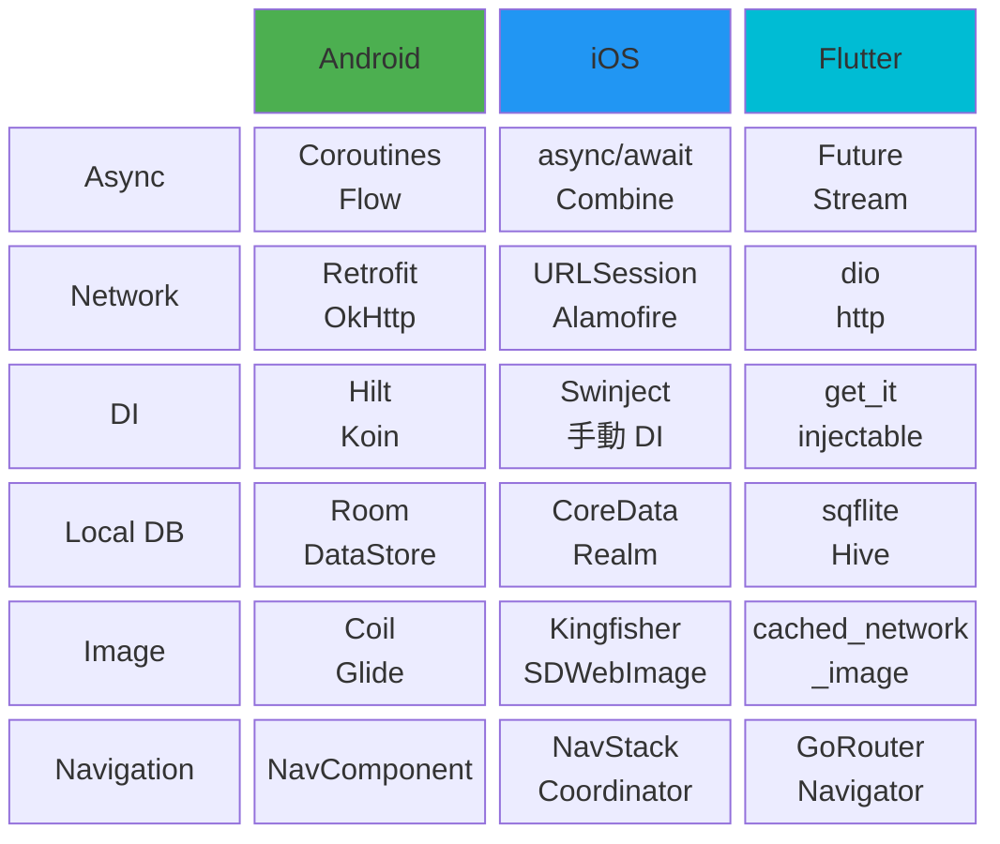

### 3.4 各平台 Repository Pattern 實作

#### Android (Kotlin)

```kotlin
// Domain Layer — 定義介面
interface UserRepository {
    fun getUser(id: String): Flow<Result<User>>
}

// Data Layer — 實作介面
class UserRepositoryImpl @Inject constructor(
    private val api: UserApi,
    private val dao: UserDao,
    private val mapper: UserMapper
) : UserRepository {

    override fun getUser(id: String): Flow<Result<User>> = flow {
        val local = dao.getUser(id)?.let { mapper.toDomain(it) }
        if (local != null) emit(Result.Success(local))

        val remote = api.getUser(id)
        dao.insert(mapper.toEntity(remote))
        emit(Result.Success(mapper.toDomain(remote)))
    }.catch { emit(Result.Error(it)) }
}
```

#### iOS (Swift)

```swift
// Domain Layer
protocol UserRepository {
    func getUser(id: String) async throws -> User
}

// Data Layer
class UserRepositoryImpl: UserRepository {
    private let api: UserAPI
    private let cache: UserCache

    func getUser(id: String) async throws -> User {
        if let cached = cache.getUser(id: id) {
            return cached.toDomain()
        }
        let dto = try await api.getUser(id: id)
        cache.save(dto)
        return dto.toDomain()
    }
}
```

#### Flutter (Dart)

```dart
// Domain Layer
abstract class UserRepository {
  Future<Either<Failure, User>> getUser(String id);
}

// Data Layer
class UserRepositoryImpl implements UserRepository {
  final UserApi api;
  final UserDao dao;

  @override
  Future<Either<Failure, User>> getUser(String id) async {
    try {
      final local = await dao.getUser(id);
      if (local != null) return Right(local.toDomain());

      final remote = await api.getUser(id);
      await dao.insert(remote.toEntity());
      return Right(remote.toDomain());
    } catch (e) {
      return Left(ServerFailure(e.toString()));
    }
  }
}
```

---

## 四、單向資料流架構設計

### 4.1 核心概念

單向資料流（Unidirectional Data Flow, UDF）確保資料只朝一個方向流動，使狀態變化可預測、可追蹤。

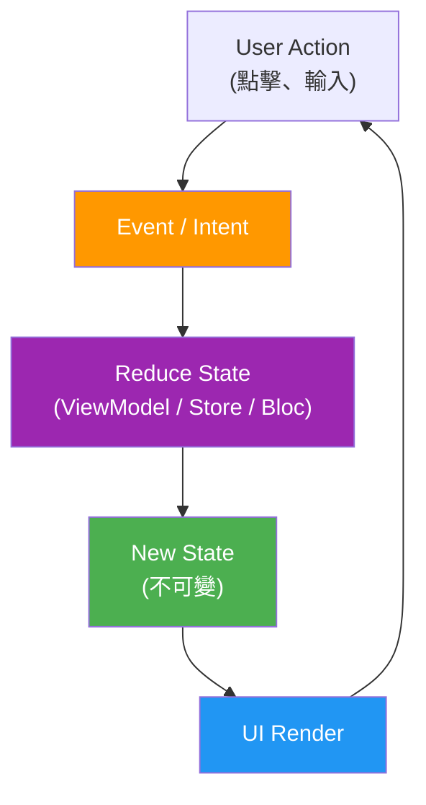

**三大要素**：
1. **State（狀態）**：不可變的資料，描述 UI 在某一時刻應該呈現的樣貌
2. **Event / Intent / Action（事件）**：使用者操作或系統事件，觸發狀態變化的唯一途徑
3. **Effect / Side Effect（副作用）**：一次性事件（導航、Toast、對話框），不屬於持續性狀態

### 4.2 跨平台對應架構

| 概念 | Android (MVI) | iOS (TCA) | Flutter (BLoC) |
|------|--------------|-----------|----------------|
| **架構名稱** | MVI (Model-View-Intent) | TCA (The Composable Architecture) | BLoC (Business Logic Component) |
| **狀態容器** | ViewModel | Store | Bloc / Cubit |
| **狀態** | `data class UiState` | `struct State` | `class XxxState` |
| **使用者動作** | `sealed class Event` | `enum Action` | `sealed class XxxEvent` |
| **副作用** | `sealed class Effect` + `SharedFlow` | `Effect<Action>` | 在 `mapEventToState` 中 emit |
| **狀態更新** | `reduce()` in ViewModel | `Reducer` | `on<Event>()` handler |
| **UI 訂閱** | `collectAsState()` / `collect {}` | `WithViewStore` / `@Observable` | `BlocBuilder` / `BlocListener` |
| **組合性** | 手動組合 | `Scope` + child store | `MultiBlocProvider` |

### 4.3 各平台實作範例

以「登入功能」為例：

#### Android — MVI

```kotlin
// State
data class LoginUiState(
    val email: String = "",
    val password: String = "",
    val isLoading: Boolean = false,
    val error: String? = null
)

// Event
sealed class LoginEvent {
    data class EmailChanged(val email: String) : LoginEvent()
    data class PasswordChanged(val password: String) : LoginEvent()
    data object LoginClicked : LoginEvent()
}

// Effect（一次性事件）
sealed class LoginEffect {
    data object NavigateToHome : LoginEffect()
    data class ShowToast(val message: String) : LoginEffect()
}

// ViewModel
class LoginViewModel @Inject constructor(
    private val loginUseCase: LoginUseCase
) : ViewModel() {

    private val _state = MutableStateFlow(LoginUiState())
    val state: StateFlow<LoginUiState> = _state.asStateFlow()

    private val _effect = Channel<LoginEffect>()
    val effect: Flow<LoginEffect> = _effect.receiveAsFlow()

    fun onEvent(event: LoginEvent) {
        when (event) {
            is LoginEvent.EmailChanged ->
                _state.update { it.copy(email = event.email) }
            is LoginEvent.PasswordChanged ->
                _state.update { it.copy(password = event.password) }
            is LoginEvent.LoginClicked -> login()
        }
    }

    private fun login() {
        viewModelScope.launch {
            _state.update { it.copy(isLoading = true, error = null) }
            loginUseCase(state.value.email, state.value.password)
                .onSuccess { _effect.send(LoginEffect.NavigateToHome) }
                .onFailure { _state.update { s -> s.copy(error = it.message) } }
            _state.update { it.copy(isLoading = false) }
        }
    }
}
```

#### iOS — TCA

```swift
// Feature
@Reducer
struct LoginFeature {
    @ObservableState
    struct State: Equatable {
        var email = ""
        var password = ""
        var isLoading = false
        var error: String?
    }

    enum Action: Equatable {
        case emailChanged(String)
        case passwordChanged(String)
        case loginTapped
        case loginResponse(Result<User, APIError>)
    }

    var body: some ReducerOf<Self> {
        Reduce { state, action in
            switch action {
            case let .emailChanged(email):
                state.email = email
                return .none
            case let .passwordChanged(password):
                state.password = password
                return .none
            case .loginTapped:
                state.isLoading = true
                state.error = nil
                return .run { [email = state.email, pw = state.password] send in
                    let result = await apiClient.login(email, pw)
                    await send(.loginResponse(result))
                }
            case let .loginResponse(.success(user)):
                state.isLoading = false
                return .none
            case let .loginResponse(.failure(error)):
                state.isLoading = false
                state.error = error.localizedDescription
                return .none
            }
        }
    }
}
```

#### Flutter — BLoC

```dart
// State
class LoginState extends Equatable {
  final String email;
  final String password;
  final bool isLoading;
  final String? error;

  const LoginState({
    this.email = '',
    this.password = '',
    this.isLoading = false,
    this.error,
  });

  LoginState copyWith({String? email, String? password, bool? isLoading, String? error}) {
    return LoginState(
      email: email ?? this.email,
      password: password ?? this.password,
      isLoading: isLoading ?? this.isLoading,
      error: error,
    );
  }

  @override
  List<Object?> get props => [email, password, isLoading, error];
}

// Event
abstract class LoginEvent extends Equatable {}

class EmailChanged extends LoginEvent {
  final String email;
  EmailChanged(this.email);
  @override
  List<Object> get props => [email];
}

class PasswordChanged extends LoginEvent {
  final String password;
  PasswordChanged(this.password);
  @override
  List<Object> get props => [password];
}

class LoginSubmitted extends LoginEvent {
  @override
  List<Object> get props => [];
}

// BLoC
class LoginBloc extends Bloc<LoginEvent, LoginState> {
  final LoginUseCase loginUseCase;

  LoginBloc({required this.loginUseCase}) : super(const LoginState()) {
    on<EmailChanged>((event, emit) {
      emit(state.copyWith(email: event.email));
    });
    on<PasswordChanged>((event, emit) {
      emit(state.copyWith(password: event.password));
    });
    on<LoginSubmitted>((event, emit) async {
      emit(state.copyWith(isLoading: true, error: null));
      final result = await loginUseCase(state.email, state.password);
      result.fold(
        (failure) => emit(state.copyWith(isLoading: false, error: failure.message)),
        (user) => emit(state.copyWith(isLoading: false)),
      );
    });
  }
}
```

---

## 五、架構模式演進與選擇指南

### 架構演進路線

```mermaid
flowchart LR
    MVC --> MVP --> MVVM --> MVI["MVI\n(單向資料流)"]
    MVI -.->|搭配| CA["Clean Architecture"]
    style MVI fill:#4CAF50,color:#fff
    style CA fill:#FF9800,color:#fff
```

| 架構模式 | 資料流方向 | 狀態管理 | 複雜度 | 適用場景 |
|---------|-----------|---------|--------|---------|
| **MVC** | 雙向 | 分散 | 低 | 小型專案、快速原型 |
| **MVP** | 雙向 | Presenter | 中 | 中型專案、需要測試 Presenter |
| **MVVM** | 雙向綁定 | ViewModel | 中 | 大部分專案的起點 |
| **MVI** | 單向 | 集中式不可變 State | 高 | 複雜 UI 狀態、需要可預測性 |

### 如何選擇

```mermaid
flowchart TD
    Q["需要可預測的狀態管理？"]
    Q -->|是| UDF["MVI / TCA / BLoC\n(單向資料流)"]
    Q -->|否| MVVM["MVVM 就夠用"]
    UDF --> CA["搭配 Clean Architecture 分層"]
    MVVM --> Simple["狀態簡單的頁面\n不需要過度設計"]
    style UDF fill:#4CAF50,color:#fff
    style MVVM fill:#2196F3,color:#fff
```

### Clean Architecture + 單向資料流 = 最佳組合

```mermaid
flowchart TD
    subgraph Presentation["Presentation Layer"]
        direction LR
        Event["Event"] --> VM["ViewModel / Store / Bloc"]
        VM --> State["State"]
        State --> UIRender["UI"]
    end
    subgraph Domain["Domain Layer"]
        UseCase["UseCase"]
        RepoInterface["Repository Interface"]
    end
    subgraph Data["Data Layer"]
        RepoImpl2["Repository Impl"]
        API2["API"]
        DB2["DB"]
    end

    VM --> UseCase
    UseCase --> RepoInterface
    RepoImpl2 -.->|implements| RepoInterface
    RepoImpl2 --> API2
    RepoImpl2 --> DB2

    style Presentation fill:#E3F2FD,stroke:#1565C0
    style Domain fill:#FFF3E0,stroke:#E65100
    style Data fill:#E8F5E9,stroke:#2E7D32
```

---

> 最後更新：2026-05-08
